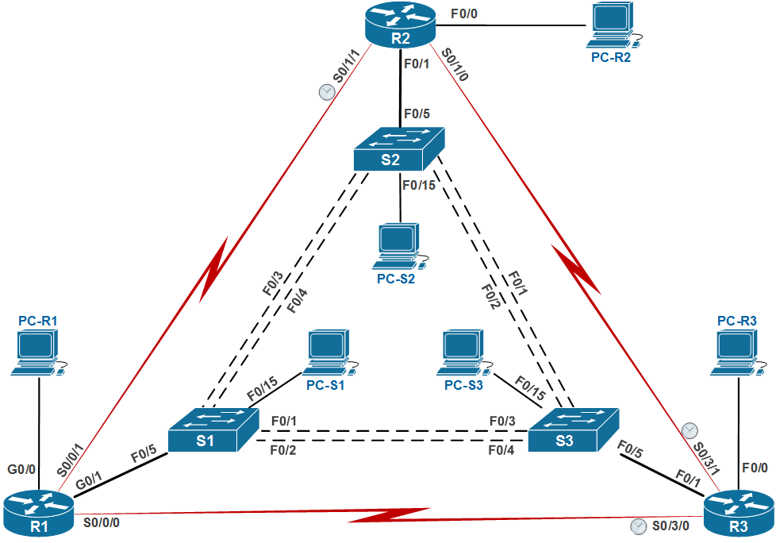

# Масштабирование сетей VLAN.
# Лабораторная работа №1. Настройка расширенных сетей VLAN, VTP и DTP 

### Схема сети



### Задание:
#### [Часть 1: Настройка VTP ](README.md#часть-1-настройка-vtp)
#### [Часть 2: Настройка динамического протокола транкинга (DTP) ](README.md#часть-2-настройка-динамического-протокола-транкинга-dtp)
* Настроить динамические магистральные каналы между S1 и S2.
* Настроить статический магистральный канал между S1 и S3.
#### [Часть 3: Добавление сетей VLAN и назначение портов ](README.md#часть-3-добавление-сетей-vlan-и-назначение-портов)
* Добавить сети VLAN
* Проверить обновления VTP на коммутаторах S1 и S3.
* Назначить порты сетям VLAN.
* Настроить IP-адреса на коммутаторах.
* Проверить наличие сквозного соединения.
#### [Часть 4: Настроить сеть VLAN расширенного диапазона ](README.md#часть-4-настроить-сеть-vlan-расширенного-диапазона)
* Превести VTP на коммутаторе S1 в прозрачный режим.
* Настроить сеть VLAN расиширенного диапазона на коммутаторе S1.
#### [Вопросы для повторения ](README.md#вопросы-для-повторения)
#### [Конфигурационные файлы ](README.md#конфигурационные-файлы)

### Решение:
#### Часть 1: Настройка VTP

настройка S2 как сервера VTP 
``` bash
S2>enable
S2#conf t
S2(config)#vtp domain CCNA
S2(config)#vtp mode server
S2(config)#vtp password cisco
S2(config)#exit
S2#exit
```

проверка статуса VTP
``` bash
S2#show vtp status
VTP Version                     : 2
Configuration Revision          : 0
Maximum VLANs supported locally : 250
Number of existing VLANs        : 5
VTP Operating Mode              : Server
VTP Domain Name                 : CCNA

```

Настройка S1 и S3 клиентами VTP
``` bash
S1>enable
S1#conf t
S1(config)#vtp domain CCNA
S1(config)#vtp mode client
S1(config)#vtp password cisco
S1(config)#exit
```

Проверка статуса VTP
``` bash
S1#sh vtp status
VTP Version                     : 2
Configuration Revision          : 0
Maximum VLANs supported locally : 250
Number of existing VLANs        : 5
VTP Operating Mode              : Client
VTP Domain Name                 : CCNA
```

#### Часть 2: Настройка динамического протокола транкинга (DTP)

*Шаг 1.Настроить динамические магистральные каналы S1 <-> S2*
``` bash
S1#sh int fa0/3 switch
---
Administrative Mode: dynamic auto
Operational Mode: trunk

S2#sh int fa0/3 switch
---   
Administrative Mode: dynamic desirable
Operational Mode: trunk
``` 
``` bash
S1#sh int trunk
Port        Mode             Encapsulation  Status        Native vlan
Fa0/1       auto             802.1q         trunking      1
Fa0/2       auto             802.1q         trunking      1
Fa0/3       auto             802.1q         trunking      1
Fa0/4       auto             802.1q         trunking      1

S2#sh int trunk
Port        Mode         Encapsulation  Status        Native vlan
Fa0/1       desirable    802.1q         trunking      1
Fa0/2       desirable    802.1q         trunking      1
Fa0/3       desirable    802.1q         trunking      1
Fa0/4       desirable    802.1q         trunking      1
```

*Шаг 2. Настроить статический магистральный канал S1 <-> S3*
``` bash
S1#conf t
Enter configuration commands, one per line.  End with CNTL/Z.
S1(config)#int fa0/1
S1(config-if)#switchport mode trunk 
S1(config-if)#exit
```
Проверка S1

``` bash
S1#sh int trunk

Port        Mode             Encapsulation  Status        Native vlan
Fa0/1       on               802.1q         trunking      1
Fa0/2       auto             802.1q         trunking      1
Fa0/3       auto             802.1q         trunking      1
Fa0/4       auto             802.1q         trunking      1
```

Настроить статический магистральный канал S3 <-> S1
``` bash
S3(config)#int fa0/1
S3(config-if)#switchport mode trunk
S3(config-if)#exit
```

Проверка S3
``` bash
S3#sh int trunk
Port        Mode         Encapsulation  Status        Native vlan
Fa0/1       on           802.1q         trunking      1
Fa0/2       desirable    802.1q         trunking      1
Fa0/3       desirable    802.1q         trunking      1
Fa0/4       desirable    802.1q         trunking      1
```

#### Часть 3: Добавление сетей VLAN и назначение портов

*Шаг 1. Добавить VLANs на коммутаторах*

На коммутаторе S1 добавить сеть VLAN 10.
``` bash
S1(config)#vlan 10
VTP VLAN configuration not allowed when device is in CLIENT mode.
```
VLAN 10 не создался, т.к. S1 работает в режиме VTP-клиент.

Добавить VLANs на S2 согласно таблице:
``` bash
S2#conf t
Enter configuration commands, one per line.  End with CNTL/Z.
S2(config)#vlan 10
S2(config-vlan)#name Red
S2(config-vlan)#vlan 20
S2(config-vlan)#name Blue
S2(config-vlan)#vlan 30
S2(config-vlan)#name Yellow
S2(config-vlan)#vlan 99
S2(config-vlan)#name Management
S2(config-vlan)#end
```
Проверяем
``` bash
S2#sh vlan 
VLAN Name                             Status    Ports
---- -------------------------------- --------- -------------------------------
1    default                          active    Fa0/5, Fa0/6, Fa0/7, Fa0/8
                                                Fa0/9, Fa0/10, Fa0/11, Fa0/12
                                                Fa0/13, Fa0/14, Fa0/15, Fa0/16
                                                Fa0/17, Fa0/18, Fa0/19, Fa0/20
                                                Fa0/21, Fa0/22, Fa0/23, Fa0/24
                                                Gi0/1, Gi0/2
10   Red                              active    
20   Blue                             active    
30   Yellow                           active    
99   Management                       active    
```

*Шаг 2. Проверить обновления VTP на коммутаторах S1 и S2*
``` bash
S1#sh vlan
VLAN Name                             Status    Ports
---- -------------------------------- --------- -------------------------------
1    default                          active    Fa0/5, Fa0/6, Fa0/7, Fa0/8
                                                Fa0/9, Fa0/10, Fa0/11, Fa0/12
                                                Fa0/13, Fa0/14, Fa0/15, Fa0/16
                                                Fa0/17, Fa0/18, Fa0/19, Fa0/20
                                                Fa0/21, Fa0/22, Fa0/23, Fa0/24
                                                Gi0/1, Gi0/2
10   Red                              active    
20   Blue                             active    
30   Yellow                           active    
99   Management                       active
```
*Шаг 3. Назначение портов сетям VLAN.*

Связываем физические порты с VLAN согласно таблице.

Назначение портов | VLAN |Компьютер и IP-адрес
------------- | ------------- | -------------
S1 fa0/15 | 10 | PC-S1: 192.168.10.1/24
S2 fa0/16 | 20 | PC-S2: 192.168.20.1/24
S3 fa0/15 | 10 | PC-S3: 192.168.10.2/24

*Шаг 4. Настройка IP-адресов на коммутаторах*

Назначаем сетевые настройки интерфейсам VLAN.
``` bash
S1#conf t
Enter configuration commands, one per line.  End with CNTL/Z.
S1(config)#int vlan 99
S1(config-if)#ip address 192.168.99.1 255.255.255.0
S1(config-if)#no shut
S1(config-if)#exit
S1(config)#exit
```
*Шаг 5. Проверить наличие сквозного соединения*

#### Часть 4: Настроить сеть VLAN расширенного диапазона

Шаг 1. Переводим S1 в VTP transparent
``` bash
S1#conf t
S1(config)#vtp mode transparent 
Setting device to VTP Transparent mode for VLANS.
```
Проверяем

``` bash
S1#sh vtp status
Feature VLAN:
--------------
VTP Operating Mode                : Transparent
```

*Шаг 2. Настроить сеть VLAN расширенного диапазона на S1.*
``` bash
S1#conf t
S1(config)#vlan 2000
```
#### Вопросы для повторения
*Каковы преимущества и недостатки использования VTP?*


_Преимущества:_ не нужно объявлять (создавать) VLAN на каждом коммутаторе, VTP позволяет автоматически обмениваться информацией о существующих сети VLAN.

_Недостатки_: при покупке б/у коммутатора, который настроен как VTP-сервер и подключении в существующую сетевую инфраструктуру, могут возникнуть проблемы связанные с перераспределением VLAN.


#### Конфигурационные файлы 
[здесь](config/).
