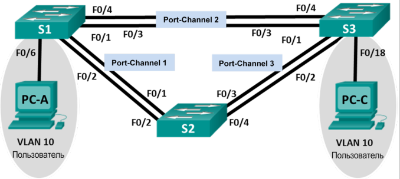

# Агрегация соединений
# Лабораторная работа №3. Поиск и устранение неполадок в работе EtherChannel.

### Топология

### Таблица адресации

Устройство | Интерфейс | IP-адрес | Маска подсети
---- | ---- | ---- | ----
S1 | VLAN 99 | 192.168.1.11 | 255.255.255.0
S2 | VLAN 99 | 192.168.1.12 | 255.255.255.0
S3 | VLAN 99 | 192.168.1.13 | 255.255.255.0
PC-A | NIC | 192.168.10.1 | 255.255.255.0
PC-B | NIC | 192.168.10.2 | 255.255.255.0
PC-C | NIC | 192.168.10.3 | 255.255.255.0