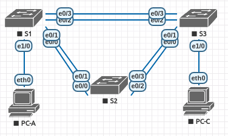
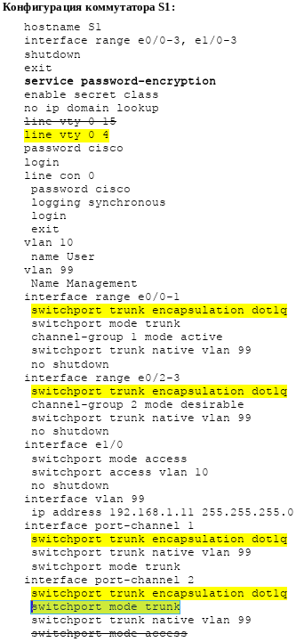
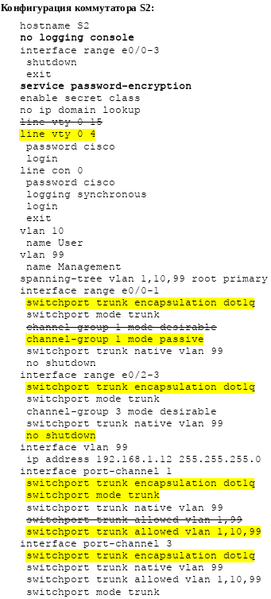
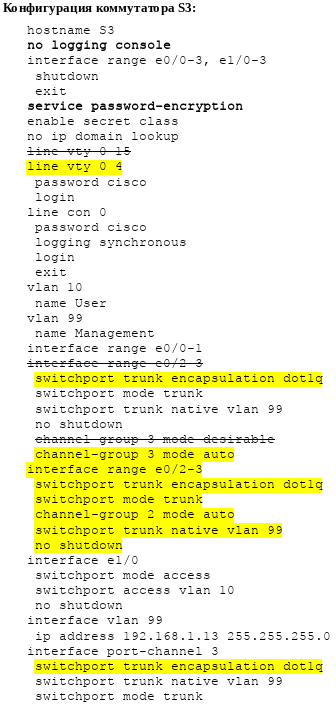
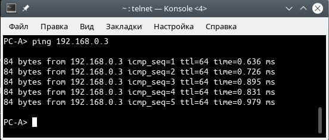

# Агрегация соединений
# Лабораторная работа №3. Поиск и устранение неполадок в работе EtherChannel.

### Топология


### Таблица адресации

Устройство | Интерфейс | IP-адрес | Маска подсети
---- | ---- | ---- | ----
S1 | VLAN 99 | 192.168.1.11 | 255.255.255.0
S2 | VLAN 99 | 192.168.1.12 | 255.255.255.0
S3 | VLAN 99 | 192.168.1.13 | 255.255.255.0
PC-A | NIC | 192.168.10.1 | 255.255.255.0
PC-B | NIC | 192.168.10.2 | 255.255.255.0
PC-C | NIC | 192.168.10.3 | 255.255.255.0

### Назначения сети VLAN

VLAN | Имя
---- | ----
10 | User
99 | Управление

### Задачи
#### Часть 1. [Построение сети и загрузка настроек устройств](README.md#часть-1-построение-сети-изагрузка-настроек-устройств-1)
#### Часть 2. [Отладка EtherChannel](README.md#часть-2-поиск-иустранение-неисправностей-вработе-etherchannel-1)
#### [Конфигурационные файлы](README.md#конфигурационные-файлы-здесь)

### Решение

### Часть 1. Построение сети и загрузка настроек устройств



Настройка роутеров согласно методическому пособию.

<details>
 <summary>Настройка S1</summary>

``` bash
S1(config)#hostname S1
S1(config)#interface range e0/0-3, e1/0-3
S1(config-if-range)#shutdown
S1(config-if-range)#exit
S1(config)#enable secret class
S1(config)#no ip domain lookup
S1(config)#line vty 0 4
S1(config-line)#password cisco
S1(config-line)#login
S1(config-line)#line con 0
S1(config-line)# password cisco
S1(config-line)# logging synchronous
S1(config-line)# login
S1(config-line)# exit
S1(config)#vlan 10
S1(config-vlan)# name User
S1(config-vlan)#vlan 99
S1(config-vlan)# Name Management
S1(config-vlan)#interface range e0/0-1
S1(config-if-range)# switchport mode trunk
Command rejected: An interface whose trunk encapsulation is "Auto" can not be configured to "trunk" mode.
% Range command terminated because it failed on Ethernet0/0
S1(config-if-range)# channel-group 1 mode active
S1(config-if-range)# switchport trunk native vlan 99
S1(config-if-range)# no shutdown
S1(config-if-range)#interface range e0/2-3
S1(config-if-range)# channel-group 2 mode desirable
S1(config-if-range)# switchport trunk native vlan 99
S1(config-if-range)# no shutdown
S1(config-if-range)#interface e1/0
S1(config-if)# switchport mode access
S1(config-if)# switchport access vlan 10
S1(config-if)# no shutdown
S1(config-if)#interface vlan 99
S1(config-if)# ip address 192.168.1.11 255.255.255.0
S1(config-if)#interface port-channel 1
S1(config-if)# switchport trunk native vlan 99
S1(config-if)# switchport mode trunk
Command rejected: An interface whose trunk encapsulation is "Auto" can not be configured to "trunk" mode.
S1(config-if)#interface port-channel 2
S1(config-if)# switchport trunk native vlan 99
S1(config-if)# switchport mode access
```
</details>
<details>
 <summary>Настройка S2</summary>

``` bash
S2(config)#hostname S2
S2(config)#interface range e0/0-3
S2(config-if-range)#shutdown
S2(config-if-range)#exit
S2(config)#enable secret class
S2(config)#no ip domain lookup
S2(config)#line vty 0 4
S2(config-line)#password cisco
S2(config-line)#login
S2(config-line)#line con 0
S2(config-line)#password cisco
S2(config-line)#logging synchronous
S2(config-line)#login
S2(config-line)#exit
S2(config)#vlan 10
S2(config-vlan)#name User
S2(config-vlan)#vlan 99
S2(config-vlan)#name Management
S2(config-vlan)#spanning-tree vlan 1,10,99 root primary
S2(config-vlan)#interface range e0/0-1
S2(config-if-range)#switchport mode trunk
S2(config-if-range)#channel-group 1 mode desirable
S2(config-if-range)#switchport trunk native vlan 99
S2(config-if-range)#no shutdown
S2(config)#interface range e0/2-3
S2(config-if-range)#switchport mode trunk
S2(config-if-range)#channel-group 3 mode desirable
S2(config-if-range)#switchport trunk native vlan 99
S2(config)#interface vlan 99
S2(config-if)#ip address 192.168.1.12 255.255.255.0
S2(config)#interface port-channel 1
S2(config-if)#switchport trunk native vlan 99
S2(config-if)#switchport trunk allowed vlan 1,99
S2(config)#interface port-channel 3
S2(config-if)#switchport trunk native vlan 99
S2(config-if)#switchport trunk allowed vlan 1,10,99
S2(config-if)#switchport mode trunk
```
</details>
<details>
 <summary>Настройка S3</summary>

``` bash
S3(config)#hostname S3
S3(config)#interface range e0/0-3, e1/0-3
S3(config-if-range)#shutdown
S3(config-if-range)#exit
S3(config)#enable secret class
S3(config)#no ip domain lookup
S3(config)#line vty 0 4
S3(config-line)#password cisco
S3(config-line)#login
S3(config-line)##line con 0
S3(config-line)#password cisco
S3(config-line)#logging synchronous
S3(config-line)#login
S3(config-line)#exit
S3(config)#vlan 10
S3(config-vlan)#name User
S3(config-vlan)#vlan 99
S3(config-vlan)#name Management
S3(config-vlan)#interface range e0/0-1
S3(config-if-range)#interface range e0/2-3
S3(config-if-range)#switchport mode trunk
S3(config-if-range)#channel-group 3 mode desirable
S3(config-if-range)#switchport trunk native vlan 99
S3(config-if-range)#no shutdown
S3(config)#interface e1/0
S3(config-if)#switchport mode access
S3(config-if)#switchport access vlan 10
S3(config-if)#no shutdown
S3(config)#interface vlan 99
S3(config-if)#ip address 192.168.1.13 255.255.255.0
S3(config-if)#interface port-channel 3
S3(config-if)#switchport trunk native vlan 99
S3(config-if)#switchport mode trunk
```
</details>

### Часть 2. Поиск и устранение неисправностей в работе EtherChannel

##### *Шаг 1. Выполните поиск и устранение неполадок в работе маршрутизатора S1*

</details>
<details>
 <summary>Агрегированные каналы работают, как транковые порты?</summary>

``` bash
S1#sh int e0/0 trunk

Port        Mode             Encapsulation  Status        Native vlan
Et0/0       auto             negotiate      not-trunking  99

S1#sh int e0/1 trunk

Port        Mode             Encapsulation  Status        Native vlan
Et0/1       auto             negotiate      not-trunking  99

S1#sh int e0/2 trunk

Port        Mode             Encapsulation  Status        Native vlan
Et0/2       auto             negotiate      not-trunking  99

S1#sh int e0/3 trunk

Port        Mode             Encapsulation  Status        Native vlan
Et0/3       auto             negotiate      not-trunking  99

```
</details>
<details>
 <summary>Входят ли интерфейсы в состав соответствующего агрегированного канала?</summary>

``` bash
S1#sh etherchannel summary 
Flags:  D - down        P - bundled in port-channel
        I - stand-alone s - suspended
        H - Hot-standby (LACP only)
        R - Layer3      S - Layer2
        U - in use      f - failed to allocate aggregator

        M - not in use, minimum links not met
        u - unsuitable for bundling
        w - waiting to be aggregated
        d - default port


Number of channel-groups in use: 2
Number of aggregators:           2

Group  Port-channel  Protocol    Ports
------+-------------+-----------+-----------------------------------------------
1      Po1(SD)         LACP      Et0/0(s)    Et0/1(s)    
2      Po2(SD)         PAgP      Et0/2(s)    Et0/3(s)  
```
</details>

Видим, наличие агрегированных каналов Po1 (LACP) и Po2 (PAgP), но они в состоянии **down**.

<details>
 <summary>Просмотр конфигурации агрегированных интерфейсов</summary>

``` bash
S1#show run interface Port-channel 1
Building configuration...

interface Port-channel1
 switchport trunk native vlan 99
end

S1#show run interface Port-channel 2

interface Port-channel2
 switchport trunk native vlan 99
 switchport mode access
end
```
</details>
<details>
 <summary>Выявленные ошибки и их исправление</summary>

``` bash
1. Ошибка в строке настройке консоли "line vty 0 15" Всего 5 консолей 0-4. + Ещё бы включил шифрование паролей.
2. Транковые магистрали не поднялись из-за несогласованности портов. 
Добавил команду "switchport trunk encapsulation dot1q"
3. Интерфейс Po2 настроен как порт доступа. Перенастроил в транк.
В результате выполненных действий интерфейс Po1 остался в неактивном режиме (SD), а Po2 перешёл в работоспособное состояние (SU). Интерфейс Po1 не поднялся по причине рассогласованности режимов etherchannel
Po1 S1 (active) <-> Po1 S2 (desirable).
Изменил режим etherchannel Po1 S2 на "passive"
```
</details>
<details>
<summary>Просмотр исправлений конфига для S1</summary>

 **жёлтым** выделены добавленые и/или исправленые выше строки

 **жирным** добавленные необязательные строки



</details>

##### *Шаг 2-3. Выполните поиск и устранение неполадок в работе маршрутизаторах S2 и S3*

Ниже приведены исправленные версии настроек коммутаторов.

<details>
 <summary>Просмотр исправлений конфига для S2</summary>

 **жёлтым** выделены добавленые и/или исправленые выше строки

 **жирным** добавленные необязательные строки



</details>
<details>
 <summary>Просмотр исправлений конфига для S3</summary>

**жёлтым** выделены добавленые и/или исправленые выше строки

 **жирным** добавленные необязательные строки



</details>

##### *Шаг 4. Проверка EtherChannel и подключения*

Проверка работы EtherChannel на всех коммутаторах

<details>
 <summary>Коммутатор S1</summary>

###### *S1#sh int Po1*

``` bash
Port-channel1 is up, line protocol is up (connected) 
  Hardware is EtherChannel, address is aabb.cc00.1000 (bia aabb.cc00.1000)
  MTU 1500 bytes, BW 20000 Kbit/sec, DLY 100 usec, 
     reliability 255/255, txload 1/255, rxload 1/255
  
  Members in this channel: Et0/0 Et0/1
```
###### *S1#sh int Po2*

``` bash
Port-channel2 is up, line protocol is up (connected) 
  Hardware is EtherChannel, address is aabb.cc00.1020 (bia aabb.cc00.1020)
  MTU 1500 bytes, BW 20000 Kbit/sec, DLY 100 usec, 
     reliability 255/255, txload 1/255, rxload 1/255
  
  Members in this channel: Et0/2 Et0/3
```
###### *S1#sh etherchannel summary*

``` bash
Group  Port-channel  Protocol    Ports
------+-------------+-----------+-----------------------------------------------
1      Po1(SU)         LACP      Et0/0(P)    Et0/1(P)    
2      Po2(SU)         PAgP      Et0/2(P)    Et0/3(P) 
```
</details>

<details>
 <summary>Коммутатор S2</summary>

###### *S2#sh int Po1*

``` bash
Port-channel1 is up, line protocol is up (connected) 
  Hardware is EtherChannel, address is aabb.cc00.2010 (bia aabb.cc00.2010)
  MTU 1500 bytes, BW 20000 Kbit/sec, DLY 1000 usec, 
     reliability 255/255, txload 1/255, rxload 1/255
  
  Members in this channel: Et0/0 Et0/1
```
###### *S2#sh int Po3*

``` bash
Port-channel3 is up, line protocol is up (connected) 
  Hardware is EtherChannel, address is aabb.cc00.2020 (bia aabb.cc00.2020)
  MTU 1500 bytes, BW 20000 Kbit/sec, DLY 1000 usec, 
     reliability 255/255, txload 1/255, rxload 1/255
  
  Members in this channel: Et0/2 Et0/3
```
###### *S2#sh etherchannel summary*

``` bash
Group  Port-channel  Protocol    Ports
------+-------------+-----------+-----------------------------------------------
1      Po1(SU)         LACP      Et0/0(P)    Et0/1(P)
3      Po3(SU)         PAgP      Et0/2(P)    Et0/3(P)
```
</details>

<details>
 <summary>Коммутатор S3</summary>

###### *S3#sh int Po2*

``` bash
Port-channel2 is up, line protocol is up (connected) 
  Hardware is EtherChannel, address is aabb.cc00.3030 (bia aabb.cc00.3030)
  MTU 1500 bytes, BW 20000 Kbit/sec, DLY 1000 usec, 
     reliability 255/255, txload 1/255, rxload 1/255
   
  Members in this channel: Et0/2 Et0/3
```
###### *S3#sh int Po3*

``` bash
Port-channel3 is up, line protocol is up (connected) 
  Hardware is EtherChannel, address is aabb.cc00.3000 (bia aabb.cc00.3000)
  MTU 1500 bytes, BW 20000 Kbit/sec, DLY 1000 usec, 
     reliability 255/255, txload 1/255, rxload 1/255
  
  Members in this channel: Et0/0 Et0/1 
```
###### *S3#sh etherchannel summary*

``` bash
Group  Port-channel  Protocol    Ports
------+-------------+-----------+-----------------------------------------------
2      Po2(SU)         PAgP      Et0/2(P)    Et0/3(P)
3      Po3(SU)         PAgP      Et0/0(P)    Et0/1(P)
```
</details>

Проверьте подключение сети VLAN Management.

<details>
 <summary>Ping между коммутаторами</summary>

###### *S1#ping 192.168.1.12*

``` bash
Type escape sequence to abort.
Sending 5, 100-byte ICMP Echos to 192.168.1.12, timeout is 2 seconds:
.!!!!
Success rate is 80 percent (4/5), round-trip min/avg/max = 1/1/1 ms
```
###### *S1#ping 192.168.1.13*

``` bash
Type escape sequence to abort.
Sending 5, 100-byte ICMP Echos to 192.168.1.13, timeout is 2 seconds:
.!!!!
Success rate is 80 percent (4/5), round-trip min/avg/max = 1/1/1 ms
```
###### *S2#ping 192.168.1.13*

``` bash
Type escape sequence to abort.
Sending 5, 100-byte ICMP Echos to 192.168.1.13, timeout is 2 seconds:
!!!!!
Success rate is 100 percent (5/5), round-trip min/avg/max = 1/1/1 ms
```
</details>

Проверьте подключения компьютеров.

<details>
 <summary>Ping между ПК</summary>


###### *PC-A> ping 192.168.0.3*



</details>


#### Конфигурационные файлы [здесь](config/).