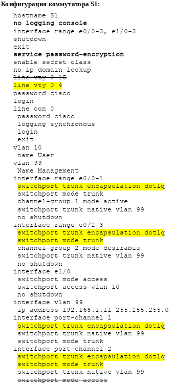

# Агрегация соединений
# Лабораторная работа №3. Поиск и устранение неполадок в работе EtherChannel.

### Топология


### Таблица адресации

Устройство | Интерфейс | IP-адрес | Маска подсети
---- | ---- | ---- | ----
S1 | VLAN 99 | 192.168.1.11 | 255.255.255.0
S2 | VLAN 99 | 192.168.1.12 | 255.255.255.0
S3 | VLAN 99 | 192.168.1.13 | 255.255.255.0
PC-A | NIC | 192.168.10.1 | 255.255.255.0
PC-B | NIC | 192.168.10.2 | 255.255.255.0
PC-C | NIC | 192.168.10.3 | 255.255.255.0

### Назначения сети VLAN

VLAN | Имя
---- | ----
10 | User
99 | Управление

### Задачи
Часть 1. Построение сети и загрузка настроек устройств
Часть 2. Отладка EtherChannel

### Часть 1. Построение сети и загрузка настроек устройств


Настройка роутеров согласно методическому пособию.

<details>
 <summary>Настройка S1</summary>

``` bash
S1(config)#hostname S1
S1(config)#interface range e0/0-3, e1/0-3
S1(config-if-range)#shutdown
S1(config-if-range)#exit
S1(config)#enable secret class
S1(config)#no ip domain lookup
S1(config)#line vty 0 4
S1(config-line)#password cisco
S1(config-line)#login
S1(config-line)#line con 0
S1(config-line)# password cisco
S1(config-line)# logging synchronous
S1(config-line)# login
S1(config-line)# exit
S1(config)#vlan 10
S1(config-vlan)# name User
S1(config-vlan)#vlan 99
S1(config-vlan)# Name Management
S1(config-vlan)#interface range e0/0-1
S1(config-if-range)# switchport mode trunk
Command rejected: An interface whose trunk encapsulation is "Auto" can not be configured to "trunk" mode.
% Range command terminated because it failed on Ethernet0/0
S1(config-if-range)# channel-group 1 mode active
S1(config-if-range)# switchport trunk native vlan 99
S1(config-if-range)# no shutdown
S1(config-if-range)#interface range e0/2-3
S1(config-if-range)# channel-group 2 mode desirable
S1(config-if-range)# switchport trunk native vlan 99
S1(config-if-range)# no shutdown
S1(config-if-range)#interface e1/0
S1(config-if)# switchport mode access
S1(config-if)# switchport access vlan 10
S1(config-if)# no shutdown
S1(config-if)#interface vlan 99
S1(config-if)# ip address 192.168.1.11 255.255.255.0
S1(config-if)#interface port-channel 1
S1(config-if)# switchport trunk native vlan 99
S1(config-if)# switchport mode trunk
Command rejected: An interface whose trunk encapsulation is "Auto" can not be configured to "trunk" mode.
S1(config-if)#interface port-channel 2
S1(config-if)# switchport trunk native vlan 99
S1(config-if)# switchport mode access
```
</details>
<details>
 <summary>Настройка S2</summary>

``` bash

```
</details>
<details>
 <summary>Настройка S3</summary>

``` bash

```
</details>

### Часть 2. Поиск и устранение неисправностей в работе EtherChannel

##### *Шаг 1. Выполните поиск и устранение неполадок в работе маршрутизатора S1*

</details>
<details>
 <summary>Агрегированные каналы работают, как транковые порты?</summary>

``` bash
S1#sh int e0/0 trunk

Port        Mode             Encapsulation  Status        Native vlan
Et0/0       auto             negotiate      not-trunking  99

S1#sh int e0/1 trunk

Port        Mode             Encapsulation  Status        Native vlan
Et0/1       auto             negotiate      not-trunking  99

S1#sh int e0/2 trunk

Port        Mode             Encapsulation  Status        Native vlan
Et0/2       auto             negotiate      not-trunking  99

S1#sh int e0/3 trunk

Port        Mode             Encapsulation  Status        Native vlan
Et0/3       auto             negotiate      not-trunking  99

```
</details>
<details>
 <summary>Входят ли интерфейсы в состав соответствующего агрегированного канала?</summary>

``` bash
S1#sh etherchannel summary 
Flags:  D - down        P - bundled in port-channel
        I - stand-alone s - suspended
        H - Hot-standby (LACP only)
        R - Layer3      S - Layer2
        U - in use      f - failed to allocate aggregator

        M - not in use, minimum links not met
        u - unsuitable for bundling
        w - waiting to be aggregated
        d - default port


Number of channel-groups in use: 2
Number of aggregators:           2

Group  Port-channel  Protocol    Ports
------+-------------+-----------+-----------------------------------------------
1      Po1(SD)         LACP      Et0/0(s)    Et0/1(s)    
2      Po2(SD)         PAgP      Et0/2(s)    Et0/3(s)  
```
</details>

Видим, наличие агрегированных каналов Po1 (LACP) и Po2 (PAgP), но они в состоянии **down**.

<details>
 <summary>Просмотр конфигурации агрегированных интерфейсов</summary>

``` bash
S1#show run interface Port-channel 1
Building configuration...

interface Port-channel1
 switchport trunk native vlan 99
end

S1#show run interface Port-channel 2

interface Port-channel2
 switchport trunk native vlan 99
 switchport mode access
end
```
</details>
<details>
 <summary>Выявленные ошибки и их исправление</summary>

``` bash
1. Ошибка в строке настройке консоли "line vty 0 15" Всего 5 консолей 0-4. + Ещё бы включил шифрование паролей.
2. Транковые магистрали не поднялись из-за несогласованности портов. 
Добавил команду "switchport trunk encapsulation dot1q"
3. Интерфейс Po2 настроен как порт доступа. Перенастроил в транк.
В результате выполненных действий интерфейс Po1 остался в неактивном режиме (SD), а Po2 перешёл в работоспособное состояние (SU). Интерфейс Po1 не поднялся по причине рассогласованности режимов etherchannel
Po1 S1 (active) <-> Po1 S2 (desirable).
Изменил режим etherchannel Po1 S2 на "passive"
```
</details>
<details>
 <summary>Просмотр исправлений конфига для S1</summary>



</details>

##### *Шаг 2-3. Выполните поиск и устранение неполадок в работе маршрутизаторах S2 и S3*

Ниже приведены исправленные версии настроек коммутаторов.

<details>
 <summary>Просмотр исправлений конфига для S2</summary>
 


</details>
<details>
 <summary>Просмотр исправлений конфига для S3</summary>
 


</details>


