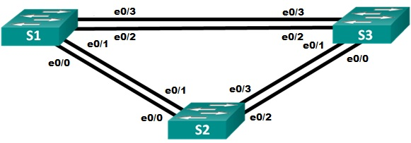
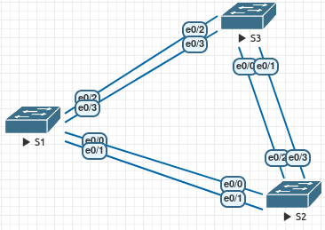

# Избыточность локальных сетей. STP
# Лабораторная работа №3. Развертывание коммутируемой сети с резервными каналами.

### Схема сети



### Таблица адресации
Устройство | Интерфейс | IP-адрес | Маска подсети
----- | ----- | ----- | -----
S1 | VLAN 1 | 192.168.1.1 | 255.255.255.0
S2 | VLAN 1 | 192.168.1.2 | 255.255.255.0
S3 | VLAN 1 | 192.168.1.3 | 255.255.255.0

### Задание:
#### [Часть 1. Создание сети и настройка основных параметров устройства](README.md#часть-1-создание-сети-и-настройка-основных-параметров-устройства-1)
#### [Часть 2. Выбор корневого моста](README.md#часть-2-выбор-корневого-моста)
#### [Часть 3. Наблюдение за процессом выбора протоколом STP порта, исходя из стоимости портов](README.md#часть-3-наблюдение-за-процессом-выбора-протоколом-stp-порта-исходя-из-стоимости-портов)
#### [Часть 4. Наблюдение за процессом выбора протоколом STP порта, исходя из приоритета портов](README.md#часть-4-наблюдение-за-процессом-выбора-протоколом-stp-порта-исходя-из-приоритета-портов)

### Решение:
#### Часть 1. Создание сети и настройка основных параметров устройства

*Шаг 1: Создать сеть согласно топологии.*

Подключили устройства, как показано в топологии, и подсоединили необходимые кабели.



*Шаг 2. Выполнить инициализацию и перезагрузку коммутаторов.*

*Шаг 3. Настроить базовые параметры каждого коммутатора.*
  
Пример для S1

Отключить поиск DNS и присвоить имена устройствам в соответствии с топологией.
``` bash
Switch(config)#hostname S1
S1(config)#no ip domain-lookup
S1(config)#exit
S1#wr
```
Назначить **class** в качестве зашифрованного пароля доступа к привилегированному режиму.
``` bash
S1(config)#service password-encryption 
S1(config)#enable secret class
```
Назначить **cisco** в качестве паролей консоли и VTY и активируйте вход для консоли и VTY каналов. Настроить _logging synchronous_ для консольного канала. Настроить автовыход при бездействии 5 минут. 

назначение пароля для _console_
``` bash
S1(config)#line console 0
S1(config-line)#password cisco
S1(config-line)#exec-timeout 5 0 
S1(config-line)#logging synchronous
S1(config-line)#login
S1(config-line)#exit
```
назначение пароля для _telnet_
``` bash
S1(config)#line vty 0 4
S1(config-line)#password cisco
S1(config-line)#exec-timeout 5 0 
S1(config-line)#logging synchronous
S1(config-line)#login
S1(config-line)#exit
```

Настроить баннерное сообщение дня (MOTD) для предупреждения пользователей о запрете несанкционированного доступа.
``` bash
S1(config)#banner motd #Enter password for access#
```
Задать IP-адрес, указанный в таблице адресации для VLAN 1 на всех коммутаторах.
``` bash
S1#conf t
S1(config)#int vlan 1
S1(config)#ip address 192.168.1.1 255.255.255.0
S1(config)#exit
S1#copy running-config startup-config
```


Аналогично настраиваем коммутаторы S2 и S3.

*Шаг 4. Проверить связь.*

Проверть способность компьютеров обмениваться эхо-запросами.
Успешно ли выполняется эхо-запрос от коммутатора S1 на коммутатор S2?

Успешно ли выполняется эхо-запрос от коммутатора S1 на коммутатор S3?

Успешно ли выполняется эхо-запрос от коммутатора S2 на коммутатор S3?

Выполняйте отладку до тех пор, пока ответы на все вопросы не будут положительными.

Ответ: Чтобы проходили пинги, необходимо включить (активировать) интерфейсы Vlan1 и порты с e0/0 по e0/3 на всех коммутаторах.

#### Часть 2. Выбор корневого моста

