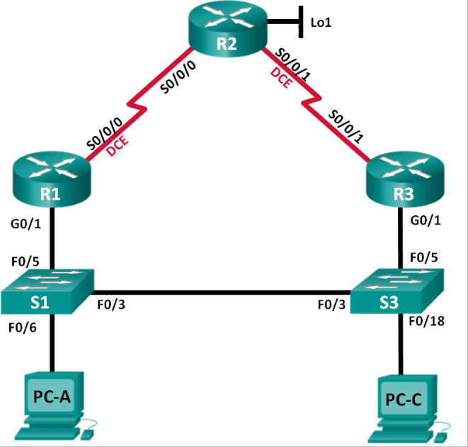
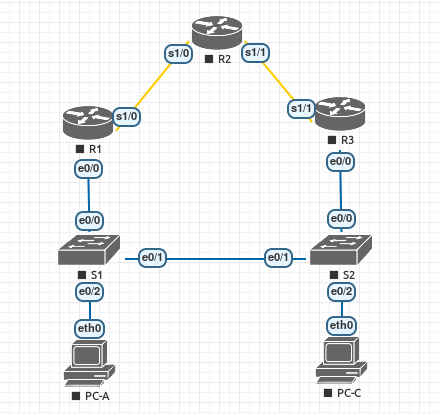
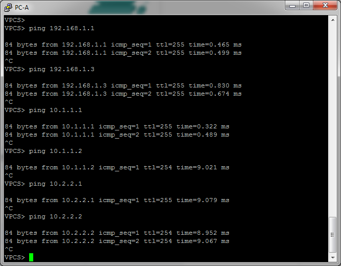
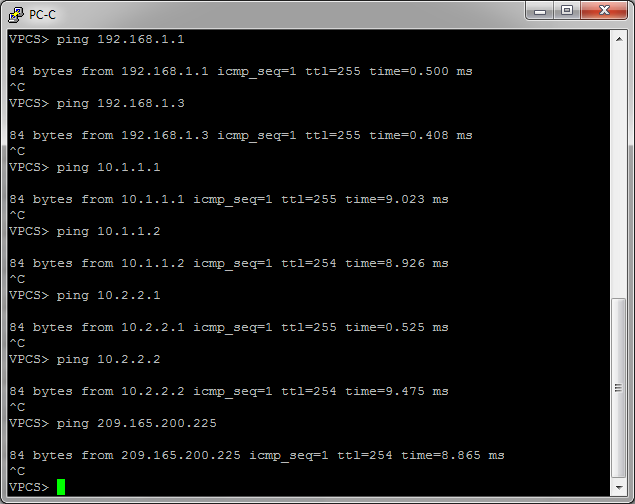

# Исследование работы протоколов избыточности шлюза HSRP, GLBP.
# Лабораторная работа №4. Настройка HSRP.

### Топология


### Таблица адресации

<table>
  <tr>
    <th>Устройство</th>
    <th>Интерфейс</th>
    <th>IP-адрес</th>
    <th>Маска подсет</th>
    <th>Шлюз по умолчанию</th>
  </tr>
  <tr>
    <td rowspan="2">R1</td>
    <td>G0/1</td>
    <td>192.168.1.1</td>
    <td>255.255.255.0</td>
    <td> - </td>
  </tr>
  <tr>
    <td>S0/0/0 (DCE)</td>
    <td>10.1.1.1</td>
    <td>255.255.255.252</td>
    <td> - </td>
  </tr>
  <tr>
    <td rowspan="3">R2</td>
    <td>S0/0/0</td>
    <td>10.1.1.2</td>
    <td>255.255.255.252</td>
    <td> - </td>
  </tr>
  <tr>
    <td>S0/0/1 (DCE)</td>
    <td>10.2.2.2</td>
    <td>255.255.255.252</td>
    <td> - </td>
  </tr>
  <tr>
    <td>Lo1</td>
    <td>209.165.200.225</td>
    <td>255.255.255.224</td>
    <td> - </td>
  </tr>
  <tr>
    <td rowspan="2">R3</td>
    <td>G0/1</td>
    <td>192.168.1.3</td>
    <td>255.255.255.0</td>
    <td> - </td>
  </tr>
  <tr>
    <td>S0/0/1</td>
    <td>10.2.2.1</td>
    <td>255.255.255.252</td>
    <td> - </td>
  </tr>
  <tr>
    <td>S1</td>
    <td>VLAN 1</td>
    <td>192.168.1.11</td>
    <td>255.255.255.0</td>
    <td>192.168.1.1</td>
  </tr>
  <tr>
    <td>S2</td>
    <td>VLAN 1</td>
    <td>192.168.1.13</td>
    <td>255.255.255.0</td>
    <td>192.168.1.3</td>
  </tr>
  <tr>
    <td>PC-A</td>
    <td>NIC</td>
    <td>192.168.1.31</td>
    <td>255.255.255.0</td>
    <td>192.168.1.1</td>
  </tr>
  <tr>
    <td>PC-C</td>
    <td>NIC</td>
    <td>192.168.1.33</td>
    <td>255.255.255.0</td>
    <td>192.168.1.3</td>
  </tr>
</table>


### Задание:
#### [Часть 1. Построение сети и проверка соединения](README.md#часть-1построение-сети-и-проверка-связи)
- ###### [создать сеть согласно топологии](README.md#шаг-1-создать-сеть-согласно-топологии)
- ###### [настроить узлы ПК](README.md#шаг-2-настроить-узлы-пк)
- ###### [выполнить инициализацию и перезагрузку маршрутизатора и коммутаторов](README.md#шаг-3-выполнить-инициализацию-иперезагрузку-маршрутизатора-икоммутаторов)
- ###### [произвести базовую настройку маршрутизаторов](README.md#шаг-4-произвести-базовую-настройку-маршрутизаторов)
- ###### [настроить базовые параметры каждого коммутатора](README.md#шаг-5-произвести-базовую-настройку-коммутаторов)
- ###### [проверьть подключение между PC-A и PC-C](README.md#шаг-6-проверить-подключение-между-pc-a-иpc-c)
- ###### [настройть маршрутизацию](README.md#шаг-7-настроить-маршрутизацию)
- ###### [проверить подключение](README.md#шаг-8проверить-подключение)

#### [Часть 2. Настройка обеспечения избыточности на первом хопе с помощью HSRP](README.md#часть-2настроить-обеспечение-избыточности-на-первом-хопе-с-помощью-hsrp)

- ###### [определить путь интернет-трафика для PC-A и PC-C](README.md#шаг-1определить-путь-интернет-трафика-для-pc-a-и-pc-c)
- ###### [запустить сеанс эхо-тестирования на PC-A и разорвать соединение между S1 и R1](README.md#шаг-2запустить-сеанс-эхо-тестирования-на-pc-a-и-разорвать-соединение-между-s1-и-r1)
- ###### [настроить HSRP на R1 и R3](README.md#шаг-3настроить-HSRP-на-r1-и-r3)
- ###### [запустить сеанс эхо-тестирования на PC-A и разорвать соединение с коммутатором, подключенным к активному маршрутизатору HSRP (R1)](README.md#шаг-4запустить-сеанс-эхо-тестирования-на-pc-c-и-разорвать-соединение-с-коммутатором-подключенным-к-активному-маршрутизатору-hsrp-r1)
- ###### [проверить настройки HSRP на маршрутизаторах R1 и R3](README.md#шаг-5проверить-настройки-HSRP-на-маршрутизаторах-r1-и-r3)
- ###### [измененить приоритеты HSRP](README.md#шаг-6измененить-приоритеты-hsrp)

#### [Вопросы для повторения](README.md#вопросы-для-повторения-1)
#### [Конфигурационные файлы ](README.md#конфигурационные-файлы-здесь)

### Решение:

### Часть 1:	Построение сети и проверка связи
##### *Шаг 1. Создать сеть согласно топологии.*

Подключить устройства, как показано в топологии, и подсоединить необходимые кабели.



##### Таблица адресации

<table>
  <tr>
    <th>Устройство</th>
    <th>Интерфейс</th>
    <th>IP-адрес</th>
    <th>Маска подсет</th>
    <th>Шлюз по умолчанию</th>
  </tr>
  <tr>
    <td rowspan="2">R1</td>
    <td>e0/0</td>
    <td>192.168.1.1</td>
    <td>255.255.255.0</td>
    <td> - </td>
  </tr>
  <tr>
    <td>S1/0 (DCE)</td>
    <td>10.1.1.1</td>
    <td>255.255.255.252</td>
    <td> - </td>
  </tr>
  <tr>
    <td rowspan="3">R2</td>
    <td>S1/0</td>
    <td>10.1.1.2</td>
    <td>255.255.255.252</td>
    <td> - </td>
  </tr>
  <tr>
    <td>S1/1 (DCE)</td>
    <td>10.2.2.2</td>
    <td>255.255.255.252</td>
    <td> - </td>
  </tr>
  <tr>
    <td>Lo1</td>
    <td>209.165.200.225</td>
    <td>255.255.255.224</td>
    <td> - </td>
  </tr>
  <tr>
    <td rowspan="2">R3</td>
    <td>e0/0</td>
    <td>192.168.1.3</td>
    <td>255.255.255.0</td>
    <td> - </td>
  </tr>
  <tr>
    <td>S1/1</td>
    <td>10.2.2.1</td>
    <td>255.255.255.252</td>
    <td> - </td>
  </tr>
  <tr>
    <td>S1</td>
    <td>VLAN 1</td>
    <td>192.168.1.11</td>
    <td>255.255.255.0</td>
    <td>192.168.1.1</td>
  </tr>
  <tr>
    <td>S2</td>
    <td>VLAN 1</td>
    <td>192.168.1.13</td>
    <td>255.255.255.0</td>
    <td>192.168.1.3</td>
  </tr>
  <tr>
    <td>PC-A</td>
    <td>NIC</td>
    <td>192.168.1.31</td>
    <td>255.255.255.0</td>
    <td>192.168.1.1</td>
  </tr>
  <tr>
    <td>PC-C</td>
    <td>NIC</td>
    <td>192.168.1.33</td>
    <td>255.255.255.0</td>
    <td>192.168.1.3</td>
  </tr>
</table>

##### *Шаг 2. Настроить узлы ПК.*

Настройки PC-A
``` bash
VPCS> ip 192.168.1.31/24 192.168.1.1
Checking for duplicate address...
PC1 : 192.168.1.31 255.255.255.0 gateway 192.168.1.1
```

Настройки PC-C
``` bash
VPCS> ip 192.168.1.33/24 192.168.1.3
Checking for duplicate address...
PC1 : 192.168.1.33 255.255.255.0 gateway 192.168.1.3
```
##### *Шаг 3. Выполнить инициализацию и перезагрузку маршрутизатора и коммутаторов.*

##### *Шаг 4. Произвести базовую настройку маршрутизаторов.*

- Отключите поиск DNS.
- Присвойте имена устройствам в соответствии с топологией.
- Настройте IP-адреса для маршрутизаторов, указанных в таблице адресации.
- Установите тактовую частоту на 128000 для всех последовательных интерфейсов маршрутизатора DCE.
- Назначьте class в качестве зашифрованного пароля доступа к привилегированному режиму.
- Назначьте cisco в качестве пароля консоли и VTY и включите запрос пароля при подключении.
- Настройте logging synchronous, чтобы сообщения от консоли не могли прерывать ввод команд.
- Скопируйте текущую конфигурацию в файл загрузочной конфигурации.
<details>
 <summary>Пример для S1</summary>

```
Switch>ena
Switch#conf t
Switch(config)#hostname S1
S1(config)#no ip domain-lookup
S1(config)#service password-encryption
S1(config)#enable secret class
S1(config)#ip default-gateway 192.168.1.1
S1(config)#line console 0
S1(config-line)#password cisco
S1(config-line)#exec-timeout 5 0
S1(config-line)#logging synchronous
S1(config-line)#login
S1(config-line)#exit
S1(config)#line vty 0 4
S1(config-line)#password cisco
S1(config-line)#exec-timeout 5 0
S1(config-line)#logging synchronous
S1(config-line)#login
S1(config-line)#exit
S1(config)#exit
S1#wr
```
</details>

##### *Шаг 5. Произвести базовую настройку коммутаторов*
<details>
 <summary>Пример для R1</summary>

```
R3#conf t
R3(config)#hostname R3
R3(config)#no ip domain-lookup
R3(config)#int s1/1
R3(config-if)#ip address 10.2.2.1 255.255.255.252
R3(config-if)#no shutdown
R3(config-if)#exit
R3(config)#int e0/0
R3(config-if)#ip address 192.168.1.3 255.255.255.0
R3(config-if)#no shutdown
R3(config-if)#service password-encryption 
R3(config)#enable secret class
R3(config)#line console 0
R3(config-line)#password cisco
R3(config-line)#exec-timeout 5 0
R3(config-line)#logging synchronous
R3(config-line)#login
R3(config-line)#exit
R3(config)#line vty 0 4
R3(config-line)#password cisco
R3(config-line)#exec-timeout 5 0
R3(config-line)#logging synchronous
R3(config-line)#login
R3(config-line)#exit
R3(config)#exit
R3#wr
```
</details>

##### *Шаг 6. Проверить подключение между PC-A и PC-C.*
Отправьте ping-запрос с компьютера PC-A на компьютер PC-C. Удалось ли получить ответ?
> Команда пинг с PC-A до PC-C прошла успешно.

Если команды ping завершились неудачно и связь установить не удалось, исправьте ошибки в основных настройках устройства.

##### *Шаг 7. Настроить маршрутизацию.*

###### a. Настроить RIP версии 2 на всех маршрутизаторах. Добавить в процесс RIP все сети, кроме 209.165.200.224/27.

Настройка R1:
``` bash
R1#conf t
R1(config)#router rip
R1(config-router)#version 2
R1(config-router)#network 192.168.1.1
R1(config-router)#network 10.1.1.1
```
Настройка R2:
``` bash
R2#conf t
R2(config)#router rip
R2(config-router)#version 2
R2(config-router)#network 10.1.1.2
R2(config-router)#network 10.2.2.2
```
Настройка R3:
``` bash
R3#conf t
R3(config)#router rip
R3(config-router)#version 2
R3(config-router)#network 192.168.1.3
R3(config-router)#network 10.2.2.1
```

###### b. Настроить маршрут по умолчанию на маршрутизаторе R2 с использованием Lo1 в качестве интерфейса выхода в сеть 209.165.200.224/27.
``` bash
R2#conf t
R2(config)#ip route 0.0.0.0 0.0.0.0 loopback1
%Default route without gateway, if not a point-to-point interface, may impact performance
```
###### c.	На маршрутизаторе R2 используйте следующие команды для перераспределения маршрута по умолчанию в процесс RIP.

``` bash
R2#conf t
R2(config)#router rip
R2(config-router)#default-information originate
```

##### *Шаг 8:	Проверить подключение*

###### a.	Необходимо получить ответ на ping-запросы с компьютера PC-A от каждого интерфейса на маршрутизаторах R1, R2 и R3, а также от компьютера PC-C. Удалось ли получить все ответы?

> Ответ: Да, удалось получить ответы на запросы ping.


###### b.	Необходимо получить ответ на ping-запросы с компьютера PC-C от каждого интерфейса на маршрутизаторах R1, R2 и R3, а также от компьютера PC-A. Удалось ли получить все ответы? 

> Ответ: Да, удалось получить ответы на запросы ping.


### Часть 2:	Настроить обеспечение избыточности на первом хопе с помощью HSRP

##### *Шаг 1:	Определить путь интернет-трафика для PC-A и PC-C.*

###### a. Определить путь трафика от PC-A до R2 (209.165.200.225):

``` bash
VPCS> trace 209.165.200.225
trace to 209.165.200.225, 8 hops max, press Ctrl+C to stop
 1   192.168.1.1   0.342 ms  0.306 ms  0.236 ms
 2   *10.1.1.2   8.827 ms (ICMP type:3, code:3, Destination port unreachable)  *
 ```
 > трафик от PC-A идёт по цепочке
 192.168.1.31 (PC-A) -> 192.168.1.1 (R1) -> 10.1.1.2 (R2) -> 209.165.200.225 (R2)

###### b. Определить путь трафика от PC-C до R2 (209.165.200.225):

``` bash
VPCS> trace 209.165.200.225
trace to 209.165.200.225, 8 hops max, press Ctrl+C to stop
 1   192.168.1.3   0.376 ms  0.234 ms  0.263 ms
 2   *10.2.2.2   5.123 ms (ICMP type:3, code:3, Destination port unreachable)  *
```
> трафик от PC-C идёт по цепочке
 192.168.1.33 (PC-C) -> 192.168.1.3 (R3) -> 10.2.2.2 (R2) -> 209.165.200.225 (R2)

 ##### *Шаг 2:	Запустить сеанс эхо-тестирования на PC-A и разорвать соединение между S1 и R1.*

 ###### a. Запустить команду _ping 209.165.200.225 -t_ с компьютеров PC-A и PC-C.

 ``` bash
 VPCS> ping 209.165.200.225 -t
 ```

 ###### b. Поочерёдно отключить интерфейсы e0/0 на коммутаторах S1 и S3.

``` bash
S1#conf t
S1(config)#int e0/0
S1(config-if)#no shut
```
Что произошло с трафиком эхо-запросов?
> Ответ: ответы на эхо-зпросы прекратились на обоих ПК.

###### с. Повторно активировать интерфейсы e0/0 на S1 и S3, соответственно. Повторно отправить эхо-запросы на 209.165.200.225 с компьютеров PC-A и PC-C, чтобы убедиться в том, что подключение восстановлено.

> Ответ: подключение восстановлено. Ответы на эхо-запросы приходят.

##### *Шаг 3:	Настроить HSRP на R1 и R3.*

В этом шаге вам предстоит настроить HSRP и изменить адрес шлюза по умолчанию на компьютерах PC-A, PC-C, S1 и коммутаторе S2 на виртуальный IP-адрес для HSRP.

**Изменённая таблица адресации**

<table>
  <tr>
    <th>Устройство</th>
    <th>Интерфейс</th>
    <th>IP-адрес</th>
    <th>Маска подсет</th>
    <th>Шлюз по умолчанию</th>
  </tr>
  
  <tr>
    <td>S1</td>
    <td>VLAN 1</td>
    <td>192.168.1.11</td>
    <td>255.255.255.0</td>
    <td rowspan="4">192.168.1.254</td>
  </tr>
  <tr>
    <td>S2</td>
    <td>VLAN 1</td>
    <td>192.168.1.13</td>
    <td>255.255.255.0</td>
    
  </tr>
  <tr>
    <td>PC-A</td>
    <td>NIC</td>
    <td>192.168.1.31</td>
    <td>255.255.255.0</td>
  </tr>
  <tr>
    <td>PC-C</td>
    <td>NIC</td>
    <td>192.168.1.33</td>
    <td>255.255.255.0</td>
  </tr>
</table>


###### a.	Настроить протокол HSRP на маршрутизаторе R1.

``` bash
R1(config)#interface e0/0
R1(config-if)#standby version 2
R1(config-if)#standby 1 ip 192.168.1.254
R1(config-if)#standby 1 priority 150
R1(config-if)#standby 1 preempt
```
###### b.	Настроить протокол HSRP на маршрутизаторе R3.
``` bash
R3(config)#interface e0/0
R3(config-if)#standby version 2
R3(config-if)#standby 1 ip 192.168.1.254
```
###### c.	Проверить HSRP, выполнив команду show standby на R1 и R3.
<details>
 <summary>Результат show standby на R1 и R3</summary>

```

```
R1:
```
R1#sh standby
Ethernet0/0 - Group 1 (version 2)
  State is Active
    2 state changes, last state change 00:12:01
  Virtual IP address is 192.168.1.254
  Active virtual MAC address is 0000.0c9f.f001
    Local virtual MAC address is 0000.0c9f.f001 (v2 default)
  Hello time 3 sec, hold time 10 sec
    Next hello sent in 2.432 secs
  Preemption enabled
  Active router is local
  Standby router is 192.168.1.3, priority 100 (expires in 10.608 sec)
  Priority 150 (configured 150)
  Group name is "hsrp-Et0/0-1" (default)

```
R3:
```
R3#show standby
Ethernet0/0 - Group 1 (version 2)
  State is Standby
    1 state change, last state change 00:05:17
  Virtual IP address is 192.168.1.254
  Active virtual MAC address is 0000.0c9f.f001
    Local virtual MAC address is 0000.0c9f.f001 (v2 default)
  Hello time 3 sec, hold time 10 sec
    Next hello sent in 1.984 secs
  Preemption disabled
  Active router is 192.168.1.1, priority 150 (expires in 8.560 sec)
    MAC address is aabb.cc00.1000
  Standby router is local
  Priority 100 (default 100)
  Group name is "hsrp-Et0/0-1" (default)

```
</details>

#### Вопросы
- Какой маршрутизатор является активным?
> R1 - active \
R3 - standby

- Какой MAC-адрес используется для виртуального IP-адреса?
>  0000.0c9f.f001

- Какой IP-адрес и приоритет используются для резервного маршрутизатора?
> Standby router is 192.168.1.3, priority 100

###### d.	Использовать команду _show standby brief_ на R1 и R3, чтобы просмотреть сводку состояния HSRP.

<details>
 <summary>Результаты show standby brief </summary>

```
```
R1:
```
R1#show standby brief
                     P indicates configured to preempt.
                     |
Interface   Grp  Pri P State   Active          Standby         Virtual IP
Et0/0       1    150 P Active  local           192.168.1.3     192.168.1.254
```
R3:
```
R3#show standby brief
                     P indicates configured to preempt.
                     |
Interface   Grp  Pri P State   Active          Standby         Virtual IP
Et0/0       1    100   Standby 192.168.1.1     local           192.168.1.254

```  
</details>  

###### e. Изменить адрес шлюза по умолчанию для PC-A, PC-C, S1 и S3 на 192.168.1.254.

``` bash
S1#conf t
S1(config)#ip default-gateway 192.168.1.254
```

###### f.	Проверьте новые настройки. Отправьте эхо-запрос с PC-A и с PC-C на loopback-адрес маршрутизатора R2. Успешно ли выполнены эхо-запросы?
> Да, успешно.

##### *Шаг 4:	Запустить сеанс эхо-тестирования на PC-A и разорвать соединение с коммутатором, подключенным к активному маршрутизатору HSRP (R1).*
Во время отправки эхо-запроса на коммутаторе S1 выключите интерфейс e0/0.

Что произошло с трафиком эхо-запросов?
> После отключения интерфейса S1 e0/0 на некоторое время прервались эхо-ответы на ping
<details>
 <summary>Результат ping c PC-A</summary>

```
VPCS> ping 209.165.200.225 -t

84 bytes from 209.165.200.225 icmp_seq=1 ttl=254 time=8.787 ms
84 bytes from 209.165.200.225 icmp_seq=2 ttl=254 time=9.085 ms
84 bytes from 209.165.200.225 icmp_seq=3 ttl=254 time=9.049 ms
84 bytes from 209.165.200.225 icmp_seq=4 ttl=254 time=9.049 ms
84 bytes from 209.165.200.225 icmp_seq=5 ttl=254 time=8.973 ms
84 bytes from 209.165.200.225 icmp_seq=6 ttl=254 time=9.400 ms
84 bytes from 209.165.200.225 icmp_seq=7 ttl=254 time=9.420 ms
84 bytes from 209.165.200.225 icmp_seq=8 ttl=254 time=7.753 ms
84 bytes from 209.165.200.225 icmp_seq=9 ttl=254 time=9.055 ms
84 bytes from 209.165.200.225 icmp_seq=10 ttl=254 time=8.985 ms
209.165.200.225 icmp_seq=11 timeout
209.165.200.225 icmp_seq=12 timeout
209.165.200.225 icmp_seq=13 timeout
209.165.200.225 icmp_seq=14 timeout
209.165.200.225 icmp_seq=15 timeout
84 bytes from 209.165.200.225 icmp_seq=16 ttl=254 time=9.084 ms
84 bytes from 209.165.200.225 icmp_seq=17 ttl=254 time=10.506 ms
84 bytes from 209.165.200.225 icmp_seq=18 ttl=254 time=9.143 ms
```
</details>

##### *Шаг 5:	Проверить настройки HSRP на маршрутизаторах R1 и R3.*

###### a.	Выполнить команду show standby brief на маршрутизаторах R1 и R3.
Какой маршрутизатор является активным? 

> Активным маршрутизатором является виртуальный маршрутизатор с IP:192.168.1.254
<details>
 <summary>R1#show standby brief</summary>

```
R1#show standby brief
                     P indicates configured to preempt.
                     |
Interface   Grp  Pri P State   Active          Standby         Virtual IP
Et0/0       1    150 P Active  local           unknown         192.168.1.254
```
</details>

<details>
 <summary>R1#show standby</summary>

```
R1#show standby
Ethernet0/0 - Group 1 (version 2)
  State is Active
    2 state changes, last state change 02:36:03
  Virtual IP address is 192.168.1.254
  Active virtual MAC address is 0000.0c9f.f001
    Local virtual MAC address is 0000.0c9f.f001 (v2 default)
  Hello time 3 sec, hold time 10 sec
    Next hello sent in 0.336 secs
  Preemption enabled
  Active router is local
  Standby router is unknown
  Priority 150 (configured 150)
  Group name is "hsrp-Et0/0-1" (default)
```
</details>
<details>
 <summary>R3#show standby brief</summary>

```
R3#show standby brief
                     P indicates configured to preempt.
                     |
Interface   Grp  Pri P State   Active          Standby         Virtual IP
Et0/0       1    100   Active  local           unknown         192.168.1.254
```
</details>
<details>
 <summary>R3#show standby</summary>

```
R3#show standby
Ethernet0/0 - Group 1 (version 2)
  State is Active
    2 state changes, last state change 01:55:09
  Virtual IP address is 192.168.1.254
  Active virtual MAC address is 0000.0c9f.f001
    Local virtual MAC address is 0000.0c9f.f001 (v2 default)
  Hello time 3 sec, hold time 10 sec
    Next hello sent in 0.896 secs
  Preemption disabled
  Active router is local
  Standby router is unknown
  Priority 100 (default 100)
  Group name is "hsrp-Et0/0-1" (default)

```
</details>

###### Повторно включить интерфейс e0/0 на S1. Какой маршрутизатор теперь является активным? Пояснить ответ.

> Маршрутизатор R1 имеет статус active, т.к. обладает бОльшим приоритетом (150) и у него установлен параметр preempt. Резервным является R3, его приоритет 100.
``` bash
R1#sh standby brief
                     P indicates configured to preempt.
                     |
Interface   Grp  Pri P State   Active          Standby         Virtual IP
Et0/0       1    150 P Active  local           192.168.1.3     192.168.1.254
```
```
R3#sh standby brief
                     P indicates configured to preempt.
                     |
Interface   Grp  Pri P State   Active          Standby         Virtual IP
Et0/0       1    100   Standby 192.168.1.1     local           192.168.1.254

```

##### *Шаг 6:	Измененить приоритеты HSRP.*

###### a.	Изменить приоритет HSRP на 200 на маршрутизаторе R3. Какой маршрутизатор является активным?

``` bash
R3(config)#int e0/0
R3(config-if)#standby 1 priority 200
```
> Активным по-прежнему остался R1

b.	Выполнить команду, чтобы сделать активным маршрутизатор R3 без изменения приоритета. Какую команду нужно использовать?

> Нужно использовать команду standby 1 preempt.
>- Вариант 1. Убрать параметр standby 1 preempt на R1, тогда R3 станет главным, т.к. приоритет у R3 окажется больше (200 против 150).
>- Вариант 2. Добавить команду standby 1 preempt на R3.

### Вопросы для повторения

Для чего в локальной сети может потребоваться избыточность?
> Избытычность в локальной сети нужна для обеспечения бесперебойной работы сети. Избыточность позволяет увеличить доступность устройств в топологии сети за счёт устранения единой точки отказа.
>- На уровне L2. Избыточность в коммутируемой сети обеспечивается посредством использования нескольких коммутаторов или нескольких каналов между коммутаторами. Протоколы этого уровня STP, PAgP или LACP защищают от петель, но не помогут при недоступности шлюза по-умолчанию.\
>- На уровне L3. При недоступности шлюз по-умолчанию доступа к другим подсетям будет невозможен. Для создания избыточности шлюза по-умолчанию используется протокол HSRP. Он создаёт на маршрутизаторах единый виртуальный ip-адрес.

#### Конфигурационные файлы [здесь](config/).