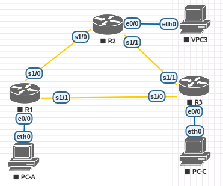
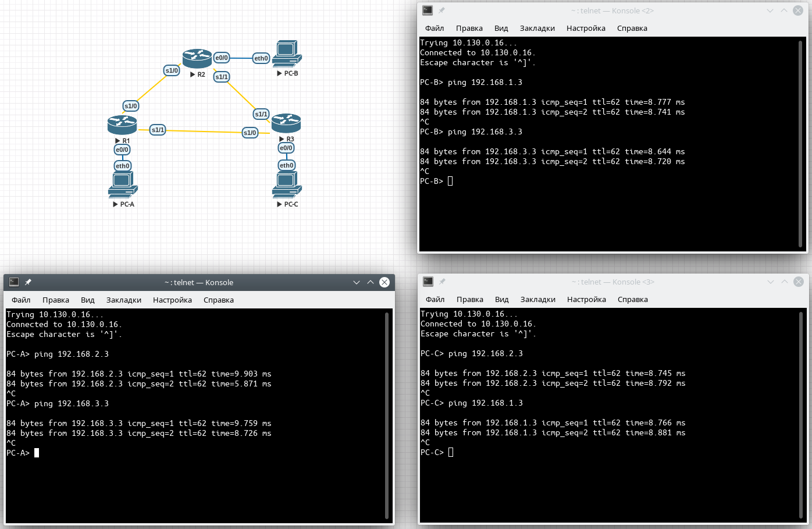

# Настройка базового протокола OSPFv2 для одной области
# Лабораторная работа №4. OSPF v2

### Задание:
#### Часть 1. [Создание сети и настройка основных параметров устройства](README.md#часть-1-создание-сети-инастройка-основных-параметров-устройства-1)

#### Часть 2. [Настройка и проверка маршрутизации OSPF](README.md#часть-2-настройка-ипроверка-маршрутизации-ospf-1)

#### Часть 3. [Изменение назначенных идентификаторов маршрутизаторов](README.md#часть-3-изменение-назначенных-идентификаторов-маршрутизаторов-1)

#### Часть 4. [Настройка пассивных интерфейсов OSPF](README.md#часть-4-настройка-пассивных-интерфейсов-ospf-1)

#### Часть 5. [Изменение метрик OSPF](README.md#часть-5-изменение-метрик-ospf-1)


### Решение:

### Часть 1. Создание сети и настройка основных параметров устройства

Создали стенд в eve-ng согласно топологии.
### Топология


### Таблица адресации

<table>
  <tr>
    <th>Устройство</th>
    <th>Интерфейс</th>
    <th>IP-адрес</th>
    <th>Маска подсети</th>
    <th>Шлюз по умолчанию</th>
  </tr>
  <tr>
    <td rowspan="3">R1</td>
    <td>E0/0</td>
    <td>192.168.1.1</td>
    <td>255.255.255.0</td>
    <td rowspan="9"></td>
  </tr>
  <tr>
    <td>S1/0 (DCE)</td>
    <td>192.168.12.1</td>
    <td>255.255.255.252</td>
  </tr>
  <tr>
    <td>S1/1</td>
    <td>192.168.13.1</td>
    <td>255.255.255.252</td>
  </tr>
  <tr>
    <td rowspan="3">R2</td>
    <td>E0/0</td>
    <td>192.168.2.1</td>
    <td>255.255.255.0</td>
  </tr>
  <tr>
    <td>S1/0</td>
    <td>192.168.12.2</td>
    <td>255.255.255.252</td>
  </tr>
  <tr>
    <td>S1/1 (DCE)</td>
    <td>192.168.23.1</td>
    <td>255.255.255.252</td>
  </tr>
  <tr>
    <td rowspan="3">R3</td>
    <td>E0/0</td>
    <td>192.168.3.1</td>
    <td>255.255.255.0</td>
  </tr>
  <tr>
    <td>S1/0 (DCE)</td>
    <td>192.168.13.2</td>
    <td>255.255.255.252</td>
  </tr>
  <tr>
    <td>S1/1</td>
    <td>192.168.23.2</td>
    <td>255.255.255.252</td>
  </tr>
  <tr>
    <td>PC-A</td>
    <td>NIC</td>
    <td>192.168.1.3</td>
    <td>255.255.255.0</td>
    <td>192.168.1.1</td>
  </tr>
  <tr>
    <td>PC-B</td>
    <td>NIC</td>
    <td>192.168.2.3</td>
    <td>255.255.255.0</td>
    <td>192.168.2.1</td>
  </tr>
  <tr>
    <td>PC-C</td>
    <td>NIC</td>
    <td>192.168.3.3</td>
    <td>255.255.255.0</td>
    <td>192.168.3.1</td>
  </tr>
</table>

Произвели базовую настройку маршрутизаторов.

<details>
 <summary>Настройка R1</summary>

``` bash
Router(config)#conf t
Enter configuration commands, one per line.  End with CNTL/Z.
Router(config)#hostname R1
R1(config)#no logging console
R1(config)#no ip domain-lookup
R1(config)#int s1/0
R1(config-if)#ip address 192.168.12.1 255.255.255.252
R1(config-if)#clock rate 128000
R1(config-if)#no shutdown
R1(config-if)#exit
R1(config)#
R1(config)#int s1/1
R1(config-if)#ip address 192.168.13.1 255.255.255.252
R1(config-if)#no shutdown
R1(config-if)#exit
R1(config)#
R1(config)#int e0/0
R1(config-if)#ip address 192.168.1.1 255.255.255.0
R1(config-if)#no shutdown
R1(config-if)#exit
R1(config)#
R1(config)#service password-encryption
R1(config)#enable secret class
R1(config)#line console 0
R1(config-line)#password cisco
R1(config-line)#exec-timeout 5 0
R1(config-line)#logging synchronous
R1(config-line)#login
R1(config-line)#exit
R1(config)#line vty 0 4
R1(config-line)#password cisco
R1(config-line)#exec-timeout 5 0
R1(config-line)#logging synchronous
R1(config-line)#login
R1(config-line)#exit
R1(config)#exit
R1#wr
Building configuration...
[OK]
R1#
```
</details>

<details>
 <summary>Настройка R2</summary>

``` bash
Router(config)#hostname R2
R2(config)#no logging console
R2(config)#no ip domain-lookup
R2(config)#int s1/0
R2(config-if)#ip address 192.168.12.2 255.255.255.252
R2(config-if)#no shutdown
R2(config-if)#exit
R2(config)#int s1/1
R2(config-if)#ip address 192.168.23.1 255.255.255.252
R2(config-if)#clock rate 128000
R2(config-if)#no shutdown
R2(config-if)#exit
R2(config)#int e0/0
R2(config-if)#ip address 192.168.2.1 255.255.255.0
R2(config-if)#no shutdown
R2(config-if)#exit
R2(config)#service password-encryption
R2(config)#enable secret class
R2(config)#line console 0
R2(config-line)#password cisco
R2(config-line)#exec-timeout 5 0
R2(config-line)#logging synchronous
R2(config-line)#login
R2(config-line)#exit
R2(config)#line vty 0 4
R2(config-line)#password cisco
R2(config-line)#exec-timeout 5 0
R2(config-line)#logging synchronous
R2(config-line)#login
R2(config-line)#exit
R2(config)#exit
R2#wr
Building configuration...
[OK]
R2#
```
</details>

<details>
 <summary>Настройка R3</summary>

``` bash
Router#conf t
Enter configuration commands, one per line.  End with CNTL/Z.
Router(config)#hostname R3
R3(config)#no logging console
R3(config)#no ip domain-lookup
R3(config)#int s1/0
R3(config-if)#ip address 192.168.13.2 255.255.255.252
R3(config-if)#clock rate 128000
R3(config-if)#no shutdown
R3(config-if)#exit
R3(config)#int s1/1
R3(config-if)#ip address 192.168.23.2 255.255.255.252
R3(config-if)#no shutdown
R3(config-if)#exit
R3(config)#int e0/0
R3(config-if)#ip address 192.168.3.1 255.255.255.0
R3(config-if)#no shutdown
R3(config-if)#exit
R3(config)#service password-encryption
R3(config)#enable secret class
R3(config)#line console 0
R3(config-line)#password cisco
R3(config-line)#exec-timeout 5 0
R3(config-line)#logging synchronous
R3(config-line)#login
R3(config-line)#exit
R3(config)#line vty 0 4
R3(config-line)#password cisco
R3(config-line)#exec-timeout 5 0
R3(config-line)#logging synchronous
R3(config-line)#login
R3(config-line)#exit
R3(config)#exit
R3#wr
Building configuration...
[OK]
R3#wr

```
</details>

<details>
 <summary>Настройка компьютеров</summary>

Настройка PC-A
``` bash
VPCS> set pcname PC-A
PC-A> ip 192.168.1.3/24 192.168.1.1
Checking for duplicate address...
PC1 : 192.168.1.3 255.255.255.0 gateway 192.168.1.1
```
Настройка PC-B
``` bash
VPCS> set pcname PC-B
PC-B> ip 192.168.2.3/24 192.168.2.1
Checking for duplicate address...
PC1 : 192.168.2.3 255.255.255.0 gateway 192.168.2.1
```
Настройка PC-C
``` bash
VPCS> set pcname PC-C
PC-C> ip 192.168.3.3/24 192.168.3.1
Checking for duplicate address...
PC1 : 192.168.3.3 255.255.255.0 gateway 192.168.3.1

```
</details>

<details>
 <summary>Проверка доступности маршрутизаторов</summary>


``` bash
```

Доступность R1->R2 и R1->R3
``` bash
R1>ping 192.168.12.2

Success rate is 100 percent (5/5), round-trip min/avg/max = 8/8/9 ms

R1>ping 192.168.13.2

Success rate is 100 percent (5/5), round-trip min/avg/max = 8/8/9 ms
R1>
```

Доступность R2->R3
``` bash
R2>ping 192.168.23.2

Success rate is 100 percent (5/5), round-trip min/avg/max = 8/8/9 ms
```
</details>

### Часть 2. Настройка и проверка маршрутизации OSPF

Настроить протокол OSPF на маршрутизаторах.

<details>
 <summary>Настройка R1</summary>

``` bash
R1#conf t
Enter configuration commands, one per line.  End with CNTL/Z.
R1(config)#router ospf 1
R1(config-router)#network 192.168.1.0 0.0.0.255 area 0
R1(config-router)#network 192.168.12.0 0.0.0.3 area 0
R1(config-router)#network 192.168.13.0 0.0.0.3 area 0
R1(config-router)#exit
R1(config)#exit
R1#wr
```
</details>
<details>
 <summary>Настройка R2</summary>

``` bash
R2#conf t
Enter configuration commands, one per line.  End with CNTL/Z.
R2(config)#router ospf 1
R2(config-router)#network 192.168.2.0 0.0.0.255 area 0
R2(config-router)#network 192.168.12.0 0.0.0.3 area 0
R2(config-router)#network 192.168.23.0 0.0.0.3 area 0
R2(config-router)#exit
R2(config)#exit
R2#wr
```
</details>

<details>
 <summary>Настройка R3</summary>

``` bash
R3#conf t
Enter configuration commands, one per line.  End with CNTL/Z.
R3(config)#router ospf 1
R3(config-router)#network 192.168.3.0 0.0.0.255 area 0
R3(config-router)#network 192.168.13.0 0.0.0.3 area 0
R3(config-router)#network 192.168.23.0 0.0.0.3 area 0
R3(config-router)#exit
R3(config)#exit
R3#wr
```
</details>

Проверить информацию о соседних устройствах и маршрутизации OSPF.


<details>
 <summary>Таблица маршрутизации и соседи R1</summary>

``` bash
```
##### #show ip ospf neighbor
``` bash
R1#show ip ospf neighbor

Neighbor ID     Pri   State           Dead Time   Address         Interface
192.168.23.2      0   FULL/  -        00:00:35    192.168.13.2    Serial1/1
192.168.23.1      0   FULL/  -        00:00:38    192.168.12.2    Serial1/0
```
##### #show ip route
``` bash
R1#show ip route

Gateway of last resort is not set

      192.168.1.0/24 is variably subnetted, 2 subnets, 2 masks
C        192.168.1.0/24 is directly connected, Ethernet0/0
L        192.168.1.1/32 is directly connected, Ethernet0/0
O     192.168.2.0/24 [110/74] via 192.168.12.2, 00:16:13, Serial1/0
O     192.168.3.0/24 [110/74] via 192.168.13.2, 00:12:01, Serial1/1
      192.168.12.0/24 is variably subnetted, 2 subnets, 2 masks
C        192.168.12.0/30 is directly connected, Serial1/0
L        192.168.12.1/32 is directly connected, Serial1/0
      192.168.13.0/24 is variably subnetted, 2 subnets, 2 masks
C        192.168.13.0/30 is directly connected, Serial1/1
L        192.168.13.1/32 is directly connected, Serial1/1
      192.168.23.0/30 is subnetted, 1 subnets
O        192.168.23.0 [110/128] via 192.168.13.2, 00:11:51, Serial1/1
                      [110/128] via 192.168.12.2, 00:16:13, Serial1/0
```
##### #show ip protocols
``` bash
R1#show ip protocols
*** IP Routing is NSF aware ***

Routing Protocol is "ospf 1"
  Outgoing update filter list for all interfaces is not set
  Incoming update filter list for all interfaces is not set
  Router ID 192.168.13.1
  Number of areas in this router is 1. 1 normal 0 stub 0 nssa
  Maximum path: 4
  Routing for Networks:
    192.168.1.0 0.0.0.255 area 0
    192.168.12.0 0.0.0.3 area 0
    192.168.13.0 0.0.0.3 area 0
  Routing Information Sources:
    Gateway         Distance      Last Update
    192.168.23.2         110      00:13:04
    192.168.23.1         110      00:17:26
  Distance: (default is 110)
```
</details>

<details>
 <summary>Таблица маршрутизации и соседи R2</summary>

``` bash
```
##### #show ip ospf neighbor
``` bash
R2#show ip ospf neighbor

Neighbor ID     Pri   State           Dead Time   Address         Interface
192.168.23.2      0   FULL/  -        00:00:37    192.168.23.2    Serial1/1
192.168.13.1      0   FULL/  -        00:00:35    192.168.12.1    Serial1/0
```
##### #show ip route
``` bash
R2#show ip route

Gateway of last resort is not set

O     192.168.1.0/24 [110/74] via 192.168.12.1, 00:19:05, Serial1/0
      192.168.2.0/24 is variably subnetted, 2 subnets, 2 masks
C        192.168.2.0/24 is directly connected, Ethernet0/0
L        192.168.2.1/32 is directly connected, Ethernet0/0
O     192.168.3.0/24 [110/74] via 192.168.23.2, 00:14:52, Serial1/1
      192.168.12.0/24 is variably subnetted, 2 subnets, 2 masks
C        192.168.12.0/30 is directly connected, Serial1/0
L        192.168.12.2/32 is directly connected, Serial1/0
      192.168.13.0/30 is subnetted, 1 subnets
O        192.168.13.0 [110/128] via 192.168.23.2, 00:14:52, Serial1/1
                      [110/128] via 192.168.12.1, 00:19:05, Serial1/0
      192.168.23.0/24 is variably subnetted, 2 subnets, 2 masks
C        192.168.23.0/30 is directly connected, Serial1/1
L        192.168.23.1/32 is directly connected, Serial1/1
```
##### #show ip protocols
``` bash
R2# show ip protocols
*** IP Routing is NSF aware ***

Routing Protocol is "ospf 1"
  Outgoing update filter list for all interfaces is not set
  Incoming update filter list for all interfaces is not set
  Router ID 192.168.23.1
  Number of areas in this router is 1. 1 normal 0 stub 0 nssa
  Maximum path: 4
  Routing for Networks:
    192.168.2.0 0.0.0.255 area 0
    192.168.12.0 0.0.0.3 area 0
    192.168.23.0 0.0.0.3 area 0
  Routing Information Sources:
    Gateway         Distance      Last Update
    192.168.13.1         110      00:19:46
    192.168.23.2         110      00:15:33
  Distance: (default is 110)
```
</details>

<details>
 <summary>Таблица маршрутизации и соседи R3</summary>

``` bash
```
##### #show ip ospf neighbor
``` bash
R3#show ip ospf neighbor

Neighbor ID     Pri   State           Dead Time   Address         Interface
192.168.23.1      0   FULL/  -        00:00:36    192.168.23.1    Serial1/1
192.168.13.1      0   FULL/  -        00:00:37    192.168.13.1    Serial1/0
```
##### #show ip route
``` bash
R3#show ip route

Gateway of last resort is not set

O     192.168.1.0/24 [110/74] via 192.168.13.1, 00:18:33, Serial1/0
O     192.168.2.0/24 [110/74] via 192.168.23.1, 00:18:23, Serial1/1
      192.168.3.0/24 is variably subnetted, 2 subnets, 2 masks
C        192.168.3.0/24 is directly connected, Ethernet0/0
L        192.168.3.1/32 is directly connected, Ethernet0/0
      192.168.12.0/30 is subnetted, 1 subnets
O        192.168.12.0 [110/128] via 192.168.23.1, 00:18:23, Serial1/1
                      [110/128] via 192.168.13.1, 00:18:33, Serial1/0
      192.168.13.0/24 is variably subnetted, 2 subnets, 2 masks
C        192.168.13.0/30 is directly connected, Serial1/0
L        192.168.13.2/32 is directly connected, Serial1/0
      192.168.23.0/24 is variably subnetted, 2 subnets, 2 masks
C        192.168.23.0/30 is directly connected, Serial1/1
L        192.168.23.2/32 is directly connected, Serial1/1
```
##### #show ip protocols
``` bash
R3#show ip protocols
*** IP Routing is NSF aware ***

Routing Protocol is "ospf 1"
  Outgoing update filter list for all interfaces is not set
  Incoming update filter list for all interfaces is not set
  Router ID 192.168.23.2
  Number of areas in this router is 1. 1 normal 0 stub 0 nssa
  Maximum path: 4
  Routing for Networks:
    192.168.3.0 0.0.0.255 area 0
    192.168.13.0 0.0.0.3 area 0
    192.168.23.0 0.0.0.3 area 0
  Routing Information Sources:
    Gateway         Distance      Last Update
    192.168.13.1         110      00:26:05
    192.168.23.1         110      00:25:55
  Distance: (default is 110)
```
</details>

Какую команду вы бы применили, чтобы просмотреть в таблице маршрутизации только маршруты OSPF?
>Ответ: _show ip route ospf_

Проверить данные процесса OSPF

<details>
 <summary>Процессы OSPF R1</summary>

``` bash
R1#show ip ospf
 Routing Process "ospf 1" with ID 192.168.13.1
 
    Area BACKBONE(0)
        Number of interfaces in this area is 3
        
        SPF algorithm last executed 01:12:23.892 ago
        
```
</details>

<details>
 <summary>Процессы OSPF R2</summary>

``` bash
R2#show ip ospf
 Routing Process "ospf 1" with ID 192.168.23.1
     Area BACKBONE(0)
        Number of interfaces in this area is 3
        SPF algorithm last executed 01:16:48.954 ago
```
</details>
<details>
 <summary>Процессы OSPF R3</summary>

``` bash
R3#show ip ospf
 Routing Process "ospf 1" with ID 192.168.23.2
 
    Area BACKBONE(0)
        Number of interfaces in this area is 3
        SPF algorithm last executed 01:21:25.001 ago
```
</details>

Проверить параметры интерфейса OSPF

<details>
 <summary>Параметры интерфейсов OSPF R1</summary>

``` bash
R1#show ip ospf interface brief
Interface    PID   Area            IP Address/Mask    Cost  State Nbrs F/C
Se1/1        1     0               192.168.13.1/30    64    P2P   1/1
Se1/0        1     0               192.168.12.1/30    64    P2P   1/1
Et0/0        1     0               192.168.1.1/24     10    DR    0/0

```
</details>

<details>
 <summary>Параметры интерфейсов OSPF R2</summary>

``` bash
R2#show ip ospf interface brief
Interface    PID   Area            IP Address/Mask    Cost  State Nbrs F/C
Se1/1        1     0               192.168.23.1/30    64    P2P   1/1
Se1/0        1     0               192.168.12.2/30    64    P2P   1/1
Et0/0        1     0               192.168.2.1/24     10    DR    0/0
```
</details>

<details>
 <summary>Параметры интерфейсов OSPF R3</summary>

``` bash
R3#show ip ospf interface brief
Interface    PID   Area            IP Address/Mask    Cost  State Nbrs F/C
Se1/1        1     0               192.168.23.2/30    64    P2P   1/1
Se1/0        1     0               192.168.13.2/30    64    P2P   1/1
Et0/0        1     0               192.168.3.1/24     10    DR    0/0
```
</details>

Проверим наличие сквозного соединения.



### Часть 3. Изменение назначенных идентификаторов маршрутизаторов

Существует 3 способа назначения идентификатора:

1. IP-адрес **router-id**
2. IP-адрес **loopback**
3. IP-адрес физического интерфейса.

Чем выше значение ip-адреса, тем выше приоритет.

##### *Шаг 1. Изменить идентификаторы loopback-интерфейсов.*

Настроим значения loopback-интерфейсов маршрутизаторов R1, R2 и R3 на 1.1.1.1, 2.2.2.2 и 3.3.3.3 соответственно.*
<details>
 <summary>Пример настройки R1</summary>

``` bash
R1#conf t
R1(config)#interface lo0
R1(config-if)#ip address 1.1.1.1 255.255.255.255
R1(config-if)#end
```
</details>

<details>
 <summary>Просмотр изменений идентификаторов </summary>

``` bash
R1#sh ip ospf nei

Neighbor ID     Pri   State           Dead Time   Address         Interface
3.3.3.3           0   FULL/  -        00:00:35    192.168.13.2    Serial1/1
2.2.2.2           0   FULL/  -        00:00:32    192.168.12.2    Serial1/0
```
</details>

##### *Шаг 2. Изменить идентификатор маршрутизаторов с помощью команды router-id.*

Настроим значения router-id маршрутизаторов R1, R2 и R3 на 11.11.11.11, 22.22.22.22 и 33.33.33.33 соответственно.

Пример для R1.

``` bash
R1#conf t
Enter configuration commands, one per line.  End with CNTL/Z.
R1(config)#router ospf 1
R1(config-router)#router-id 11.11.11.11
% OSPF: Reload or use "clear ip ospf process" command, for this to take effect
R1(config-router)#end
R1#wr
R1#reload
```
Идентификатор роутера изменился, т.к. приоритет router-id выше идентификатора loopbak.

<details>
 <summary>Смотрим идентификатор</summary>

``` bash
R1#show ip protocols
*** IP Routing is NSF aware ***

Routing Protocol is "ospf 1"
  Outgoing update filter list for all interfaces is not set
  Incoming update filter list for all interfaces is not set
  Router ID 11.11.11.11
  Number of areas in this router is 1. 1 normal 0 stub 0 nssa
  Maximum path: 4
  Routing for Networks:
    192.168.1.0 0.0.0.255 area 0
    192.168.12.0 0.0.0.3 area 0
    192.168.13.0 0.0.0.3 area 0
  Routing Information Sources:
    Gateway         Distance      Last Update
    33.33.33.33          110      00:00:04
    22.22.22.22          110      00:00:04
    3.3.3.3              110      00:10:01
    2.2.2.2              110      00:10:01
  Distance: (default is 110)

```

``` bash
R1#show ip ospf neighbor

Neighbor ID     Pri   State           Dead Time   Address         Interface
33.33.33.33       0   FULL/  -        00:00:34    192.168.13.2    Serial1/1
22.22.22.22       0   FULL/  -        00:00:38    192.168.12.2    Serial1/0
```
</details>

### Часть 4. Настройка пассивных интерфейсов OSPF

##### *Шаг 1. Настроим интерфейсы e0/0 на всех роутерах, чтобы через них не пересылались обновления маршрутов.*

<details>
 <summary>Отключение обновлений на E0/0 интерфейсах</summary>

``` bash
R1#conf t
Enter configuration commands, one per line.  End with CNTL/Z.
R1(config)#router ospf 1
R1(config-router)#passive-interface e0/0
R1(config-router)#exit
R1(config)#exit
R1#wr

```
</details>

Проверка passive-interface на E0/0
``` bash
R1#show ip ospf interface e0/0
Ethernet0/0 is up, line protocol is up
  Internet Address 192.168.1.1/24, Area 0, Attached via Network Statement
  Process ID 1, Router ID 11.11.11.11, Network Type BROADCAST, Cost: 10
  
    No Hellos (Passive interface)
```
Проверим, что у роутеров R2 и R3 не пропали маршруты до сети 192.168.1.0/24

<details>
 <summary>R2 знает маршрут до 192.168.1.0/24</summary>

``` bash
R2#sh ip route ospf

O     192.168.1.0/24 [110/74] via 192.168.12.1, 00:33:10, Serial1/0
```
</details>

<details>
 <summary>R3 знает маршрут до 192.168.1.0/24</summary>

``` bash
R3#sh ip route ospf

O     192.168.1.0/24 [110/74] via 192.168.13.1, 00:24:41, Serial1/0

```
</details>

##### *Шаг 2. Настроить на маршрутизаторе пассивный интерфейс в качестве интерфейса по умолчанию.*

Список соседей для R1
``` bash
R1#show ip ospf neighbor

Neighbor ID     Pri   State           Dead Time   Address         Interface
33.33.33.33       0   FULL/  -        00:00:31    192.168.13.2    Serial1/1
22.22.22.22       0   FULL/  -        00:00:39    192.168.12.2    Serial1/0
```
Сделаем все интерфейсы на R2 пассивными по-умолчанию.
``` bash
R2(config)#router ospf 1
R2(config-router)#passive-interface default
```
Роутер R2 больше не является соседом R1 и R3, т.к. не делает рассылку маршрутов. Сейчас у маршрутизаторов R1 и R3 отсутствует маршрут к сети 192.168.2.0/24.
<details>
 <summary>Проверка отсутствия соседства R2 c R3,R4</summary>

``` bash
R1#show ip ospf neighbor

Neighbor ID     Pri   State           Dead Time   Address         Interface
33.33.33.33       0   FULL/  -        00:00:37    192.168.13.2    Serial1/1
```
</details>
<details>
 <summary>Проверка отсутствия маршрута до 192.168.2.0/24</summary>

``` bash
R1#show ip route ospf

O     192.168.3.0/24 [110/74] via 192.168.13.2, 17:12:27, Serial1/1
      192.168.23.0/30 is subnetted, 1 subnets
O        192.168.23.0 [110/128] via 192.168.13.2, 17:12:27, Serial1/1
```
</details>
Включим рассылку маршрутов на интерфейсе S1/0 у R2.

``` bash
R2(config)#router ospf 1
R2(config-router)#no passive-interface s1/0
```
Теперь роутеры R1, R3 узнают про маршрут до 192.168.2.0/24

<details>
 <summary>Вывод R1#show ip route ospf</summary>

``` bash
R1#show ip route ospf

O     192.168.2.0/24 [110/74] via 192.168.12.2, 00:00:04, Serial1/0
O     192.168.3.0/24 [110/74] via 192.168.13.2, 17:35:18, Serial1/1
      192.168.23.0/30 is subnetted, 1 subnets
O        192.168.23.0 [110/128] via 192.168.13.2, 17:35:18, Serial1/1
                      [110/128] via 192.168.12.2, 00:00:04, Serial1/0
```
</details>

#### Ответы на вопросы:

1. Какой интерфейс использует R3 для маршрута к сети 192.168.2.0/24?
   > Интерфейс S1/0
   
2. Чему равна суммарная метрика стоимости для сети 192.168.2.0/24 на R3?
    > 138 
3. Отображается ли маршрутизатор R2 как соседнее устройство OSPF на маршрутизаторе R1?
   > Да, т.к. R1 подключён к S1/0 на R2, через который разрешено анонсировать маршруты и отправлять hello-пакеты.
4. Отображается ли маршрутизатор R2 как соседнее устройство OSPF на маршрутизаторе R3?
   > Нет, т.к. R3 подключён к S1/1 на R2. Интерфейсу S1/1 запрещено отправлять hello-пакеты.
5. Что дает вам эта информация?
   > Сведения о существующих подсетях и путь до них.
6. Настройте интерфейс S0/0/1 маршрутизатора R2 так, чтобы разрешить ему объявлять маршруты OSPF. Ниже запишите используемые команды.
    > R2(config)#router ospf 1 \
R2(config-router)#no   passive-interface s1/1

7. Какой интерфейс использует R3 для маршрута к сети 192.168.2.0/24?
   > S1/1, подключённый к R2.
8. Отображается ли маршрутизатор R2 как сосед OSPF для маршрутизатора R3?
   > Да.

### Часть 5. Изменение метрик OSPF

##### *Шаг 1. Изменить заданную пропускную способность для маршрутизаторов*
Скорость интерфейса e0/0 на R1 равно 10Mb/s (10000kbit/s)

Маршрут до сети 192.168.3.0/24 на R1
``` bash
192.168.3.0/24 [110/74] via 192.168.13.2, 19:26:44, Serial1/1
```
Стоимость маршрутизации для e0/0 на R3 равна **10**.

Стоимость маршрутизации для s1/1 на R1 равна **64**.

Суммарная стоимость маршрута 64+10=**74**.

Изменим параметр эталонной пропускной способности по умолчанию на всех роутерах

<details>
 <summary>Настройка стоимости маршрута относительно скорости порта</summary>

``` bash
R1#conf t
R1(config)#router ospf 1
R1(config-router)#auto-cost reference-bandwidth 10000
```
</details>

Теперь стоимость маршрутизации для s1/1 на R1 равна **6476**.

**Вопрос**: Почему может понадобиться изменить эталонную пропускную способность OSPF по умолчанию?

> Чтобы при расчёте маршрутов учитывать метрику скорости интерфейсов. Иначе, для всех интерфейсов она равна 1.

##### *Шаг 2. Изменить пропускную способность для интерфейса.*

Изначально скорость порта s1/0 на R1 **1544 Kbit/sec**
<details>
 <summary>Стоимость пути до 192.168.23.0 на R1</summary>

``` bash
R1#show ip route ospf | begin 192.168.23.0
      192.168.23.0/30 is subnetted, 1 subnets
O        192.168.23.0 [110/128] via 192.168.13.2, 00:09:36, Serial1/1
                      [110/128] via 192.168.12.2, 00:09:36, Serial1/0
```
</details>

Изменим значение метрики скорости интерфейса s1/0 R1 на 128. Таблица маршрутов до сети 23.х измениться. Останется только наилучший маршрут через s1/1 -> 192.168.13.2 

<details>
 <summary>Останется только наилучший маршрут через s1/1 -> 192.168.13.2</summary>

``` bash
R1#show ip route ospf | begin 192.168.23.0
      192.168.23.0/30 is subnetted, 1 subnets
O        192.168.23.0 [110/128] via 192.168.13.2, 00:16:54, Serial1/1
```
</details>

Если изменить метрику скорости порта s1/1 на R1, то в таблице маршрутизации вновь будет два маршрута до сети 23.x, т.к. их суммарные стоимости будут равны.

<details>
 <summary>Маршруты OSFP на R1</summary>

``` bash
R1#show ip route ospf
O     192.168.2.0/24 [110/791] via 192.168.12.2, 00:10:30, Serial1/0
O     192.168.3.0/24 [110/791] via 192.168.13.2, 00:10:30, Serial1/1
      192.168.23.0/30 is subnetted, 1 subnets
O        192.168.23.0 [110/845] via 192.168.13.2, 00:10:30, Serial1/1
                      [110/845] via 192.168.12.2, 00:10:30, Serial1/0
```
</details>

**Объясните**, как были рассчитаны стоимости маршрутов от маршрутизатора R1 для сетей 192.168.3.0/24 и 192.168.23.0/30.

> Стоимость маршрута до сети 192.168.3.0/24 равна сумме стоимостей интерфейсов s1/1 на R1 и R3 = **791** (781+10)\
Стоимость маршрута до сети 192.168.23.0/24 равна сумме стоимостей интерфейсов s1/1 R1 и E0/0 на R3 = **845**(781+64)

Изменили значения метрики стоимости всех последовательных интерфейсов на 128.
В результате новая суммарная стоимость для сети 192.168.23.0/24 на R1 равна 1562 (781+781).

##### *Шаг 3. Измените стоимость маршрута.*

В настоящий момент стоимость пути до сети 3.х/24 равна **791**
``` begin
R1#show ip route ospf | begin 192.168.3.0
O     192.168.3.0/24 [110/791] via 192.168.13.2, 00:32:33, Serial1/1

```
Изменим значение метрики стоимости порта с помощью команды _ip ospf cost_ на 1565
``` bash
R1#conf t
R1(config)#interface s1/1
R1(config-if)#ip ospf cost 1565
```

Теперь маршрут до 3.x/24 находится за s1/0->192.168.12.2
``` begin
R1#show ip route ospf

O     192.168.2.0/24 [110/791] via 192.168.12.2, 00:44:06, Serial1/0
O     192.168.3.0/24 [110/1572] via 192.168.12.2, 00:01:02, Serial1/0
      192.168.23.0/30 is subnetted, 1 subnets
O        192.168.23.0 [110/1562] via 192.168.12.2, 00:22:28, Serial1/0
```

Почему маршрут к сети 192.168.3.0/24 от маршрутизатора R1 теперь проходит через R2?
> Суммарная стоимость маршрута меньше, чем через R3.

### Вопросы для повторения

1. Почему так важно управлять назначением идентификатора маршрутизатора при использовании протокола OSPF?
    > Индентификатор маршрутизатора нужен для выбора DR и BDR. Для выставления приоритета тому или иному маршрутизатору можно изменить один из параметров, влияющих на идентификацию маршрутизатора в домене ospf.

2. Почему в этой лабораторной работе не рассматривается процесс выбора DR/BDR?
    > Потому что это тема следующей лекции про многозонную маршрутизацию)))

3. Почему рекомендуется настраивать интерфейс OSPF как пассивный?
    > Чтобы не делать рассылку информации о маршрутизации в сторону локальной сети. Тем самым уменьшится объём мультикаст-трафика и обеспечим некоторую безопасность сети (ограничим широковещательный домен от прослушки ospf-трафика)
