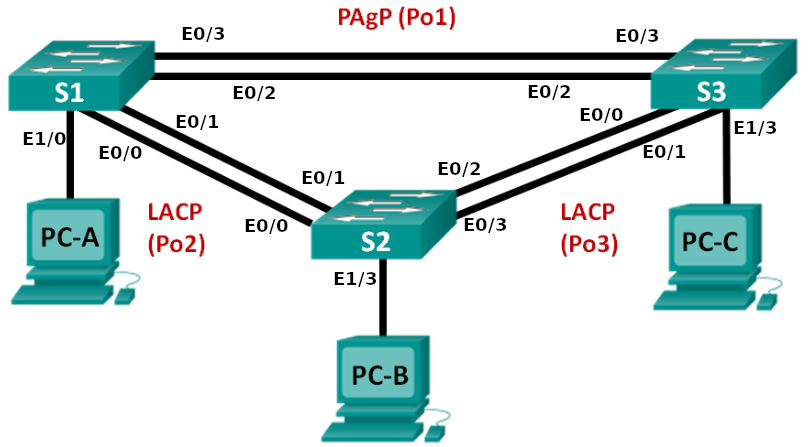
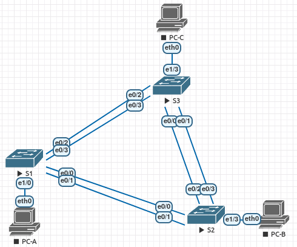
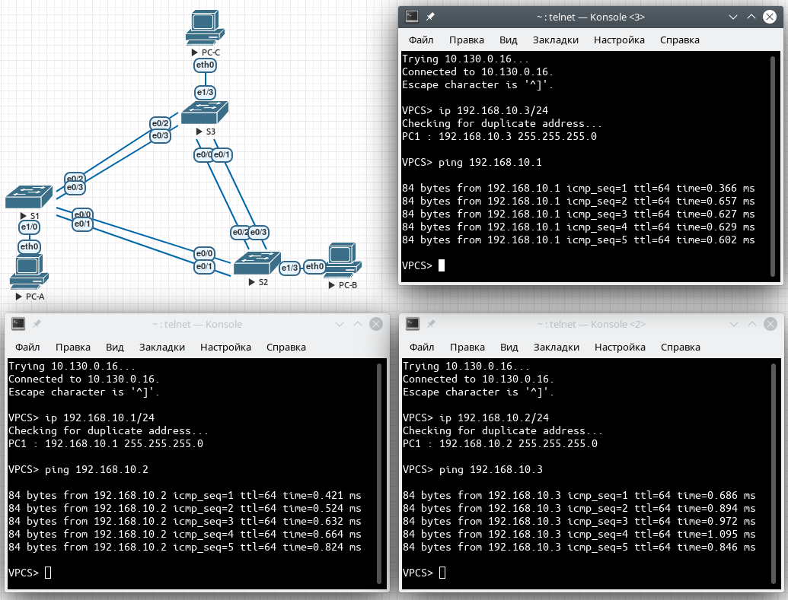

# Агрегация соединений
# Лабораторная работа №4. Настройка EtherChannel.

### Топология


### Таблица адресации

Устройство | Интерфейс | IP-адрес | Маска подсети
---- | ---- | ---- | ----
S1 | VLAN 99 | 192.168.99.11 | 255.255.255.0
S2 | VLAN 99 | 192.168.99.12 | 255.255.255.0
S3 | VLAN 99 | 192.168.99.13 | 255.255.255.0
PC-A | NIC | 192.168.10.1 | 255.255.255.0
PC-B | NIC | 192.168.10.2 | 255.255.255.0
PC-C | NIC | 192.168.10.3 | 255.255.255.0


### Задание:
#### [Часть 1. Настройка базовых параметров коммутатора](README.md#часть-1-настройка-базовых-параметров-коммутатора-1)
#### [Часть 2. Настройка PAgP](README.md#часть-2-настройка-протокола-pagp)
#### [Часть 3. Настройка LACP](README.md#часть-3-настройка-протокола-lacp)
#### [Вопросы для повторения](README.md#вопросы-для-повторения-1)
#### [Конфигурационные файлы ](README.md#конфигурационные-файлы-здесь)

### Решение:
#### Часть 1. Настройка базовых параметров коммутатора

##### *Шаг 1. Создайте сеть согласно топологии.*
 
 Подключите устройства, как показано в топологии, и подсоедините необходимые кабели.

 

##### *Шаг 2. Выполните инициализацию и перезагрузку коммутаторов.*

##### *Шаг 3. Настройте базовые параметры каждого коммутатора.*

- Отключите поиск DNS.
- Настройте имя устройства в соответствии с топологией.
- Зашифруйте незашифрованные пароли.
- Создайте баннерное сообщение дня MOTD, предупреждающее пользователей о том, что несанкционированный доступ запрещен.
- Назначьте class в качестве зашифрованного пароля доступа к привилегированному режиму. f. Назначьте cisco в качестве пароля консоли и VTY и включите запрос пароля при подключении.
- Настройте logging synchronous, чтобы предотвратить прерывание ввода команд сообщениями консоли.
- Отключите все порты коммутатора, кроме портов, подключенных к компьютерам.

<details>
 <summary>Настройка коммутатора S1</summary>

``` bash
Switch#conf t
Switch(config)#no ip domain-lookup 
Switch(config)#hostname S1
S1(config)#service password-encryption
S1(config)#enable secret class
S1(config)#line console 0
S1(config-line)#password cisco
S1(config-line)#login
S1(config-line)#exec-timeout 5 0
S1(config-line)#logging synchronous
S1(config-line)#exit
S1(config)#line vty 0 4
S1(config-line)#password cisco
S1(config-line)#login
S1(config-line)#exec-timeout 5 0
S1(config-line)#logging synchronous
S1(config-line)#exit
S1(config)#int range e0/0-3,e1/1-3
S1(config-if-range)#shut
S1(config)#exit
S1#wr
```
</details>
|

Для S2 и S3 аналогично, кроме команды:
``` bash
S1(config)#int range e0/0-3,e1/0-2
S1(config-if-range)#shut
```
- Настройте сеть VLAN 99 и присвойте ей имя Management.
- Настройте сеть VLAN 10 и присвойте ей имя Staff.
- Настройте порты коммутатора с присоединёнными узлами в качестве портов доступа в сети VLAN 10.
- Назначьте IP-адреса в соответствии с таблицей адресации.
- Сохраните текущую конфигурацию в загрузочную конфигурацию.

<details>
 <summary>Настройка коммутатора S1.</summary>

``` bash
S1#conf t
S1(config)#no logging console
S1(config)#vtp mode transparent
S1(config)#vlan 99
S1(config-vlan)#name Management
S1(config-vlan)#vlan 10
S1(config-vlan)#name Staff
S1(config-vlan)#exit
S1(config)#int e1/0
S1(config-if)#switchport mode access
S1(config-if)#switchport access vlan 10
S1(config-if)#exit
S1(config)#int vlan 99
S1(config-if)#ip address 192.168.99.11 255.255.255.0
S1(config-if)#exit
S1(config)#exit
S1#wr
```
</details>
|

Настройки коммутатора S2 аналогичны S1, разница:
``` bash
S1(config)#int e1/3
S1(config-if)#switchport mode access
S1(config-if)#switchport access vlan 10
S1(config-if)#exit
S1(config)#int vlan 99
S1(config-if)#ip address 192.168.99.12 255.255.255.0
```
Настройки коммутатора S3 аналогичны S2, разница:
``` bash
S1(config-if)#ip address 192.168.99.13 255.255.255.0
```
##### *Шаг 4: Настройте компьютеры.
Назначьте IP-адреса компьютерам в соответствии с таблицей адресации.*

Настройка PC-A. Настройка PC-B и PC-C осуществляется также.
``` bash
VPCS> ip 192.168.10.1/24
Checking for duplicate address...
PC1 : 192.168.10.1 255.255.255.0
```

#### Часть 2. Настройка протокола PAgP

##### *Шаг 1:	Настройте PAgP на S1 и S3*
Создать канал между S1 и S3. Настроить порты на S1 с использованием рекомендуемого режима (desirable),
а порты на S3 — с использованием автоматического режима (auto). Включить порты после настройки режимов PAgP.

Настройка S1:
``` bash
S1#conf t
S1(config)#interface range e0/2-3
S1(config-if-range)#channel-group 1 mode desirable
Creating a port-channel interface Port-channel 1

S1(config-if-range)#no shut
```
Настройка S3:
``` bash
S3#conf t
S3(config)#interface range e0/2-3
S3(config-if-range)#channel-group 1 mode auto
Creating a port-channel interface Port-channel 1

S3(config-if-range)#no shut
```
##### *Шаг 2. Проверить конфигурации на портах.*

<details>
 <summary>Проверка конфигурации на S1</summary>

``` bash
S1#sh run interface e0/2

interface Ethernet0/2
 channel-group 1 mode desirable
end
```

``` bash
S1#sh run interface e0/3

interface Ethernet0/3
 channel-group 1 mode desirable
end
```

``` bash
S1#sh int e0/2 switchport
Administrative Mode: dynamic auto
Operational Mode: static access (member of bundle Po1)
```

``` bash
S1#sh int e0/3 switchport
Administrative Mode: dynamic auto
Operational Mode: static access (member of bundle Po1)

```
</details>

<details>
 <summary>Проверка конфигурации на S3</summary>

``` bash
S3#sh run interface e0/2
interface Ethernet0/2
 channel-group 1 mode auto
```

``` bash
S3#sh run interface e0/3
interface Ethernet0/3
 channel-group 1 mode auto
```

``` bash
S3#sh int e0/2 switch
Administrative Mode: dynamic auto
Operational Mode: static access (member of bundle Po1)
```

``` bash
S3#sh int e0/3 switch
Administrative Mode: dynamic auto
Operational Mode: static access (member of bundle Po1)
```
</details>

##### *Шаг 3. Убедиться, что порты объединены.*

Проверяем объединение портов в EtherChannel на S1:
``` bash
S1#show etherchannel summary

Group  Port-channel  Protocol    Ports
------+-------------+-----------+-----------------------------------------------
1      Po1(SU)         PAgP      Et0/2(P)    Et0/3(P)
```
Проверяем объединение портов в EtherChannel на S3:
``` bash
S3#sh etherchannel summary

Group  Port-channel  Protocol    Ports
------+-------------+-----------+-----------------------------------------------
1      Po1(SU)         PAgP      Et0/2(P)    Et0/3(P)
```

Что означают флаги «SU» и «P» в сводных данных по Ethernet?

> Обозначение (SU) расшифровывается как:
> 
> S - флаг уровня Layer2,
> 
> U - in use (используется).
>
> Обозначение (P) расшифровывается как:
>
> P - bundled in port-channel
> 
##### *Шаг 4. Настройте транковые порты.*

Настроить порты Po1 на S1 и S3 в качестве транковых и назначить их сети native VLAN 99.

Настройка S1. Для S3 аналогично.
``` bash
S1(config)# interface port-channel 1
S1(config-if)# switchport mode trunk
S1(config-if)# switchport trunk native vlan 99
```

##### *Шаг 5. Убедиться в том, что порты настроены в качестве транковых.*
- Какие команды включены в список для интерфейсов e0/2 и e0/3 на обоих коммутаторах? Сравните результаты с текущей конфигурацией для интерфейса Po1. Запишите наблюдения.

<details>
 <summary>Вывод команд</summary>

``` bash
S1# sh run interface Po1

interface Port-channel1
 switchport trunk native vlan 99
end
```

``` bash
S3# sh run interface Po1

interface Port-channel1
 switchport trunk native vlan 99
end
```
``` bash
S1#sh int Po1 switchport
Name: Po1
Switchport: Enabled
Administrative Mode: dynamic auto
Operational Mode: static access
Administrative Trunking Encapsulation: negotiate
Operational Trunking Encapsulation: native
Negotiation of Trunking: On
Access Mode VLAN: 1 (default)
Trunking Native Mode VLAN: 99 (Management)
Administrative Native VLAN tagging: enabled
Voice VLAN: none
Administrative private-vlan host-association: none
Administrative private-vlan mapping: none
Administrative private-vlan trunk native VLAN: none
Administrative private-vlan trunk Native VLAN tagging: enabled
Administrative private-vlan trunk encapsulation: dot1q
Administrative private-vlan trunk normal VLANs: none
Administrative private-vlan trunk associations: none
Administrative private-vlan trunk mappings: none
Operational private-vlan: none
Trunking VLANs Enabled: ALL
Pruning VLANs Enabled: 2-1001
```

``` bash
S3#sh int Po1 switchport
Name: Po1
Switchport: Enabled
Administrative Mode: dynamic auto
Operational Mode: static access
Administrative Trunking Encapsulation: negotiate
Operational Trunking Encapsulation: native
Negotiation of Trunking: On
Access Mode VLAN: 1 (default)
Trunking Native Mode VLAN: 99 (Management)
Administrative Native VLAN tagging: enabled
Voice VLAN: none
Administrative private-vlan host-association: none
Administrative private-vlan mapping: none
Administrative private-vlan trunk native VLAN: none
Administrative private-vlan trunk Native VLAN tagging: enabled
Administrative private-vlan trunk encapsulation: dot1q
Administrative private-vlan trunk normal VLANs: none
Administrative private-vlan trunk associations: none
Administrative private-vlan trunk mappings: none
Operational private-vlan: none
Trunking VLANs Enabled: ALL
Pruning VLANs Enabled: 2-1001
```
</details>
|

- Выполните команды show interfaces trunk и show spanning-tree на S1 и S3. Какой транковый порт включен в список? Какая используется сеть native VLAN? Какой вывод можно сделать на основе выходных данных?

<details>
 <summary>Вывод команд show interfaces trunk и show spanning-tree на S1 и S3</summary>

``` bash
S1#sh int Po1 trunk

Port        Mode             Encapsulation  Status        Native vlan
Po1         auto             negotiate      not-trunking  99

Port        Vlans allowed on trunk
Po1         1

Port        Vlans allowed and active in management domain
Po1         1

Port        Vlans in spanning tree forwarding state and not pruned
Po1         1
```
``` bash
S3#sh int Po1 trunk

Port        Mode             Encapsulation  Status        Native vlan
Po1         auto             negotiate      not-trunking  99

Port        Vlans allowed on trunk
Po1         1

Port        Vlans allowed and active in management domain
Po1         1

Port        Vlans in spanning tree forwarding state and not pruned
Po1         1
```
``` bash
S1#sh span

VLAN0001
  Spanning tree enabled protocol ieee
  Root ID    Priority    32769
             Address     aabb.cc00.1000
             This bridge is the root
             Hello Time   2 sec  Max Age 20 sec  Forward Delay 15 sec

  Bridge ID  Priority    32769  (priority 32768 sys-id-ext 1)
             Address     aabb.cc00.1000
             Hello Time   2 sec  Max Age 20 sec  Forward Delay 15 sec
             Aging Time  300 sec

Interface           Role Sts Cost      Prio.Nbr Type
------------------- ---- --- --------- -------- --------------------------------
Po1                 Desg FWD 56        128.65   Shr


VLAN0010
  Spanning tree enabled protocol ieee
  Root ID    Priority    32778
             Address     aabb.cc00.1000
             This bridge is the root
             Hello Time   2 sec  Max Age 20 sec  Forward Delay 15 sec

  Bridge ID  Priority    32778  (priority 32768 sys-id-ext 10)
             Address     aabb.cc00.1000
             Hello Time   2 sec  Max Age 20 sec  Forward Delay 15 sec
             Aging Time  300 sec

Interface           Role Sts Cost      Prio.Nbr Type
------------------- ---- --- --------- -------- --------------------------------
Et1/0               Desg FWD 100       128.5    Shr
```
``` bash
S3#sh span

VLAN0001
  Spanning tree enabled protocol ieee
  Root ID    Priority    32769
             Address     aabb.cc00.1000
             Cost        56
             Port        65 (Port-channel1)
             Hello Time   2 sec  Max Age 20 sec  Forward Delay 15 sec

  Bridge ID  Priority    32769  (priority 32768 sys-id-ext 1)
             Address     aabb.cc00.3000
             Hello Time   2 sec  Max Age 20 sec  Forward Delay 15 sec
             Aging Time  300 sec

Interface           Role Sts Cost      Prio.Nbr Type
------------------- ---- --- --------- -------- --------------------------------
Po1                 Root FWD 56        128.65   Shr


VLAN0010
  Spanning tree enabled protocol ieee
  Root ID    Priority    32778
             Address     aabb.cc00.3000
             This bridge is the root
             Hello Time   2 sec  Max Age 20 sec  Forward Delay 15 sec

  Bridge ID  Priority    32778  (priority 32768 sys-id-ext 10)
             Address     aabb.cc00.3000
             Hello Time   2 sec  Max Age 20 sec  Forward Delay 15 sec
             Aging Time  300 sec

Interface           Role Sts Cost      Prio.Nbr Type
------------------- ---- --- --------- -------- --------------------------------
Et1/3               Desg FWD 100       128.8    Shr
```
</details>

|
> В широковещательном домене VLAN1 S1 остался корневым мостом, а во VLAN10 каждый из коммутаторов является корневым мостом, т.к. каждый из коммутаторов думает, что vlan10 есть только у него (анонс vlan10 по транку не настроен).

- Какие значения стоимости и приоритета порта для агрегированного канала отображены в выходных данных команды show spanning-tree?
  
``` bash
Interface           Role Sts Cost      Prio.Nbr Type
------------------- ---- --- --------- -------- --------------------------------
Po1                 Root FWD 56        128.65   Shr
```
``` bash
Interface           Role Sts Cost      Prio.Nbr Type
------------------- ---- --- --------- -------- --------------------------------
Po1                 Desg FWD 56        128.65   Shr
```
#### Часть 3. Настройка протокола LACP

Выполнить настройку канала между S1 и S2 и канала между S2 и S3 с помощью протокола LACP. Кроме того, отдельные каналы необходимо настроить в качестве транковых, прежде чем они будут объединены в каналы EtherChannel.

##### *Шаг 1. Настроить LACP между S1 и S2.*

Настройка коммутатора S1. 
``` bash
S1#conf t
S1(config)#interface range e0/0-1
S1(config-if-range)#switchport trunk encapsulation dot1q
S1(config-if-range)#switchport mode trunk
S1(config-if-range)#switchport trunk native vlan 99
S1(config-if-range)#channel-group 2 mode active
S1(config-if-range)#no shutdown
```

##### *Шаг 2. Убедитесь, что порты объединены.

Какой протокол использует Po2 для агрегирования каналов?

[Ответ: используется протокол LACP]

``` bash
S2#sh int Po2
Port-channel2 is up, line protocol is up (connected)

Members in this channel: Et0/0 Et0/1
```

Какие порты агрегируются для образования Po2?
[Ответ: используются порты E0/0 и E0/1]

``` bash
S2#sh etherchannel summary

Group  Port-channel  Protocol    Ports
------+-------------+-----------+-----------------------------------------------
2      Po2(SU)         LACP      Et0/0(P)    Et0/1(P)
```

##### *Шаг 3. Настройте LACP между S2 и S3.*

Настроить канал между S2 и S3 как Po3, используя LACP как протокол агрегирования каналов.

<details>
 <summary>Настройка S2</summary>

``` bash
S2(config)#int range e0/2-3
S2(config-if-range)#switchport trunk encapsulation dot1q
S2(config-if-range)#switchport mode trunk
S2(config-if-range)#switchport trunk native vlan 99
S2(config-if-range)#channel-group 3 mode active
Creating a port-channel interface Port-channel 3

S2(config-if-range)#no shutdown

```
</details>

<details>
 <summary>Настройки S3</summary>

```  bash
S3(config)#int range e0/0-1
S3(config-if-range)#switchport trunk encapsulation dot1q
S3(config-if-range)#switchport mode trunk
S3(config-if-range)#switchport trunk native vlan 99
S3(config-if-range)#channel-group 3 mode active
Creating a port-channel interface Port-channel 3

S3(config-if-range)#no shutdown
```
</details>

### проверка работы PAgP и LACP
S1
``` bash
Group  Port-channel  Protocol    Ports
------+-------------+-----------+-----------------------------------------------
1      Po1(SU)         PAgP      Et0/2(P)    Et0/3(P)
2      Po2(SU)         LACP      Et0/0(P)    Et0/1(P)

```
S2
``` bash
Group  Port-channel  Protocol    Ports
------+-------------+-----------+-----------------------------------------------
2      Po2(SD)         LACP      Et0/0(H)    Et0/1(w)
3      Po3(SU)         LACP      Et0/2(P)    Et0/3(P)

```
S3
``` bash
Group  Port-channel  Protocol    Ports
------+-------------+-----------+-----------------------------------------------
1      Po1(SU)         PAgP      Et0/2(P)    Et0/3(P)
3      Po3(SU)         LACP      Et0/0(P)    Et0/1(P)

```

##### *Шаг 4. Проверка наличия сквозного соединения.*



#### Вопросы для повторения

Что может препятствовать образованию каналов EtherChannel?

> Ответ:
> 1. Отсутствие статического транка на портах.
> 2. Несогласованность trunk-портов auto/desirable;
> 
> 3. Несогласованность режимов работы EtherChannel:
>     - Active/Passive [для LACP]
>     - Auto/Desirable [для PAgP]

#### Конфигурационные файлы [здесь](config/).
