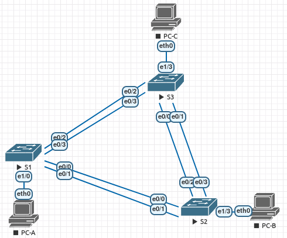

# Агрегация соединений
# Лабораторная работа №4. Настройка EtherChannel.

### Топология


### Таблица адресации

Устройство | Интерфейс | IP-адрес | Маска подсети
---- | ---- | ---- | ----
S1 | VLAN 99 | 192.168.99.11 | 255.255.255.0
S2 | VLAN 99 | 192.168.99.12 | 255.255.255.0
S3 | VLAN 99 | 192.168.99.13 | 255.255.255.0
PC-A | NIC | 192.168.10.1 | 255.255.255.0
PC-B | NIC | 192.168.10.2 | 255.255.255.0
PC-C | NIC | 192.168.10.3 | 255.255.255.0


### Задание:
#### [Часть 1. Настройка базовых параметров коммутатора](README.md#часть-1-настройка-базовых-параметров-коммутатора-1)
#### [Часть 2. Настройка PAgP](README.md#часть-2-настройка-pagp-1)
#### [Часть 3. Настройка LACP](README.md#часть-3-настройка-lacp-1)
#### [Вопросы для повторения](README.md#вопросы-для-повторения-1)

### Решение:
#### Часть 1. Настройка базовых параметров коммутатора


#### Часть 1. Настройка базовых параметров коммутатора

 *Шаг 1. Создайте сеть согласно топологии.*
 
 Подключите устройства, как показано в топологии, и подсоедините необходимые кабели.

 

*Шаг 2. Выполните инициализацию и перезагрузку коммутаторов.*

*Шаг 3. Настройте базовые параметры каждого коммутатора.*

- Отключите поиск DNS.
- Настройте имя устройства в соответствии с топологией.
- Зашифруйте незашифрованные пароли.
- Создайте баннерное сообщение дня MOTD, предупреждающее пользователей о том, что несанкционированный доступ запрещен.
- Назначьте class в качестве зашифрованного пароля доступа к привилегированному режиму. f. Назначьте cisco в качестве пароля консоли и VTY и включите запрос пароля при подключении.
- Настройте logging synchronous, чтобы предотвратить прерывание ввода команд сообщениями консоли.
- Отключите все порты коммутатора, кроме портов, подключенных к компьютерам.

Пример для коммутатора S1.
``` bash
Switch#conf t
Switch(config)#no ip domain-lookup 
Switch(config)#hostname S1
S1(config)#service password-encryption
S1(config)#enable secret class
S1(config)#line console 0
S1(config-line)#password cisco
S1(config-line)#login
S1(config-line)#exec-timeout 5 0
S1(config-line)#logging synchronous
S1(config-line)#exit
S1(config)#line vty 0 4
S1(config-line)#password cisco
S1(config-line)#login
S1(config-line)#exec-timeout 5 0
S1(config-line)#logging synchronous
S1(config-line)#exit
S1(config)#int range e0/0-3,e1/1-3
S1(config-if-range)#shut
S1(config)#exit
S1#wr
```
Для S2 и S3 аналогично, кроме команды:
``` bash
S1(config)#int range e0/0-3,e1/0-2
S1(config-if-range)#shut
```
- Настройте сеть VLAN 99 и присвойте ей имя Management.
- Настройте сеть VLAN 10 и присвойте ей имя Staff.
- Настройте порты коммутатора с присоединёнными узлами в качестве портов доступа в сети VLAN 10.
- Назначьте IP-адреса в соответствии с таблицей адресации.
- Сохраните текущую конфигурацию в загрузочную конфигурацию.

Настройки коммутатора S1.
``` bash
S1#conf t
S1(config)#no logging console
S1(config)#vtp mode transparent
S1(config)#vlan 99
S1(config-vlan)#name Management
S1(config-vlan)#vlan 10
S1(config-vlan)#name Staff
S1(config-vlan)#exit
S1(config)#int e1/0
S1(config-if)#switchport mode access
S1(config-if)#switchport access vlan 10
S1(config-if)#exit
S1(config)#int vlan 99
S1(config-if)#ip address 192.168.99.11 255.255.255.0
S1(config-if)#exit
S1(config)#exit
S1#wr
```

Настройки коммутатора S2. Аналогично S1, разница:
``` bash
S1(config)#int e1/3
S1(config-if)#switchport mode access
S1(config-if)#switchport access vlan 10
S1(config-if)#exit
S1(config)#int vlan 99
S1(config-if)#ip address 192.168.99.12 255.255.255.0
```
Настройки коммутатора S3. Аналогично S2, разница:
``` bash
S1(config-if)#ip address 192.168.99.13 255.255.255.0
```
*Шаг 4: Настройте компьютеры.
Назначьте IP-адреса компьютерам в соответствии с таблицей адресации.*

