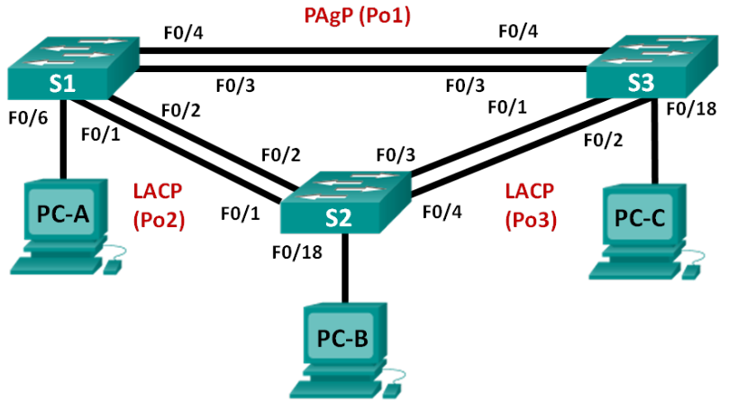

# Настройка базового протокола OSPFv2 для одной области
# Лабораторная работа №4.

### Топология


### Таблица адресации

<table>
  <tr>
    <th>Устройство</th>
    <th>Интерфейс</th>
    <th>IP-адрес</th>
    <th>Маска подсет</th>
    <th>Шлюз по умолчанию</th>
  </tr>
  <tr>
    <td rowspan="3">R1</td>
    <td>E0/0</td>
    <td>192.168.1.1</td>
    <td>255.255.255.0</td>
    <td rowspan="9"></td>
  </tr>
  <tr>
    <td>S1/0 (DCE)</td>
    <td>192.168.12.1</td>
    <td>255.255.255.252</td>
  </tr>
  <tr>
    <td>S1/1</td>
    <td>192.168.13.1</td>
    <td>255.255.255.252</td>
  </tr>
  <tr>
    <td rowspan="3">R2</td>
    <td>E0/0</td>
    <td>192.168.2.1</td>
    <td>255.255.255.0</td>
  </tr>
  <tr>
    <td>S1/0</td>
    <td>192.168.12.2</td>
    <td>255.255.255.252</td>
  </tr>
  <tr>
    <td>S1/1 (DCE)</td>
    <td>192.168.23.1</td>
    <td>255.255.255.252</td>
  </tr>
  <tr>
    <td rowspan="3">R3</td>
    <td>E0/0</td>
    <td>192.168.3.1</td>
    <td>255.255.255.0</td>
  </tr>
  <tr>
    <td>S1/0 (DCE)</td>
    <td>192.168.13.2</td>
    <td>255.255.255.252</td>
  </tr>
  <tr>
    <td>S1/1</td>
    <td>192.168.23.2</td>
    <td>255.255.255.252</td>
  </tr>
  <tr>
    <td>PC-A</td>
    <td>NIC</td>
    <td>192.168.1.3</td>
    <td>255.255.255.0</td>
    <td>192.168.1.1</td>
  </tr>
  <tr>
    <td>PC-B</td>
    <td>NIC</td>
    <td>192.168.2.3</td>
    <td>255.255.255.0</td>
    <td>192.168.2.1</td>
  </tr>
  <tr>
    <td>PC-C</td>
    <td>NIC</td>
    <td>192.168.3.3</td>
    <td>255.255.255.0</td>
    <td>192.168.3.1</td>
  </tr>
</table>


### Задание:
#### [Часть 1. Создание сети и настройка основных параметров устройства](README.md#часть-1-создание-сети-и-настройка-основных-параметров-устройства-1)

#### Часть 2. Настройка и проверка маршрутизации OSPF

#### Часть 3. Изменение назначений идентификаторов маршрутизаторов

#### Часть 4. Настройка пассивных интерфейсов OSPF

#### Часть 5. Изменение метрик OSPF

### Решение:

#### Часть 1. Создание сети и настройка основных параметров устройства

Создали стенд в eve-ng согласно топологии.
Произвели базовую настройку маршрутизаторов.
<details>
 <summary>Настройка R1</summary>

``` bash
Router(config)#conf t
Enter configuration commands, one per line.  End with CNTL/Z.
Router(config)#hostname R1
R1(config)#no logging console
R1(config)#no ip domain-lookup
R1(config)#int s1/0
R1(config-if)#ip address 192.168.12.1 255.255.255.252
R1(config-if)#clock rate 128000
R1(config-if)#no shutdown
R1(config-if)#exit
R1(config)#
R1(config)#int s1/1
R1(config-if)#ip address 192.168.13.1 255.255.255.252
R1(config-if)#no shutdown
R1(config-if)#exit
R1(config)#
R1(config)#int e0/0
R1(config-if)#ip address 192.168.1.1 255.255.255.0
R1(config-if)#no shutdown
R1(config-if)#exit
R1(config)#
R1(config)#service password-encryption
R1(config)#enable secret class
R1(config)#line console 0
R1(config-line)#password cisco
R1(config-line)#exec-timeout 5 0
R1(config-line)#logging synchronous
R1(config-line)#login
R1(config-line)#exit
R1(config)#line vty 0 4
R1(config-line)#password cisco
R1(config-line)#exec-timeout 5 0
R1(config-line)#logging synchronous
R1(config-line)#login
R1(config-line)#exit
R1(config)#exit
R1#wr
Building configuration...
[OK]
R1#
```
</details>

<details>
 <summary>Настройка R2</summary>

``` bash
Router(config)#hostname R2
R2(config)#no logging console
R2(config)#no ip domain-lookup
R2(config)#int s1/0
R2(config-if)#ip address 192.168.12.2 255.255.255.252
R2(config-if)#no shutdown
R2(config-if)#exit
R2(config)#int s1/1
R2(config-if)#ip address 192.168.23.1 255.255.255.252
R2(config-if)#clock rate 128000
R2(config-if)#no shutdown
R2(config-if)#exit
R2(config)#int e0/0
R2(config-if)#ip address 192.168.2.1 255.255.255.0
R2(config-if)#no shutdown
R2(config-if)#exit
R2(config)#service password-encryption
R2(config)#enable secret class
R2(config)#line console 0
R2(config-line)#password cisco
R2(config-line)#exec-timeout 5 0
R2(config-line)#logging synchronous
R2(config-line)#login
R2(config-line)#exit
R2(config)#line vty 0 4
R2(config-line)#password cisco
R2(config-line)#exec-timeout 5 0
R2(config-line)#logging synchronous
R2(config-line)#login
R2(config-line)#exit
R2(config)#exit
R2#wr
Building configuration...
[OK]
R2#
```
</details>

<details>
 <summary>Настройка R3</summary>

``` bash
Router#conf t
Enter configuration commands, one per line.  End with CNTL/Z.
Router(config)#hostname R3
R3(config)#no logging console
R3(config)#no ip domain-lookup
R3(config)#int s1/0
R3(config-if)#ip address 192.168.13.2 255.255.255.252
R3(config-if)#clock rate 128000
R3(config-if)#no shutdown
R3(config-if)#exit
R3(config)#int s1/1
R3(config-if)#ip address 192.168.23.2 255.255.255.252
R3(config-if)#no shutdown
R3(config-if)#exit
R3(config)#int e0/0
R3(config-if)#ip address 192.168.3.1 255.255.255.0
R3(config-if)#no shutdown
R3(config-if)#exit
R3(config)#service password-encryption
R3(config)#enable secret class
R3(config)#line console 0
R3(config-line)#password cisco
R3(config-line)#exec-timeout 5 0
R3(config-line)#logging synchronous
R3(config-line)#login
R3(config-line)#exit
R3(config)#line vty 0 4
R3(config-line)#password cisco
R3(config-line)#exec-timeout 5 0
R3(config-line)#logging synchronous
R3(config-line)#login
R3(config-line)#exit
R3(config)#exit
R3#wr
Building configuration...
[OK]
R3#wr

```
</details>

<details>
 <summary>Настройка компьютеров</summary>

Настройка PC-A
``` bash

VPCS> ip 192.168.1.3/24 192.168.1.1
Checking for duplicate address...
PC1 : 192.168.1.3 255.255.255.0 gateway 192.168.1.1
```
Настройка PC-B
``` bash
VPCS> ip 192.168.2.3/24 192.168.2.1
Checking for duplicate address...
PC1 : 192.168.2.3 255.255.255.0 gateway 192.168.2.1
```
Настройка PC-C
``` bash
VPCS> ip 192.168.3.3/24 192.168.3.1
Checking for duplicate address...
PC1 : 192.168.3.3 255.255.255.0 gateway 192.168.3.1

```
</details>

<details>
 <summary>Проверка доступности маршрутизаторов</summary>


``` bash
```

Доступность R1->R2 и R1->R3
``` bash
R1>ping 192.168.12.2

Success rate is 100 percent (5/5), round-trip min/avg/max = 8/8/9 ms

R1>ping 192.168.13.2

Success rate is 100 percent (5/5), round-trip min/avg/max = 8/8/9 ms
R1>
```

Доступность R2->R3
``` bash
R2>ping 192.168.23.2

Success rate is 100 percent (5/5), round-trip min/avg/max = 8/8/9 ms
```
</details>
