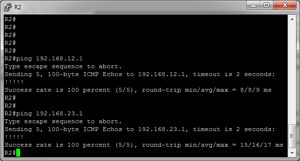

# Настройка базового протокола OSPFv2 для нескольких областей
# Лабораторная работа №5. OSPF v2 Multiarea

### Задание:
#### Часть 1. [Создание сети и настройка основных параметров устройства](README.md#часть-1-создание-сети-инастройка-основных-параметров-устройства-1)
#### Часть 2. [Настройка сети OSPFv2 для нескольких областей](README.md#часть-2-настройка-сети-ospfv2-для-нескольких-областей-1)
#### Часть 3. [Настройка межобластных суммарных маршрутов](README.md#часть-3-настройка-межобластных-суммарных-маршрутов-1)

### Топология
Создали стенд в eve-ng согласно топологии.


### Таблица адресации

<table>
  <tr>
    <th>Устройство</th>
    <th>Интерфейс</th>
    <th>IP-адрес</th>
    <th>Маска подсети</th>
  </tr>
  <tr>
    <td rowspan="4">R1</td>
    <td>Lo/0</td>
    <td>209.165.200.225</td>
    <td>255.255.255.252</td>
  </tr>
  <tr>
    <td>Lo1</td>
    <td>192.168.1.1</td>
    <td>255.255.255.0</td>
  </tr>
  <tr>
    <td>Lo2</td>
    <td>192.168.2.1</td>
    <td>255.255.255.0</td>
  </tr>
  <tr>
    <td>S1/0 (DCE)</td>
    <td>192.168.12.1</td>
    <td>255.255.255.252</td>
  </tr>
  <tr>
    <td rowspan="3">R2</td>
    <td>Lo6</td>
    <td>192.168.6.1</td>
    <td>255.255.255.0</td>
  </tr>
  <tr>
    <td>S1/0</td>
    <td>192.168.12.2</td>
    <td>255.255.255.252</td>
  </tr>
  <tr>
    <td>S1/1 (DCE)</td>
    <td>192.168.23.1</td>
    <td>255.255.255.252</td>
  </tr>
  <tr>
    <td rowspan="3">R3</td>
    <td>Lo4</td>
    <td>192.168.4.1</td>
    <td>255.255.255.0</td>
  </tr>
  <tr>
    <td>Lo5</td>
    <td>192.168.5.1</td>
    <td>255.255.255.0</td>
  </tr>
  <tr>
    <td>S1/1</td>
    <td>192.168.23.2</td>
    <td>255.255.255.252</td>
  </tr>
</table>

### Решение:

### Часть 1. Создание сети и настройка основных параметров устройства
Произвели базовую настройку маршрутизаторов.

<details>
 <summary>Базовые настройки R1</summary>

``` bash
Router>
Router>ena
Router#conf t
Router(config)#hostname R1
R1(config)#no logging console
R1(config)#no ip domain-lookup
R1(config)#service password-encryption 
R1(config)#enable secret class
R1(config)#line console 0
R1(config-line)#password cisco
R1(config-line)#logging synchronous
R1(config-line)#login
R1(config-line)#exit
R1(config)#line vty 0 4
R1(config-line)#password cisco
R1(config-line)#logging synchronous
R1(config-line)#login
R1(config-line)#exit
R1(config)#exit
R1#wr
Building configuration...
[OK]
R1#
R1#conf t
Enter configuration commands, one per line.  End with CNTL/Z.
R1(config)#int Lo0
R1(config-if)#ip address 209.165.200.225 255.255.255.252
R1(config-if)#no shutdown
R1(config-if)#end
R1#
R1#conf t
Enter configuration commands, one per line.  End with CNTL/Z.
R1(config)#int Lo1
R1(config-if)#ip address 192.168.1.1 255.255.255.0
R1(config-if)#no shutdown
R1(config-if)#end
R1#
R1#conf t
Enter configuration commands, one per line.  End with CNTL/Z.
R1(config)#int Lo2
R1(config-if)#ip address 192.168.2.1 255.255.255.0
R1(config-if)#no shutdown
R1(config-if)#end
R1#
R1#conf t
Enter configuration commands, one per line.  End with CNTL/Z.
R1(config)#int s1/0
R1(config-if)#ip address 192.168.12.1 255.255.255.252
R1(config-if)#clock rate 128000
R1(config-if)#no shutdown
R1(config-if)#end
R1#wr
Building configuration...
[OK]
R1#

```
</details>

<details>
 <summary>Базовые настройки R2</summary>

``` bash
Router>
Router>ena
Router#conf t
Router(config)#hostname R2
R2(config)#no logging console
R2(config)#no ip domain-lookup
R2(config)#service password-encryption 
R2(config)#enable secret class
R2(config)#line console 0
R2(config-line)#password cisco
R2(config-line)#logging synchronous
R2(config-line)#login
R2(config-line)#exit
R2(config)#line vty 0 4
R2(config-line)#password cisco
R2(config-line)#logging synchronous
R2(config-line)#login
R2(config-line)#exit
R2(config)#exit
R2#wr
Building configuration...
[OK]
R2#
R2#conf t
Enter configuration commands, one per line.  End with CNTL/Z.
R2(config)#int Lo6
R2(config-if)#ip address 192.168.6.1 255.255.255.0
R2(config-if)#no shutdown
R2(config-if)#end
R2#conf t
Enter configuration commands, one per line.  End with CNTL/Z.
R2(config)#int S1/0
R2(config-if)#ip address 192.168.12.2 255.255.255.252
R2(config-if)#no shutdown
R2(config-if)#end
R2#conf t
Enter configuration commands, one per line.  End with CNTL/Z.
R2(config)#int s1/1
R2(config-if)#ip address 192.168.23.1 255.255.255.252
R2(config-if)#clock rate 128000
R2(config-if)#no shutdown
R2(config-if)#end
R2#wr
Building configuration...
[OK]
R2#

```
</details>

<details>
 <summary>Базовые настройки R3</summary>

``` bash
Router>
Router>ena
Router#conf t
Enter configuration commands, one per line.  End with CNTL/Z.
Router(config)#hostname R3
R3(config)#no logging console
R3(config)#no ip domain-lookup
R3(config)#service password-encryption 
R3(config)#enable secret class
R3(config)#line console 0
R3(config-line)#password cisco
R3(config-line)#logging synchronous
R3(config-line)#login
R3(config-line)#exit
R3(config)#line vty 0 4
R3(config-line)#password cisco
R3(config-line)#logging synchronous
R3(config-line)#login
R3(config-line)#exit
R3(config)#exit
R3#wr
Building configuration...
[OK]
R3#
R3#conf t
Enter configuration commands, one per line.  End with CNTL/Z.
R3(config)#int Lo4
R3(config-if)#ip address 192.168.4.1 255.255.255.0
R3(config-if)#no shutdown
R3(config-if)#end
R3#
R3#conf t
Enter configuration commands, one per line.  End with CNTL/Z.
R3(config)#int Lo5
R3(config-if)#ip address 192.168.5.1 255.255.255.0
R3(config-if)#no shutdown
R3(config-if)#end
R3#
R3#conf t
Enter configuration commands, one per line.  End with CNTL/Z.
R3(config)#int s1/1
R3(config-if)#ip address 192.168.23.2 255.255.255.252
R3(config-if)#no shutdown
R3(config-if)#end
R3#wr
Building configuration...
[OK]
R3#

```
</details>

Проверка наличия подключения на уровне 3.

<details>
 <summary>R2</summary>

``` bash

R2>ping 192.168.12.1
Success rate is 100 percent (5/5), round-trip min/avg/max = 5/8/9 ms

R2>ping 192.168.23.2
Success rate is 100 percent (5/5), round-trip min/avg/max = 8/8/9 ms
R2>

```
</details>

### Часть 2. Настройка сети OSPFv2 для нескольких областей

##### *Определить типы маршрутизаторов OSPF в топологии*

- Магистральные маршрутизаторы: R1 и R2;
- Граничные маршрутизаторы автономной области (ASBR): R1
- Граничные маршрутизаторы области (ABR): R2;
- Внутренние маршрутизаторы: R3.

##### *Настроить OSPF на всех маршрутизаторах*
<details>
 <summary>Настроить протокол OSPF на маршрутизаторе R1</summary>

Сделаю по-умолчанию все интерфейсы роутера пассивными, затем исключу из пассивного режима только S1/0.

``` bash
R1#conf t
Enter configuration commands, one per line.  End with CNTL/Z.
R1(config)#router ospf 1
R1(config-router)#router-id 1.1.1.1
R1(config-router)#network 192.168.1.0 0.0.0.255 area 1
R1(config-router)#network 192.168.2.0 0.0.0.255 area 1
R1(config-router)#network 192.168.12.0 0.0.0.3 area 0
R1(config-router)#passive-interface default
R1(config-router)#no passive-interface s1/0
R1(config-router)#default-information originate
R1(config-router)#exit
R1(config)#ip route 0.0.0.0 0.0.0.0 loopback1
%Default route without gateway, if not a point-to-point interface, may impact performance
R1(config)#end
R1#wr
Building configuration...
[OK]

```
</details>

<details>
 <summary>Настроить протокол OSPF на маршрутизаторе R2</summary>

 Все интерфейсы роутера пассивные, кроме S1/0 и S1/1.

``` bash
R2#conf t
Enter configuration commands, one per line.  End with CNTL/Z.
R2(config)#router ospf 1
R2(config-router)#router-id 2.2.2.2
R2(config-router)#passive-interface default
R2(config-router)#network 192.168.6.0 0.0.0.255 area 3
R2(config-router)#network 192.168.12.0 0.0.0.3 area 0
R2(config-router)#network 192.168.23.0 0.0.0.3 area 3
R2(config-router)#no passive-interface s1/0
R2(config-router)#no passive-interface s1/1
R2(config-router)#end
R2#wr

```
 </details>

 <details>
 <summary>Настроить протокол OSPF на маршрутизаторе R3</summary>

Все интерфейсы роутера пассивные, кроме S1/1.

``` bash
R3#conf t
Enter configuration commands, one per line.  End with CNTL/Z.
R3(config)#router ospf 1
R3(config-router)#router-id 3.3.3.3
R3(config-router)#passive-interface default
R3(config-router)#network 192.168.4.0 0.0.0.255 area 3
R3(config-router)#network 192.168.5.0 0.0.0.255 area 3
R3(config-router)#network 192.168.23.0 0.0.0.3 area 3
R3(config-router)#no passive-interface s1/1
R3(config-router)#end
R3#wr
```
 </details>

##### *Убедимся в правильности настройки протокола OSPF и в установлении отношений смежности между маршрутизаторами*

<details>
 <summary>R1</summary>

``` bash
R1#show ip protocols
*** IP Routing is NSF aware ***

Routing Protocol is "ospf 1"
  
  Router ID 1.1.1.1
  It is an area border and autonomous system boundary router
 Redistributing External Routes from,
  Number of areas in this router is 2. 2 normal 0 stub 0 nssa
  Maximum path: 4
  Routing for Networks:
    192.168.1.0 0.0.0.255 area 1
    192.168.2.0 0.0.0.255 area 1
    192.168.12.0 0.0.0.3 area 0
  Passive Interface(s):
    Ethernet0/0
    Ethernet0/1
    Ethernet0/2
    Ethernet0/3
    Serial1/1
    Serial1/2
    Serial1/3
    Loopback0
    Loopback1
    Loopback2
    RG-AR-IF-INPUT1
    VoIP-Null0
  Routing Information Sources:
    Gateway         Distance      Last Update
    2.2.2.2              110      00:04:35
  Distance: (default is 110)
```
 </details>

 <details>
 <summary>R2</summary>

``` bash
R2#show ip protocols
*** IP Routing is NSF aware ***

Routing Protocol is "ospf 1"
  Outgoing update filter list for all interfaces is not set
  Incoming update filter list for all interfaces is not set
  Router ID 2.2.2.2
  It is an area border router
  Number of areas in this router is 2. 2 normal 0 stub 0 nssa
  Maximum path: 4
  Routing for Networks:
    192.168.6.0 0.0.0.255 area 3
    192.168.12.0 0.0.0.3 area 0
    192.168.23.0 0.0.0.3 area 3
  Passive Interface(s):
    Ethernet0/0
    Ethernet0/1
    Ethernet0/2
    Ethernet0/3
    Serial1/2
    Serial1/3
    Loopback6
    RG-AR-IF-INPUT1
    VoIP-Null0
  Routing Information Sources:
    Gateway         Distance      Last Update
    3.3.3.3              110      00:06:39
    1.1.1.1              110      00:10:37
  Distance: (default is 110)
```
 </details>

 <details>
 <summary>R3</summary>

``` bash
R3#show ip protocols
*** IP Routing is NSF aware ***

Routing Protocol is "ospf 1"
  Outgoing update filter list for all interfaces is not set
  Incoming update filter list for all interfaces is not set
  Router ID 3.3.3.3
  Number of areas in this router is 1. 1 normal 0 stub 0 nssa
  Maximum path: 4
  Routing for Networks:
    192.168.4.0 0.0.0.255 area 3
    192.168.5.0 0.0.0.255 area 3
    192.168.23.0 0.0.0.3 area 3
  Passive Interface(s):
    Ethernet0/0
    Ethernet0/1
    Ethernet0/2
    Ethernet0/3
    Serial1/0
    Serial1/2
    Serial1/3
    Loopback4
    Loopback5
    RG-AR-IF-INPUT1
    VoIP-Null0
  Routing Information Sources:
    Gateway         Distance      Last Update
    1.1.1.1              110      00:08:52
    2.2.2.2              110      00:08:52
  Distance: (default is 110)
```
 </details>

 К какому типу маршрутизаторов OSPF относится каждый маршрутизатор?
 > R1: Backbone+ASBR \
 R2: Backbone+ABR \
 R3: Internal

Проверим отношения смежности между маршрутизаторами

<details>
 <summary>Соседи R1</summary>

``` bash
R1#show ip ospf neighbor

Neighbor ID     Pri   State           Dead Time   Address         Interface
2.2.2.2           0   FULL/  -        00:00:30    192.168.12.2    Serial1/0
```
 </details>

 <details>
 <summary>Соседи R2</summary>

``` bash
R2#show ip ospf neighbor

Neighbor ID     Pri   State           Dead Time   Address         Interface
1.1.1.1           0   FULL/  -        00:00:36    192.168.12.1    Serial1/0
3.3.3.3           0   FULL/  -        00:00:37    192.168.23.2    Serial1/1
```
 </details>

 <details>
 <summary>Соседи R3</summary>

``` bash
R3#show ip ospf neighbor

Neighbor ID     Pri   State           Dead Time   Address         Interface
2.2.2.2           0   FULL/  -        00:00:32    192.168.23.1    Serial1/1
```
 </details>

Cводка стоимости маршрутов интерфейсов.

<details>
 <summary>Стоимости маршрутов на R1</summary>

``` bash
R1#show ip ospf interface brief
Interface    PID   Area            IP Address/Mask    Cost  State Nbrs F/C
Se1/0        1     0               192.168.12.1/30    64    P2P   1/1
Se1/1        1     0               192.168.12.1/30    64    DOWN  0/0
Lo1          1     1               192.168.1.1/24     1     LOOP  0/0
Lo2          1     1               192.168.2.1/24     1     LOOP  0/0
```
</details>

<details>
 <summary>Стоимости маршрутов на R2</summary>

``` bash
R2#show ip ospf interface brief
Interface    PID   Area            IP Address/Mask    Cost  State Nbrs F/C
Se1/0        1     0               192.168.12.2/30    64    P2P   1/1
Lo6          1     3               192.168.6.1/24     1     LOOP  0/0
Se1/1        1     3               192.168.23.1/30    64    P2P   1/1
```
</details>

<details>
 <summary>Стоимости маршрутов на R3</summary>

``` bash
R3#show ip ospf interface brief
Interface    PID   Area            IP Address/Mask    Cost  State Nbrs F/C
Lo4          1     3               192.168.4.1/24     1     LOOP  0/0
Lo5          1     3               192.168.5.1/24     1     LOOP  0/0
Se1/1        1     3               192.168.23.2/30    64    P2P   1/1
```
</details>

##### *Настроить аутентификацию MD5 для всех последовательных интерфейсов*

На R1 настроим порт S1/0
На R2 порты S1/0, S1/1
R3 порт S1/1

<details>
 <summary>Пример настройки S1/0 на R1</summary>

``` bash
R1#conf t
R1(config)#int s1/0
R1(config-if)#ip ospf authentication message-digest
R1(config-if)#ip ospf message-digest-key 1 md5 Cisco123
R1(config-if)#end

```
</details>

Проверить восстановление отношений смежности OSPF.

<details>
 <summary>Проверка соседей R2</summary>

 ``` bash
 R2#sh ip ospf neighbor

Neighbor ID     Pri   State           Dead Time   Address         Interface
1.1.1.1           0   FULL/  -        00:00:37    192.168.12.1    Serial1/0
3.3.3.3           0   FULL/  -        00:00:33    192.168.23.2    Serial1/1
 ```
  </details>

### Часть 3. Настройка межобластных суммарных маршрутов

##### *Просмотреть таблицы маршрутизации OSPF для всех маршрутизаторов*

<details>
 <summary>Таблица OSPF на R1</summary>

``` bash
R1#show ip route ospf

Gateway of last resort is 0.0.0.0 to network 0.0.0.0

      192.168.4.0/32 is subnetted, 1 subnets
O IA     192.168.4.1 [110/129] via 192.168.12.2, 00:07:49, Serial1/0
      192.168.5.0/32 is subnetted, 1 subnets
O IA     192.168.5.1 [110/129] via 192.168.12.2, 00:07:49, Serial1/0
      192.168.6.0/32 is subnetted, 1 subnets
O IA     192.168.6.1 [110/65] via 192.168.12.2, 00:07:49, Serial1/0
      192.168.23.0/30 is subnetted, 1 subnets
O IA     192.168.23.0 [110/128] via 192.168.12.2, 00:07:49, Serial1/0

```
</details>

<details>
 <summary>Таблица OSPF на R2</summary>

``` bash
R2#show ip route ospf

Gateway of last resort is 192.168.12.1 to network 0.0.0.0

O*E2  0.0.0.0/0 [110/1] via 192.168.12.1, 00:09:47, Serial1/0
      192.168.1.0/32 is subnetted, 1 subnets
O IA     192.168.1.1 [110/65] via 192.168.12.1, 00:09:46, Serial1/0
      192.168.2.0/32 is subnetted, 1 subnets
O IA     192.168.2.1 [110/65] via 192.168.12.1, 00:09:46, Serial1/0
      192.168.4.0/32 is subnetted, 1 subnets
O        192.168.4.1 [110/65] via 192.168.23.2, 00:09:47, Serial1/1
      192.168.5.0/32 is subnetted, 1 subnets
O        192.168.5.1 [110/65] via 192.168.23.2, 00:09:47, Serial1/1

```
</details>

<details>
 <summary>Таблица OSPF на R3</summary>

``` bash
R3#show ip route ospf

Gateway of last resort is 192.168.23.1 to network 0.0.0.0

O*E2  0.0.0.0/0 [110/1] via 192.168.23.1, 00:10:32, Serial1/1
      192.168.1.0/32 is subnetted, 1 subnets
O IA     192.168.1.1 [110/129] via 192.168.23.1, 00:10:30, Serial1/1
      192.168.2.0/32 is subnetted, 1 subnets
O IA     192.168.2.1 [110/129] via 192.168.23.1, 00:10:30, Serial1/1
      192.168.6.0/32 is subnetted, 1 subnets
O        192.168.6.1 [110/65] via 192.168.23.1, 00:10:37, Serial1/1
      192.168.12.0/30 is subnetted, 1 subnets
O IA     192.168.12.0 [110/128] via 192.168.23.1, 00:10:32, Serial1/1

```
</details>

##### *Просмотреть базы данных LSDB на всех маршрутизаторах*

<details>
 <summary>LSDB на R1</summary>

``` bash
R1#show ip ospf database

            OSPF Router with ID (1.1.1.1) (Process ID 1)

                Router Link States (Area 0)

Link ID         ADV Router      Age         Seq#       Checksum Link count
1.1.1.1         1.1.1.1         803         0x80000003 0x00485E 2
2.2.2.2         2.2.2.2         827         0x80000002 0x00E3C0 2

                Summary Net Link States (Area 0)

Link ID         ADV Router      Age         Seq#       Checksum
192.168.1.1     1.1.1.1         818         0x80000001 0x00AE1E
192.168.2.1     1.1.1.1         818         0x80000001 0x00A328
192.168.4.1     2.2.2.2         821         0x80000001 0x00F193
192.168.5.1     2.2.2.2         821         0x80000001 0x00E69D
192.168.6.1     2.2.2.2         821         0x80000001 0x00596A
192.168.23.0    2.2.2.2         821         0x80000001 0x000E69

                Router Link States (Area 1)

Link ID         ADV Router      Age         Seq#       Checksum Link count
1.1.1.1         1.1.1.1         828         0x80000002 0x009CA0 2

                Summary Net Link States (Area 1)

Link ID         ADV Router      Age         Seq#       Checksum
192.168.4.1     1.1.1.1         798         0x80000001 0x0092B6
192.168.5.1     1.1.1.1         798         0x80000001 0x0087C0
192.168.6.1     1.1.1.1         798         0x80000001 0x00F98D
192.168.12.0    1.1.1.1         818         0x80000001 0x00A5E0
192.168.23.0    1.1.1.1         798         0x80000001 0x00AE8C

                Type-5 AS External Link States

Link ID         ADV Router      Age         Seq#       Checksum Tag
0.0.0.0         1.1.1.1         832         0x80000001 0x001D91 1
```
 </details>

<details>
 <summary>LSDB на R2</summary>

``` bash
R2#show ip ospf database

            OSPF Router with ID (2.2.2.2) (Process ID 1)

                Router Link States (Area 0)

Link ID         ADV Router      Age         Seq#       Checksum Link count
1.1.1.1         1.1.1.1         810         0x80000003 0x00485E 2
2.2.2.2         2.2.2.2         833         0x80000002 0x00E3C0 2

                Summary Net Link States (Area 0)

Link ID         ADV Router      Age         Seq#       Checksum
192.168.1.1     1.1.1.1         826         0x80000001 0x00AE1E
192.168.2.1     1.1.1.1         826         0x80000001 0x00A328
192.168.4.1     2.2.2.2         826         0x80000001 0x00F193
192.168.5.1     2.2.2.2         826         0x80000001 0x00E69D
192.168.6.1     2.2.2.2         826         0x80000001 0x00596A
192.168.23.0    2.2.2.2         826         0x80000001 0x000E69

                Router Link States (Area 3)

Link ID         ADV Router      Age         Seq#       Checksum Link count
2.2.2.2         2.2.2.2         833         0x80000002 0x007491 3
3.3.3.3         3.3.3.3         832         0x80000002 0x00F989 4

                Summary Net Link States (Area 3)

Link ID         ADV Router      Age         Seq#       Checksum
192.168.1.1     2.2.2.2         825         0x80000001 0x001375
192.168.2.1     2.2.2.2         825         0x80000001 0x00087F
192.168.12.0    2.2.2.2         826         0x80000001 0x0087FA

                Summary ASB Link States (Area 3)

Link ID         ADV Router      Age         Seq#       Checksum
1.1.1.1         2.2.2.2         826         0x80000001 0x00935C

                Type-5 AS External Link States

Link ID         ADV Router      Age         Seq#       Checksum Tag
0.0.0.0         1.1.1.1         839         0x80000001 0x001D91 1
```
 </details>

 <details>
 <summary>LSDB на R3</summary>

``` bash
R3#show ip ospf database

            OSPF Router with ID (3.3.3.3) (Process ID 1)

                Router Link States (Area 3)

Link ID         ADV Router      Age         Seq#       Checksum Link count
2.2.2.2         2.2.2.2         840         0x80000002 0x007491 3
3.3.3.3         3.3.3.3         837         0x80000002 0x00F989 4

                Summary Net Link States (Area 3)

Link ID         ADV Router      Age         Seq#       Checksum
192.168.1.1     2.2.2.2         832         0x80000001 0x001375
192.168.2.1     2.2.2.2         832         0x80000001 0x00087F
192.168.12.0    2.2.2.2         833         0x80000001 0x0087FA

                Summary ASB Link States (Area 3)

Link ID         ADV Router      Age         Seq#       Checksum
1.1.1.1         2.2.2.2         833         0x80000001 0x00935C

                Type-5 AS External Link States

Link ID         ADV Router      Age         Seq#       Checksum Tag
0.0.0.0         1.1.1.1         845         0x80000001 0x001D91 1
```
 </details>

 ##### *Настроить межобластные суммарные маршруты*


Рассчитать суммарный маршрут для сетей в __area 1__

<details>
 <summary>Расчёт summary route на R1</summary>

``` bash
В зоне 1 две подсети 192.168.1.0/24 и 192.168.2.0/24.
Можно объединить в одну 192.168.0.0/22 
Это и будет суммарным маршрутом для area 1.
```
```
c
R1#conf t
R1(config)#router ospf 1
R1(config-router)#area 1 range 192.168.0.0 255.255.252.0

```
</details>
|

Рассчитать суммарный маршрут для сетей в __area 3__

<details>
 <summary>Расчёт summary route на R1</summary>

``` bash
В зоне 3 четыре подсети 
192.168.4.0/24
192.168.5.0/24
192.168.6.0/24
192.168.23.0/30

Первые три подсети можно объединить в одну с.
В итоге, ABR роутер R2 будет анонсировать две подсети зоны 3:
192.168.4.0/24
192.168.23.0/30
```
``` bash
R2#conf t
Enter configuration commands, one per line.  End with CNTL/Z.
R2(config)#router os
R2(config)#router ospf 1
R2(config-router)#area 3 range 192.168.4.0 255.255.252.0
```
 </details>

##### *Просмотреть таблицы маршрутизации OSPF и содержимое LSDB на всех маршрутизаторов*

<details>
 <summary>Таблица OSPF на R1</summary>

``` bash
R1#sh ip route ospf

Gateway of last resort is 0.0.0.0 to network 0.0.0.0

O     192.168.0.0/22 is a summary, 00:22:55, Null0
O IA  192.168.4.0/22 [110/65] via 192.168.12.2, 00:07:21, Serial1/0
      192.168.23.0/30 is subnetted, 1 subnets
O IA     192.168.23.0 [110/128] via 192.168.12.2, 00:22:55, Serial1/0
```
</details>

<details>
 <summary>Таблица OSPF на R2</summary>

``` bash
R2#show ip route ospf

Gateway of last resort is 192.168.12.1 to network 0.0.0.0

O*E2  0.0.0.0/0 [110/1] via 192.168.12.1, 00:00:59, Serial1/0
O IA  192.168.0.0/22 [110/65] via 192.168.12.1, 00:00:59, Serial1/0
O     192.168.4.0/22 is a summary, 00:00:59, Null0
      192.168.4.0/32 is subnetted, 1 subnets
O        192.168.4.1 [110/65] via 192.168.23.2, 00:00:59, Serial1/1
      192.168.5.0/32 is subnetted, 1 subnets
O        192.168.5.1 [110/65] via 192.168.23.2, 00:00:59, Serial1/1
```
</details>

<details>
 <summary>Таблица OSPF на R3</summary>

``` bash
R3#sh ip route ospf

Gateway of last resort is 192.168.23.1 to network 0.0.0.0

O*E2  0.0.0.0/0 [110/1] via 192.168.23.1, 00:29:54, Serial1/1
O IA  192.168.0.0/22 [110/129] via 192.168.23.1, 00:25:13, Serial1/1
      192.168.6.0/32 is subnetted, 1 subnets
O        192.168.6.1 [110/65] via 192.168.23.1, 00:29:59, Serial1/1
      192.168.12.0/30 is subnetted, 1 subnets
O IA     192.168.12.0 [110/128] via 192.168.23.1, 00:29:54, Serial1/1
```
</details>

<details>
 <summary>LSDB на R1</summary>

``` bash
R1#sh ip ospf database

            OSPF Router with ID (1.1.1.1) (Process ID 1)

                Router Link States (Area 0)

Link ID         ADV Router      Age         Seq#       Checksum Link count
1.1.1.1         1.1.1.1         64          0x80000004 0x00465F 2
2.2.2.2         2.2.2.2         285         0x80000003 0x00E1C1 2

                Summary Net Link States (Area 0)

Link ID         ADV Router      Age         Seq#       Checksum
192.168.0.0     1.1.1.1         1801        0x80000001 0x00B41D
192.168.4.0     2.2.2.2         868         0x80000001 0x006A5F
192.168.23.0    2.2.2.2         23          0x80000002 0x000C6A

                Router Link States (Area 1)

Link ID         ADV Router      Age         Seq#       Checksum Link count
1.1.1.1         1.1.1.1         64          0x80000003 0x009AA1 2

                Summary Net Link States (Area 1)

Link ID         ADV Router      Age         Seq#       Checksum
192.168.4.0     1.1.1.1         867         0x80000001 0x000B82
192.168.12.0    1.1.1.1         64          0x80000002 0x00A3E1
192.168.23.0    1.1.1.1         64          0x80000002 0x00AC8D

                Type-5 AS External Link States

Link ID         ADV Router      Age         Seq#       Checksum Tag
0.0.0.0         1.1.1.1         64          0x80000002 0x001B92 1
```
</details>
<details>
 <summary>LSDB на R2</summary>

``` bash
R2#sh ip ospf database

            OSPF Router with ID (2.2.2.2) (Process ID 1)

                Router Link States (Area 0)

Link ID         ADV Router      Age         Seq#       Checksum Link count
1.1.1.1         1.1.1.1         113         0x80000004 0x00465F 2
2.2.2.2         2.2.2.2         332         0x80000003 0x00E1C1 2

                Summary Net Link States (Area 0)

Link ID         ADV Router      Age         Seq#       Checksum
192.168.0.0     1.1.1.1         1850        0x80000001 0x00B41D
192.168.4.0     2.2.2.2         914         0x80000001 0x006A5F
192.168.23.0    2.2.2.2         69          0x80000002 0x000C6A

                Router Link States (Area 3)

Link ID         ADV Router      Age         Seq#       Checksum Link count
2.2.2.2         2.2.2.2         332         0x80000003 0x007292 3
3.3.3.3         3.3.3.3         99          0x80000003 0x00F78A 4

                Summary Net Link States (Area 3)

Link ID         ADV Router      Age         Seq#       Checksum
192.168.0.0     2.2.2.2         1849        0x80000001 0x001974
192.168.12.0    2.2.2.2         69          0x80000002 0x0085FB

                Summary ASB Link States (Area 3)

Link ID         ADV Router      Age         Seq#       Checksum
1.1.1.1         2.2.2.2         69          0x80000002 0x00915D

                Type-5 AS External Link States

Link ID         ADV Router      Age         Seq#       Checksum Tag
0.0.0.0         1.1.1.1         113         0x80000002 0x001B92 1
```
</details>
<details>
 <summary>LSDB на R3</summary>

``` bash
R3#sh ip route ospf
Codes: L - local, C - connected, S - static, R - RIP, M - mobile, B - BGP
       D - EIGRP, EX - EIGRP external, O - OSPF, IA - OSPF inter area
       N1 - OSPF NSSA external type 1, N2 - OSPF NSSA external type 2
       E1 - OSPF external type 1, E2 - OSPF external type 2
       i - IS-IS, su - IS-IS summary, L1 - IS-IS level-1, L2 - IS-IS level-2
       ia - IS-IS inter area, * - candidate default, U - per-user static route
       o - ODR, P - periodic downloaded static route, H - NHRP, l - LISP
       + - replicated route, % - next hop override

Gateway of last resort is 192.168.23.1 to network 0.0.0.0

O*E2  0.0.0.0/0 [110/1] via 192.168.23.1, 00:29:54, Serial1/1
O IA  192.168.0.0/22 [110/129] via 192.168.23.1, 00:25:13, Serial1/1
      192.168.6.0/32 is subnetted, 1 subnets
O        192.168.6.1 [110/65] via 192.168.23.1, 00:29:59, Serial1/1
      192.168.12.0/30 is subnetted, 1 subnets
O IA     192.168.12.0 [110/128] via 192.168.23.1, 00:29:54, Serial1/1
R3#
R3#sh ip os
R3#sh ip ospf da
R3#sh ip osp
R3#sh ip ospf data
R3#sh ip ospf database

            OSPF Router with ID (3.3.3.3) (Process ID 1)

                Router Link States (Area 3)

Link ID         ADV Router      Age         Seq#       Checksum Link count
2.2.2.2         2.2.2.2         364         0x80000003 0x007292 3
3.3.3.3         3.3.3.3         129         0x80000003 0x00F78A 4

                Summary Net Link States (Area 3)

Link ID         ADV Router      Age         Seq#       Checksum
192.168.0.0     2.2.2.2         1881        0x80000001 0x001974
192.168.12.0    2.2.2.2         102         0x80000002 0x0085FB

                Summary ASB Link States (Area 3)

Link ID         ADV Router      Age         Seq#       Checksum
1.1.1.1         2.2.2.2         102         0x80000002 0x00915D

                Type-5 AS External Link States

Link ID         ADV Router      Age         Seq#       Checksum Tag
0.0.0.0         1.1.1.1         145         0x80000002 0x001B92 1
```
</details>

Пакет LSA какого типа передается в магистраль маршрутизатором ABR, когда включено объединение межобластных маршрутов?
> Пакет 3го типа (LSA 3)

##### *Проверить наличие сквозного соединения*



### Вопросы для повторения
Какие три преимущества при проектировании сети предоставляет OSPF для нескольких областей?

Ответ:

1. Снижение нагрузки, вызванной обновлениями состояния канала — минимизация требований к ресурсам процессора и памяти.
2. Уменьшение таблиц маршрутизации за счёт объединения (суммирования) маршрутов.
3. Снижение частоты расчётов маршрутов при изменении топологии сети. Маршруты будут пересчитываться в конкретной области, а не во всей сети. 
