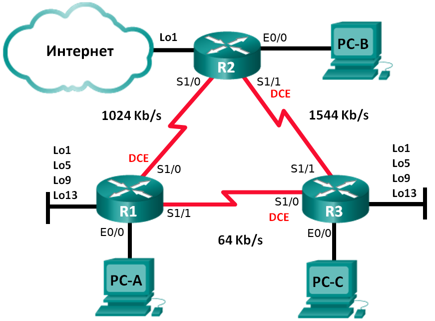
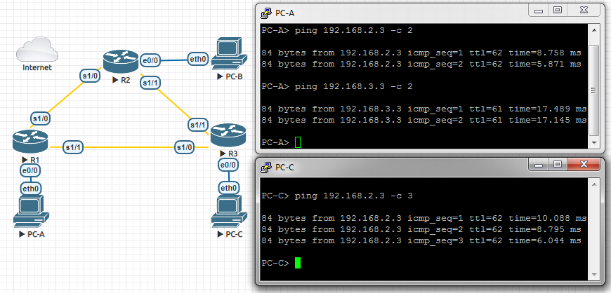

# Настройка расширенных функций EIGRP для IPv4
# Лабораторная работа №6. Расширенный EIGRP


### Задание:

#### Часть 1. [Создание сети и настройка основных параметров устройства](README.md#часть-1-создание-сети-инастройка-основных-параметров-устройства-1)

#### Часть 2. [Настройка EIGRP и проверка подключения](README.md#часть-2-настройка-eigrp-ипроверка-подключения-1)

#### Часть 3. [Настройка EIGRP для автоматического объединения](README.md#часть-3-настройка-eigrp-для-автоматического-объединения-1)

#### Часть 4. [Настройка и распространение статического маршрута по умолчанию](README.md#часть-4-настройка-и-распространение-статического-маршрута-по-умолчанию-1)

#### Часть 5. [Выполнение точной настройки EIGRP](README.md#часть-5-выполнение-точной-настройки-eigrp-1)

#### [Вопросы для повторения](README.md#вопросы-для-повторения-1)

#### [Конфигурационные файлы](README.md#конфигурационные-файлы-здесь)


### Решение:

Создали стенд в eve-ng согласно топологии.
### Топология


### Таблица адресации

<table>
  <tr>
    <th>Устройство</th>
    <th>Интерфейс</th>
    <th>IP-адрес</th>
    <th>Маска подсети</th>
    <th>Шлюз по умолчанию</th>
  </tr>
  <tr>
    <td rowspan="7">R1</td>
    <td>E0/0</td>
    <td>192.168.1.1</td>
    <td>255.255.255.0</td>
    <td rowspan="18"></td>
  </tr>
  <tr>
    <td>S1/0 (DCE)</td>
    <td>192.168.12.1</td>
    <td>255.255.255.252</td>
  </tr>
  <tr>
    <td>S1/1</td>
    <td>192.168.13.1</td>
    <td>255.255.255.252</td>
  </tr>
  <tr>
    <td>Lo1</td>
    <td>192.168.11.1</td>
    <td>255.255.255.252</td>
  </tr>
  <tr>
    <td>Lo5</td>
    <td>192.168.11.5</td>
    <td>255.255.255.252</td>
  </tr>
    <tr>
    <td>Lo9</td>
    <td>192.168.11.9</td>
    <td>255.255.255.252</td>
  </tr>
    <tr>
    <td>Lo13</td>
    <td>192.168.11.13</td>
    <td>255.255.255.252</td>
  </tr>

  <tr>
    <td rowspan="4">R2</td>
    <td>E0/0</td>
    <td>192.168.2.1</td>
    <td>255.255.255.0</td>
  </tr>
  <tr>
    <td>S1/0</td>
    <td>192.168.12.2</td>
    <td>255.255.255.252</td>
  </tr>
  <tr>
    <td>S1/1 (DCE)</td>
    <td>192.168.23.1</td>
    <td>255.255.255.252</td>
  </tr>
  <tr>
    <td>Lo1</td>
    <td>192.168.22.1</td>
    <td>255.255.255.252</td>
  </tr>
  <tr>
    <td rowspan="7">R3</td>
    <td>E0/0</td>
    <td>192.168.3.1</td>
    <td>255.255.255.0</td>
  </tr>
  <tr>
    <td>S1/0 (DCE)</td>
    <td>192.168.13.2</td>
    <td>255.255.255.252</td>
  </tr>
  <tr>
    <td>S1/1</td>
    <td>192.168.23.2</td>
    <td>255.255.255.252</td>
  </tr>
  <tr>
    <td>Lo1</td>
    <td>192.168.33.1</td>
    <td>255.255.255.252</td>
  </tr>
  <tr>
    <td>Lo5</td>
    <td>192.168.33.5</td>
    <td>255.255.255.252</td>
  </tr>
  <tr>
    <td>Lo9</td>
    <td>192.168.33.9</td>
    <td>255.255.255.252</td>
  </tr>
  <tr>
    <td>Lo13</td>
    <td>192.168.33.13</td>
    <td>255.255.255.252</td>
  </tr>
  <tr>
    <td>PC-A</td>
    <td>NIC</td>
    <td>192.168.1.3</td>
    <td>255.255.255.0</td>
    <td>192.168.1.1</td>
  </tr>
  <tr>
    <td>PC-B</td>
    <td>NIC</td>
    <td>192.168.2.3</td>
    <td>255.255.255.0</td>
    <td>192.168.2.1</td>
  </tr>
  <tr>
    <td>PC-C</td>
    <td>NIC</td>
    <td>192.168.3.3</td>
    <td>255.255.255.0</td>
    <td>192.168.3.1</td>
  </tr>
</table>

### Часть 1. Создание сети и настройка основных параметров устройства

<details>
 <summary>Базовые настройки R1</summary>

``` bash
Router>
Router>ena
Router#conf t
Router(config)#hostname R1
R1(config)#no logging console
R1(config)#no ip domain-lookup
R1(config)#service password-encryption 
R1(config)#enable secret class
R1(config)#line console 0
R1(config-line)#password cisco
R1(config-line)#logging synchronous
R1(config-line)#login
R1(config-line)#exit
R1(config)#line vty 0 4
R1(config-line)#password cisco
R1(config-line)#logging synchronous
R1(config-line)#login
R1(config-line)#exit
R1(config)#exit
R1#wr
Building configuration...
[OK]
R1#
R1#conf t
R1(config)#int e0/0
R1(config-if)#ip address 192.168.1.1 255.255.255.0
R1(config-if)#no shutdown
R1(config-if)#end
R1#
R1#conf t
R1(config)#int s1/0
R1(config-if)#ip address 192.168.12.1 255.255.255.252
Invalid address
R1(config-if)#clock rate 128000
R1(config-if)#no shutdown
R1(config-if)#end
R1#
R1#conf t
R1(config)#int s1/1
R1(config-if)#ip address 192.168.13.1 255.255.255.252
Invalid address
R1(config-if)#no shutdown
R1(config-if)#end
R1#wr
Building configuration...
[OK]
```
</details>

<details>
 <summary>Базовые настройки R2</summary>

``` bash
Router>
Router>ena
Router#conf t
Router(config)#hostname R2
R2(config)#no logging console
R2(config)#no ip domain-lookup
R2(config)#service password-encryption 
R2(config)#enable secret class
R2(config)#line console 0
R2(config-line)#password cisco
R2(config-line)#logging synchronous
R2(config-line)#login
R2(config-line)#exit
R2(config)#line vty 0 4
R2(config-line)#password cisco
R2(config-line)#logging synchronous
R2(config-line)#login
R2(config-line)#exit
R2(config)#exit
R2#wr
Building configuration...
[OK]
R2#
R2#conf t
R2(config)#int e0/0
R2(config-if)#ip address 192.168.2.1 255.255.255.0
R2(config-if)#no shutdown
R2(config-if)#end
R2#
R2#conf t
R2(config)#int s1/0
R2(config-if)#ip address 192.168.12.2 255.255.255.252
Invalid address
R2(config-if)#no shutdown
R2(config-if)#end
R2#
R2#conf t
R2(config)#int s1/1
R2(config-if)#ip address 192.168.23.1 255.255.255.252
Invalid address
R2(config-if)#clock rate 128000
R2(config-if)#no shutdown
R2(config-if)#end
R2#wr
Building configuration...
[OK]
```
</details>

<details>
 <summary>Базовые настройки R3</summary>

``` bash
Router>ena
Router#conf t
Router(config)#hostname R3
R3(config)#no logging console
R3(config)#no ip domain-lookup
R3(config)#service password-encryption 
R3(config)#enable secret class
R3(config)#line console 0
R3(config-line)#password cisco
R3(config-line)#logging synchronous
R3(config-line)#login
R3(config-line)#exit
R3(config)#line vty 0 4
R3(config-line)#password cisco
R3(config-line)#logging synchronous
R3(config-line)#login
R3(config-line)#exit
R3(config)#exit
R3#wr
Building configuration...
[OK]
R3#
R3#conf t
R3(config)#int e0/0
R3(config-if)#ip address 192.168.3.1 255.255.255.0
R3(config-if)#no shutdown
R3(config-if)#end
R3#
R3#conf t
R3(config)#int s1/0
R3(config-if)#ip address 192.168.13.2 255.255.255.252
Invalid address
R3(config-if)#clock rate 128000
R3(config-if)#no shutdown
R3(config-if)#end
R3#
R3#conf t
R3(config)#int s1/1
R3(config-if)#ip address 192.168.23.2 255.255.255.252
Invalid address
R3(config-if)#no shutdown
R3(config-if)#end
R3#wr
Building configuration...
[OK]
```
</details>

<details>
 <summary>Настройки ПК</summary>

PC-A
``` bash
VPCS> set pcname PC-A

PC-A> ip 192.168.1.3/24 192.168.1.1
Checking for duplicate address...
PC1 : 192.168.1.3 255.255.255.0 gateway 192.168.1.1
```
PC-B
``` bash
VPCS> set pcname PC-B

PC-B> ip 192.168.2.3/24 192.168.2.1
Checking for duplicate address...
PC1 : 192.168.2.3 255.255.255.0 gateway 192.168.2.1
```
PC-C
``` bash
VPCS> set pcname PC-C

PC-C> ip 192.168.3.3/24 192.168.3.1
Checking for duplicate address...
PC1 : 192.168.3.3 255.255.255.0 gateway 192.168.3.1
```
</details>

### Часть 2. Настройка EIGRP и проверка подключения

Настроим EIGRP на всех маршрутизаторах
<details>
 <summary>R1</summary>

``` bash
R1#conf t
R1(config)#router eigrp 1
R1(config-router)#network 192.168.1.0 0.0.0.255
R1(config-router)#network 192.168.12.0 0.0.0.3
R1(config-router)#network 192.168.13.0 0.0.0.3
R1(config-router)#passive-interface e0/0
R1(config)#exit
R1(config)#int s1/0
R1(config-if)#band
R1(config-if)#bandwidth 1024
R1(config-if)#int s1/1
R1(config-if)#band
R1(config-if)#bandwidth 64
R1(config-if)#end
R1#wr
```
</details>

<details>
 <summary>R2</summary>

``` bash
R2#conf t
R2(config)#router eigrp 1
R2(config-router)#network 192.168.2.0
R2(config-router)#network 192.168.12.0 0.0.0.3
R2(config-router)#network 192.168.23.0 0.0.0.3
R2(config-router)#passive-interface e0/0
R2(config-router)#exit
R2(config)#int s1/0
R2(config-if)#band
R2(config-if)#bandwidth 1024
R2(config-if)#int s1/1
R2(config-if)#band
R2(config-if)#bandwidth 1544
R2(config-if)#end
R2#wr
```
</details>

<details>
 <summary>R3</summary>

``` bash
R3#conf t
R3(config)#router eigrp 1
R3(config-router)#network 192.168.3.0
R3(config-router)#network 192.168.13.0 0.0.0.3
R3(config-router)#network 192.168.23.0 0.0.0.3
R3(config-router)#passive-interface e0/0
R3(config-router)#exit
R3(config)#int s1/0
R3(config-if)#band
R3(config-if)#bandwidth 64
R3(config-if)#int s1/1
R3(config-if)#band
R3(config-if)#bandwidth 1544
R3(config-if)#end
R3#wr
```
</details>

<details>
 <summary>Проверка доступности хостов между собой</summary>


</details>

### Часть 3. Настройка EIGRP для автоматического объединения

По-умолчанию автосуммирование маршрутов выключено.
Настроим loopback-адреса на всех роутерах и включим их анонсирование в EIGRP.

<details>
 <summary>R1</summary>

``` bash
R1#conf t
R1(config)#int Lo1
R1(config-if)#ip address 192.168.11.1 255.255.255.252
R1(config-if)#no shutdown
R1(config-if)#end
R1#conf t
R1(config)#int Lo5
R1(config-if)#ip address 192.168.11.5 255.255.255.252
R1(config-if)#no shutdown
R1(config-if)#end
R1#conf t
R1(config)#int Lo9
R1(config-if)#ip address 192.168.11.9 255.255.255.252
R1(config-if)#no shutdown
R1(config-if)#end
R1#conf t
R1(config)#int Lo13
R1(config-if)#ip address 192.168.11.13 255.255.255.252
R1(config-if)#no shutdown
R1(config-if)#end
R1#conf t
R1(config)#router eigrp 1
R1(config-router)#network 192.168.11.0 0.0.0.3
R1(config-router)#network 192.168.11.5 0.0.0.3
R1(config-router)#network 192.168.11.9 0.0.0.3
R1(config-router)#network 192.168.11.13 0.0.0.3
R1(config-router)#end
R1#wr
```
</details>

<details>
 <summary>R2</summary>

``` bash
R2#conf t
R2(config)#int Lo1
R2(config-if)#ip address 192.168.22.1 255.255.255.252
R2(config-if)#no shutdown
R2(config-if)#end
R2#conf t
R2(config)#router eigrp 1
R2(config-router)#network 192.168.22.0 0.0.0.3
R2#wr
```
</details>

<details>
 <summary>R3</summary>

``` bash
R3#conf t
R3(config)#int Lo1
R3(config-if)#ip address 192.168.33.1 255.255.255.252
R3(config-if)#no shutdown
R3(config-if)#end
R3#conf t
R3(config)#int Lo5
R3(config-if)#ip address 192.168.33.5 255.255.255.252
R3(config-if)#no shutdown
R3(config-if)#end
R3#conf t
R3(config)#int Lo9
R3(config-if)#ip address 192.168.33.9 255.255.255.252
R3(config-if)#no shutdown
R3(config-if)#end
R3#conf t
R3(config)#int Lo13
R3(config-if)#ip address 192.168.33.13 255.255.255.252
R3(config-if)#no shutdown
R3(config-if)#end
R3#conf t
R3(config)#router eigrp 1
R3(config-router)#network 192.168.33.0 0.0.0.3
R3(config-router)#network 192.168.33.5 0.0.0.3
R3(config-router)#network 192.168.33.9 0.0.0.3
R3(config-router)#network 192.168.33.13 0.0.0.3
R3#wr
```
</details>

Проверим таблицу маршрутизации на R2 до и после включения автосуммирования на R1.

<details>
 <summary>До auto-sum R1</summary>

``` bash
R2#sh ip route eigrp | incl 192.168.11
      192.168.11.0/30 is subnetted, 4 subnets
D        192.168.11.0 [90/3139840] via 192.168.12.1, 00:02:41, Serial1/0
D        192.168.11.4 [90/3139840] via 192.168.12.1, 00:02:41, Serial1/0
D        192.168.11.8 [90/3139840] via 192.168.12.1, 00:02:41, Serial1/0
D        192.168.11.12 [90/3139840] via 192.168.12.1, 00:02:41, Serial1/0
```
</details>
<details>
 <summary>После auto-sum R1</summary>

``` bash
R2#sh ip route eigrp | incl 192.168.11
D     192.168.11.0/24 [90/3139840] via 192.168.12.1, 00:00:14, Serial1/0
```
</details>

### Часть 4. Настройка и распространение статического маршрута по умолчанию

Настроим статический маршрут по-умолчанию на R2 и анонсируем его через EIGRP.

<details>
 <summary>Static route R2</summary>

``` bash
R2(config)#ip route 0.0.0.0 0.0.0.0 Lo1

R2(config)#router eigrp 1
R2(config-router)#redistribute static

R2#sh ip protocols | sec Redi
  Redistributing: static

R2#sh ip protocols | sec Distan
      Distance: internal 90 external 170
    Gateway         Distance      Last Update
  Distance: internal 90 external 170

```
</details>
