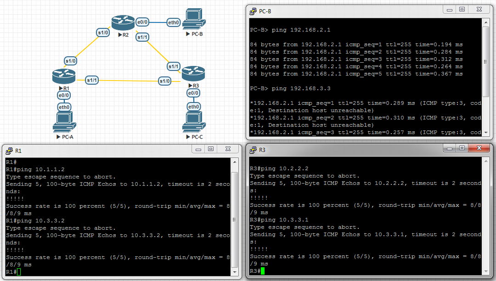

# Базовая настройка протокола EIGRP для IPv4
# Лабораторная работа №6. Базовый EIGRP

### Задание:
#### Часть 1. [Построение сети и проверка связи](README.md#часть-1-построение-сети-и-проверка-связи-1)

#### Часть 2. [Настройка маршрутизации EIGRP](README.md#часть-2-настройка-маршрутизации-eigrp-1)

#### Часть 3. [Проверка маршрутизации](README.md#часть-3-проверка-маршрутизации-1)

#### Часть 4. [Настройка пропускной способности и пассивных интерфейсов](README.md#часть-4-настройка-пропускной-способности-и-пассивных-интерфейсов-1)


### Решение:

### Часть 1. Построение сети и проверка связи

Создали стенд в eve-ng согласно топологии.
### Топология


### Таблица адресации

<table>
  <tr>
    <th>Устройство</th>
    <th>Интерфейс</th>
    <th>IP-адрес</th>
    <th>Маска подсети</th>
    <th>Шлюз по умолчанию</th>
  </tr>
  <tr>
    <td rowspan="3">R1</td>
    <td>E0/0</td>
    <td>192.168.1.1</td>
    <td>255.255.255.0</td>
    <td rowspan="9"></td>
  </tr>
  <tr>
    <td>S1/0 (DCE)</td>
    <td>10.1.1.1</td>
    <td>255.255.255.252</td>
  </tr>
  <tr>
    <td>S1/1</td>
    <td>10.3.3.1</td>
    <td>255.255.255.252</td>
  </tr>
  <tr>
    <td rowspan="3">R2</td>
    <td>E0/0</td>
    <td>192.168.2.1</td>
    <td>255.255.255.0</td>
  </tr>
  <tr>
    <td>S1/0</td>
    <td>10.1.1.2</td>
    <td>255.255.255.252</td>
  </tr>
  <tr>
    <td>S1/1 (DCE)</td>
    <td>10.2.2.2</td>
    <td>255.255.255.252</td>
  </tr>
  <tr>
    <td rowspan="3">R3</td>
    <td>E0/0</td>
    <td>192.168.3.1</td>
    <td>255.255.255.0</td>
  </tr>
  <tr>
    <td>S1/0 (DCE)</td>
    <td>10.3.3.2</td>
    <td>255.255.255.252</td>
  </tr>
  <tr>
    <td>S1/1</td>
    <td>10.2.2.1</td>
    <td>255.255.255.252</td>
  </tr>
  <tr>
    <td>PC-A</td>
    <td>NIC</td>
    <td>192.168.1.3</td>
    <td>255.255.255.0</td>
    <td>192.168.1.1</td>
  </tr>
  <tr>
    <td>PC-B</td>
    <td>NIC</td>
    <td>192.168.2.3</td>
    <td>255.255.255.0</td>
    <td>192.168.2.1</td>
  </tr>
  <tr>
    <td>PC-C</td>
    <td>NIC</td>
    <td>192.168.3.3</td>
    <td>255.255.255.0</td>
    <td>192.168.3.1</td>
  </tr>
</table>


<details>
 <summary>Базовые настройки R1</summary>

``` bash
Router#conf t
Router(config)#hostname R1
R1(config)#no logging console
R1(config)#no ip domain-lookup
R1(config)#service password-encryption
R1(config)#enable secret class
R1(config)#line console 0
R1(config-line)#password cisco
R1(config-line)#logging synchronous
R1(config-line)#login
R1(config-line)#exit
R1(config)#line vty 0 4
R1(config-line)#password cisco
R1(config-line)#logging synchronous
R1(config-line)#login
R1(config-line)#exit
R1(config)#exit
R1#wr
Building configuration...
[OK]
R1#
R1#conf t
R1(config)#int e0/0
R1(config-if)#ip address 192.168.1.1 255.255.255.0
R1(config-if)#no shutdown
R1(config-if)#end
R1#
R1#conf t
R1(config)#int s1/0
R1(config-if)#ip address 10.1.1.1 255.255.255.252
R1(config-if)#clock rate 128000
R1(config-if)#no shutdown
R1(config-if)#end
R1#
R1#conf t
R1(config)#int s1/1
R1(config-if)#ip address 10.3.3.1 255.255.255.252
R1(config-if)#no shutdown
R1(config-if)#end
R1#wr
```
</details>

<details>
 <summary>Базовые настройки R2</summary>

``` bash
Router#conf t
Router(config)#hostname R2
R2(config)#no logging console
R2(config)#no ip domain-lookup
R2(config)#service password-encryption
R2(config)#enable secret class
R2(config)#line console 0
R2(config-line)#password cisco
R2(config-line)#logging synchronous
R2(config-line)#login
R2(config-line)#exit
R2(config)#line vty 0 4
R2(config-line)#password cisco
R2(config-line)#logging synchronous
R2(config-line)#login
R2(config-line)#exit
R2(config)#exit
R2#wr
Building configuration...
[OK]
R2#
R2#conf t
R2(config)#int e0/0
R2(config-if)#ip address 192.168.2.1 255.255.255.0
R2(config-if)#no shutdown
R2(config-if)#end
R2#
R2#conf t
R2(config)#int s1/0
R2(config-if)#ip address 10.1.1.2 255.255.255.252
R2(config-if)#no shutdown
R2(config-if)#end
R2#
R2#conf t
R2(config)#int s1/1
R2(config-if)#ip address 10.2.2.2 255.255.255.252
R2(config-if)#clock rate 128000
R2(config-if)#no shutdown
R2(config-if)#end
R2#wr
```
</details>

<details>
 <summary>Базовые настройки R3</summary>

``` bash
Router#conf t
Router(config)#hostname R3
R3(config)#no logging console
R3(config)#no ip domain-lookup
R3(config)#service password-encryption
R3(config)#enable secret class
R3(config)#line console 0
R3(config-line)#password cisco
R3(config-line)#logging synchronous
R3(config-line)#login
R3(config-line)#exit
R3(config)#line vty 0 4
R3(config-line)#password cisco
R3(config-line)#logging synchronous
R3(config-line)#login
R3(config-line)#exit
R3(config)#exit
R3#wr
Building configuration...
[OK]
R3#
R3#conf t
R3(config)#int e0/0
R3(config-if)#ip address 192.168.3.1 255.255.255.0
R3(config-if)#no shutdown
R3(config-if)#end
R3#
R3#conf t
R3(config)#int s1/0
R3(config-if)#ip address 10.3.3.2 255.255.255.252
R3(config-if)#clock rate 128000
R3(config-if)#no shutdown
R3(config-if)#end
R3#
R3#conf t
R3(config)#int s1/1
R3(config-if)#ip address 10.2.2.1 255.255.255.252
R3(config-if)#no shutdown
R3(config-if)#end
R3#wr
Building configuration...
[OK]

```
</details>

<details>
 <summary>Результаты ping</summary>

``` bash
На скриншоте видим:
- Компьютер PC-B видит свой шлюз по-умолчанию, но не видит соседние компьютеры (не настроена маршрутизация между роутерами);
- R1 видит интерфейсы R2 и R3, подключённые непосредственно к нему;
- R3 аналогично -> R1 и R2.
```



</details>

### Часть 2. Настройка маршрутизации EIGRP

