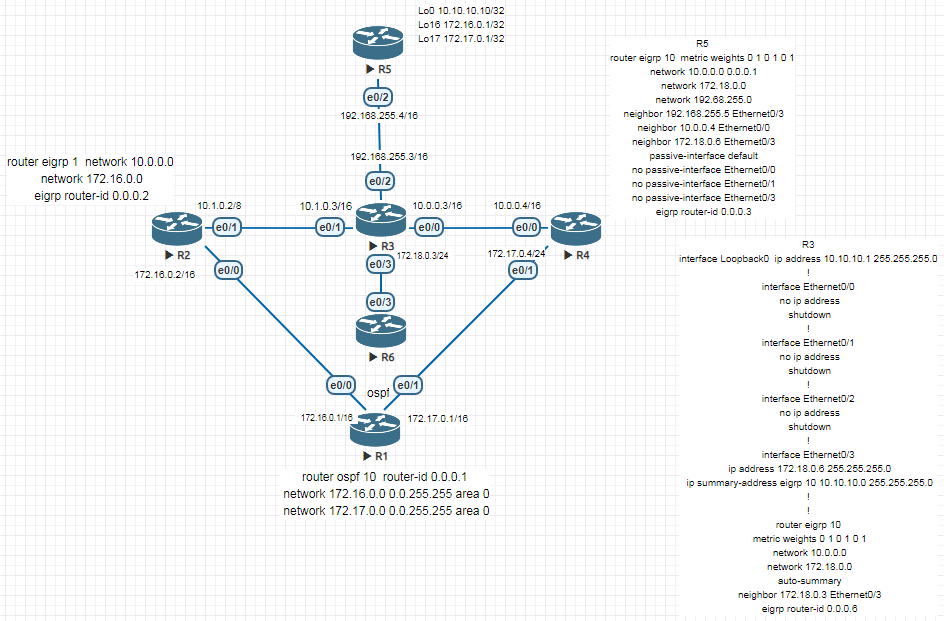
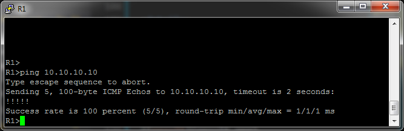

# Диагностика типичных проблем в работе EIGRP
# Лабораторная работа №6. Troubleshooting

### Задание:
Разобрать и устранить неисправности, связанные с работой сети и протокола EIGRP. Задание считается выполненным, если интерфейс 10.10.10.10 доступен с R1.
#### 1. [План действий](README.md#1-план-действий-1)
#### 2. [Список изменений](README.md#2-список-изменений-1)
#### 3. [Результат](README.md#3-результат-1)
#### [Конфигурационные файлы](README.md#конфигурационные-файлы-здесь)


### Топология



### Решение:

### 1. План действий:
1. Проверить активность интерфейсов и их настройки на 2 и 3 уровне:
    - вкл/выкл интерфейсов;
    - соответствие access/vlan портов;
    - настройку ip-адресов на портах. Убедиться, что адрес находится в той же подсети, что и адрес порта соседнего роутера;
    - наличие фильтрации на интерфейсах;

Результат: соседние роутеры должны пинговаться между собой.

2. Проверить настройки маршрутизации:
    - Проверить наличие статических маршрутов. При необходимости отключить их;
    - Проверить правильность настроек протоколов динамической маршрутизации:
        - Одинаковый протокол и id-процесса;
        - Одинаковые метрики. (Значение коэффициентов К1-K5)
        - Значения таймеров отправки hello- и hold-пакетов;

### 2. Список изменений

<details>
 <summary>Настройки R1</summary>

``` bash
- e0/0: Убираем фильтр на access-list
Включаем интерфейсов
- e0/1: Убираем фильтр на access-list
- Настроена маршрутизация по OSFP.
- Деактивируем OSPF и настраиваем EIGRP.
Хотя, думаю можно было бы сделать редистрибуцию, но данную тему пока не проходили:)
```

``` bash
R1(config)#int e0/0
R1(config-if)#no ip access-group 10 in
R1(config-if)#no shutdown

R2(config)#int e0/0
R2(config-if)#no ip access-group 10 in

R1(config)#no router ospf 10
R1(config)#router eigrp 10
R1(config-router)#network 172.16.0.0
R1(config-router)#network 172.17.0.0
```
</details>

<details>
 <summary>Настройки R2</summary>

``` bash
- Исправим hostname на R2
- Исправим id-процесса EIGRP на 10.
-На e0/1 исправим маску подсети c /8 на /16
```
</details>

<details>
 <summary>Настройки R3</summary>

``` bash
- Включим e0/2
- Исправим опечатку 192.68.0.0
- Включим маршрутизацию.
- Включим анонсирование маршрутов на интерейсах e0/0-e0/3.
- У R3 нет соседа 192.168.255.5 через e0/3
- Уберем статический маршрут до 10.10.10.10.
```
</details>

<details>
 <summary>Настройки R4</summary>

``` bash
- Анонсируем интерфейсы e0/0 и e0/1 в EIGRP и активируем eigrp 10.
- Уберём настройки таймеров отправки hello и hold пакетов
- Активируем eigrp 10.
- Убираем статический роутинг до 10.0.0.0/8 через e0/1
```
</details>

<details>
 <summary>Настройки R5</summary>

``` bash
- На e0/2 уберём привязку к access-list, назначим ip 192.168.255.4/16 и включим его.
- На e0/0 ip-адресс из той же подсети, что и на e0/2. Убираем.
- Не настроен EIGRP. Анонсируем интерфейсы 192.168.255.0/16 и Lo1
- Уберём no ip route-cache с e0/2 и Lo1
- Адреса интерфейсов Lo16 и Lo17 пересекаются с адресами R1. Уберём сетевые настройки.
- Включим Lo1.
```
</details>

<details>
 <summary>Настройки R6</summary>

``` bash
- Изменим маску для Lo0 на /32
- Отключим суммаризации маршрутов на интерфейсе e0/3 и в конфигурации eigrp.
- В EIGRP уберём параметры метрики. - Исправим анонсирование интерфейсов из 10 подсети.
```
</details>
</br>
Полный список исправлений (см. конф.файлы)

### 3. Результат



### Конфигурационные файлы [здесь](config/).
