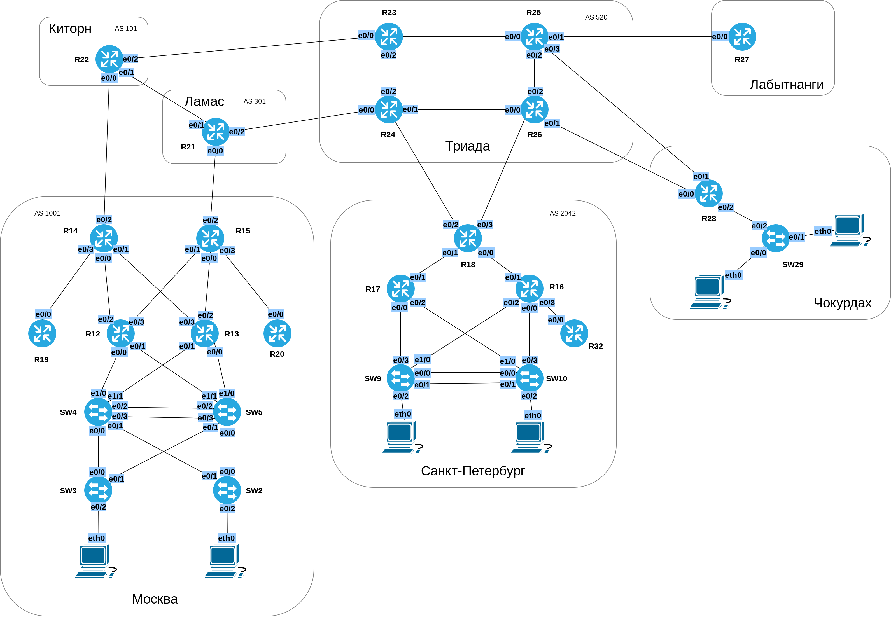
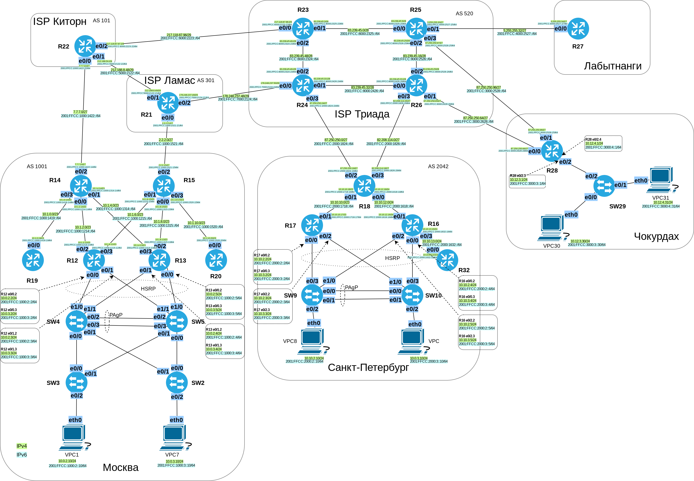

# Распланировать адресное пространство
# Настроить IP на всех активных портах
# Лабораторная работа №7. IPv4/IPv6

### Задание:
#### 1. [Разработать и задокументировать адресное пространство IPv4 и IPv6](README.md#1-разработать-и-задокументировать-адресное-пространство-ipv4-и-ipv6-1);
#### 2. [Задокументировать ip-адреса для маршрутизаторов и коммутаторов](README.md#2-задокументировать-ip-адреса-для-маршрутизаторов-и-коммутаторов-1);
#### 3. [Настроить IP адреса на каждом активном порту](README.md#3-настроить-IP-адреса-на-каждом-активном-порту-1);
#### 4. Настроить VLAN управления для сетевых устройств;
#### 5. Задокументировать все изменения.
#### [Конфигурационные файлы](README.md#конфигурационные-файлы-здесь)

### Решение:

### Топология

### 1. Разработать и задокументировать адресное пространство IPv4 и IPv6

Суммарная таблица LAN подсетей
<table>
  <tr>
    <th>Network</th>
    <th>Office</th>
    <th>Summary net</th>
    <th>Description</th>
  </tr>
  <tr>
    <th>10.0.0.0/14</th>
    <th>Москва</th>
    <td rowspan="4">/13</td>
    <th>10.[0-3].0.0/14</th>
  <tr>
    <th>10.10.0.0/15</th>
    <th>Санкт-Петербург</th>
    <th>10.[10-11].0.0/15</th>
  </tr>
  <tr>
    <th>10.12.0.0/16</th>
    <th>Чокурдах</th>
    <th>10.[12].0.0/16</th>
  </tr>
  <tr>
    <th>10.13.0.1/16</th>
    <th>Лабытнанги</th>
    <th>10.13.0.1/16</th>
  </tr>
</table>

Общая таблица подсетей IPv4/IPv6

Network IPv4 | Summary net | Network IPv6 | Summary net | Description | Eq&port
------------:|:------------|-------------:|:----------- |:-----------:|:-----
10.0.2.0/24       |  10.0.0.0/14   | 2001:FFCC:1000:2::/64    | 2001:FFCC:1000::/48 | Москва                 | SW2
10.0.3.0/24       | 10.0.0.0/14    | 2001:FFCC:1000:3::/64    | 2001:FFCC:1000::/48 | Москва                 | SW3
10.0.2.0/24       | 10.0.0.0/14    | 2001:FFCC:1000:2::/64    | 2001:FFCC:1000::/48 | Москва                 | SW4
10.0.3.0/24       | 10.0.0.0/14    | 2001:FFCC:1000:3::/64    | 2001:FFCC:1000::/48 | Москва                 | SW5
10.0.2.0/24       | 10.0.0.0/14    | 2001:FFCC:1000:2::/64    | 2001:FFCC:1000::/48 | Москва                 | VPC1
10.0.3.0/24       | 10.0.0.0/14    | 2001:FFCC:1000:3::/64    | 2001:FFCC:1000::/48 | Москва                 | VPC7
10.0.2.0/24       | 10.0.0.0/14    | 2001:FFCC:1000:2::/64    | 2001:FFCC:1000::/48 | Москва                 | R12e0/0.2 SW4e1/0 
10.0.3.0/24       | 10.0.0.0/14    | 2001:FFCC:1000:3::/64    | 2001:FFCC:1000::/48 | Москва                 | R12e0/0.3 SW4e1/0
10.0.2.0/24       | 10.0.0.0/14    | 2001:FFCC:1000:2::/64    | 2001:FFCC:1000::/48 | Москва                 | R12e0/1.2 SW5e1/1
10.0.3.0/24       | 10.0.0.0/14    | 2001:FFCC:1000:3::/64    | 2001:FFCC:1000::/48 | Москва                 | R12e0/1.3 SW5e1/1
10.0.2.0/24       | 10.0.0.0/14    | 2001:FFCC:1000:2::/64    | 2001:FFCC:1000::/48 | Москва                 | R13e0/0.2 SW5 e1/0
10.0.3.0/24       | 10.0.0.0/14    | 2001:FFCC:1000:3::/64    | 2001:FFCC:1000::/48 | Москва                 | R13e0/0.3 SW5e1/0
10.0.2.0/24       | 10.0.0.0/14    | 2001:FFCC:1000:2::/64    | 2001:FFCC:1000::/48 | Москва                 | R13e0/1.2 SW4e1/1
10.0.3.0/24       | 10.0.0.0/14    | 2001:FFCC:1000:3::/64    | 2001:FFCC:1000::/48 | Москва                 | R13e0/1.3 SW4 e1/1
10.1.0.0/23       | 10.0.0.0/14    | 2001:FFCC:1000:1419::/64 | 2001:FFCC:1000::/48 | Москва                 | R19e0/0 R14e0/3
10.1.2.0/23       | 10.0.0.0/14    | 2001:FFCC:1000:1214::/64 | 2001:FFCC:1000::/48 | Москва                 | R12e0/2 R14e0/0
10.1.4.0/23       | 10.0.0.0/14    | 2001:FFCC:1000:1314::/64 | 2001:FFCC:1000::/48 | Москва                 | R14e0/1 R13e0/3
10.1.6.0/23       | 10.0.0.0/14    | 2001:FFCC:1000:1215::/64 | 2001:FFCC:1000::/48 | Москва                 | R12e0/3 R15e0/1
10.1.8.0/23       | 10.0.0.0/14    | 2001:FFCC:1000:1315::/64 | 2001:FFCC:1000::/48 | Москва                 | R13e0/2 R15e0/0
10.1.10.0/23      | 10.0.0.0/14    | 2001:FFCC:1000:1520::/64 | 2001:FFCC:1000::/48 | Москва                 | R15e0/3 R20e0/0
7.7.7.0/27        | not used       | 2001:FFCC:1000:1422::/64 | 2001:FFCC:1000::/48 | To Internet [“Киторн”] | R14e0/2 R22e0/0
2.2.2.0/27        | not used       | 2001:FFCC:1000:1521::/64 | 2001:FFCC:1000::/48 | To Internet [“Ламас”]  | R15e0/2 R21e0/0
10.10.2.0/24      | 10.10.0.0/15   | 2001:FFCC:2000:2::/64    | 2001:FFCC:2000::/48 | С.Петербург            | R17e0/0.2 SW9e0/3
10.10.3.0/24      | 10.10.0.0/15   | 2001:FFCC:2000:3::/64    | 2001:FFCC:2000::/48 | С.Петербург            | R17e0/0.3 SW9e0/3
10.10.2.0/24      | 10.10.0.0/15   | 2001:FFCC:2000:2::/64    | 2001:FFCC:2000::/48 | С.Петербург            | R17e0/2.2 SW10e1/0
10.10.3.0/24      | 10.10.0.0/15   | 2001:FFCC:2000:3::/64    | 2001:FFCC:2000::/48 | С.Петербург            | R17e0/2.3 SW10e1/0
10.10.2.0/24      | 10.10.0.0/15   | 2001:FFCC:2000:2::/64    | 2001:FFCC:2000::/48 | С.Петербург            | R16e0/2.2 SW9e1/0
10.10.3.0/24      | 10.10.0.0/15   | 2001:FFCC:2000:3::/64    | 2001:FFCC:2000::/48 | С.Петербург            | R16e0/2.3 SW9e1/0
10.10.2.0/24      | 10.10.0.0/15   | 2001:FFCC:2000:2::/64    | 2001:FFCC:2000::/48 | С.Петербург            | R16e0/0.2 SW10e0/3
10.10.3.0/24      | 10.10.0.0/15   | 2001:FFCC:2000:3::/64    | 2001:FFCC:2000::/48 | С.Петербург            | R16e0/0.3 SW10e0/3
10.10.2.0/24      | 10.10.0.0/15   | 2001:FFCC:2000:2::/64    | 2001:FFCC:2000::/48 | С.Петербург            | VPC8
10.10.3.0/24      | 10.10.0.0/15   | 2001:FFCC:2000:3::/64    | 2001:FFCC:2000::/48 | С.Петербург            | VPC
10.10.2.0/24      | 10.10.0.0/15   | 2001:FFCC:2000:2::/64    | 2001:FFCC:2000::/48 | С.Петербург            | Vlan2
10.10.3.0/24      | 10.10.0.0/15   | 2001:FFCC:2000:3::/64    | 2001:FFCC:2000::/48 | С.Петербург            | Vlan3
10.10.10.0/23     | 10.10.0.0/15   | 2001:FFCC:2000:1718::/64 | 2001:FFCC:2000::/48 | С.Петербург            | R17e0/1 R18e0/1
10.10.12.0/24     | 10.10.0.0/15   | 2001:FFCC:2000:1618::/64 | 2001:FFCC:2000::/48 | С.Петербург            | R18e0/0 R16e0/1
10.10.13.0/24     | 10.10.0.0/15   | 2001:FFCC:2000:1632::/64 | 2001:FFCC:2000::/48 | С.Петербург            | R16e0/3 R32e0/0
87.250.250.0/27   | not used       | 2001:FFCC:2000:1824::/64 | 2001:FFCC:2000::/48 | To Internet [“Триада”] | R18e0/2 R24e0/3 
82.208.114.0/27   | not used       | 2001:FFCC:2000:1826::/64 | 2001:FFCC:2000::/48 | To Internet [“Триада”] | R18e0/3 R26e0/3
10.12.3.0/24      | 10.12.0.0/16   | 2001:FFCC:3000:3::/64    | 2001:FFCC:3000::/48 | Чокурдах               | R28e0/2.3 SW29e0/2
10.12.4.0/24      | 10.12.0.0/16   | 2001:FFCC:3000:4::/64    | 2001:FFCC:3000::/48 | Чокурдах               | R28e0/2.4 SW29e0/2
10.12.3.0/24      | 10.12.0.0/16   | 2001:FFCC:3000:3::/64    | 2001:FFCC:3000::/48 | Чокурдах               | VPC30
10.12.4.0/24      | 10.12.0.0/16   | 2001:FFCC:3000:4::/64    | 2001:FFCC:3000::/48 | Чокурдах               | VPC31
10.12.3.0/24      | 10.12.0.0/16   | 2001:FFCC:3000:3::/64    | 2001:FFCC:3000::/48 | Чокурдах               | Vlan3
10.12.4.0/24      | 10.12.0.0/16   | 2001:FFCC:3000:4::/64    | 2001:FFCC:3000::/48 | Чокурдах               | Vlan4
87.250.250.64/27  | not used       | 2001:FFCC:3000:2628::/64 | not used            | To Internet [“Триада”] | R28e0/0 R26e0/1
87.250.250.96/27  | not used       | 2001:FFCC:3000:2528::/64 | not used            | To Internet [“Триада”] | R28e0/1 R25e0/3
5.255.255.32/27   | not used       | 2001:FFCC:4000:2527::/64 | not used            | Лабытнанги             | R27e0/0 R25e0/1
212.188.8.48/29   | not used       | 2001:FFCC:5000:2122::/64 | not used            | ISP Киторн-Ламас       | R21e0/1 R22e0/1
217.118.87.96/29  | not used       | 2001:FFCC:6000:2223::/64 | not used            | ISP Киторн-Триада      | R22e0/2 R23e0/0
178.248.237.48/29 | not used       | 2001:FFCC:7000:2124::/64 | not used            | ISP Ламас-Триада       | R21e0/2 R24e0/0
83.239.45.0/28    | 83.239.45.0/26 | 2001:FFCC:8000:2325::/64 | 2001:FFCC:8000::/48 | ISP Триада             | R23e0/1 R25e0/0
83.239.45.16/28   | 83.239.45.0/26 | 2001:FFCC:8000:2526::/64 | 2001:FFCC:8000::/48 | ISP Триада             | R25e0/2 R26e0/2
83.239.45.32/28   | 83.239.45.0/26 | 2001:FFCC:8000:2426::/64 | 2001:FFCC:8000::/48 | ISP Триада             | R26e0/0 R24e0/1
83.239.45.48/28   | 83.239.45.0/26 | 2001:FFCC:8000:2324::/64 | 2001:FFCC:8000::/48 | ISP Триада             | R24e0/2 R23e0/2

### 2. Задокументировать ip-адреса для маршрутизаторов и коммутаторов

Общая таблица сетевых адресов на интерфейсах маршрутизаторов и коммутаторов

Equipment    | Port   | AddrTyp | IP Address                 | Network                  | Description
|:-----------|:-------|:--------|---------------------------:|:------------------------ |:-----------
R12          | E0/0.2 | IPv4    | 10.0.2.2/24                | 10.0.2.0/24              | R12 to SW4
R12          | E0/0.2 | IPv6    | 2001:FFCC:1000:2::2/64     | 2001:FFCC:1000:2::/64    | R12 to SW4
R12          | E0/0.2 | IPv6 LL | FE80::12/10                | FE80::/10                | Link-local e0/0.2
R12          | E0/0.3 | IPv4    | 10.0.3.2/24                | 10.0.3.0/24              | R12 to SW4
R12          | E0/0.3 | IPv6    | 2001:FFCC:1000:3::2/64     | 2001:FFCC:1000:3::/64    | R12 to SW4
R12          | E0/0.3 | IPv6 LL | FE80::12/10                | FE80::/10                | Link-local e0/0.3
R12          | E0/1.2 | IPv4    | 10.0.2.3/24                | 10.0.2.0/24              | R12 to SW5
R12          | E0/1.2 | IPv6    | 2001:FFCC:1000:2::3/64     | 2001:FFCC:1000:2::/64    | R12 to SW4
R12          | E0/1.2 | IPv6 LL | FE80::12/10                | FE80::/10                | Link-local e0/1.2
R12          | E0/1.3 | IPv4    | 10.0.3.3/24                | 10.0.3.0/24              | R12 to SW5
R12          | E0/1.3 | IPv6    | 2001:FFCC:1000:3::3/64     | 2001:FFCC:1000:3::/64    | R12 to SW4
R12          | E0/1.3 | IPv6 LL | FE80::12/10                | FE80::/10                | Link-local e0/1.3
R12          | E0/2   | IPv4    | 10.1.2.12/23               | 10.1.2.0/23              | R12 to R14
R12          | E0/2   | IPv6    | 2001:FFCC:1000:1214::12/64 | 2001:FFCC:1000:1214::/64 | R12 to R14
R12          | E0/2   | IPv6 LL | FE80::12/10                | FE80::/10                | Link-local e0/2
R12          | E0/3   | IPv4    | 10.1.6.12/23               | 10.1.6.0/23              | R12 to R15
R12          | E0/3   | IPv6    | 2001:FFCC:1000:1215::12/64 | 2001:FFCC:1000:1215::/64 | R12 to R15
R12          | E0/3   | IPv6 LL | FE80::12/10                | FE80::/10                | Link-local e0/3
R13          | E0/2   | IPv4    | 10.1.8.13/23               | 10.1.8.0/23              | R13 to R15
R13          | E0/2   | IPv6    | 2001:FFCC:1000:1315::13/64 | 2001:FFCC:1000:1315::/64 | R13 to R15
R13          | E0/2   | IPv6 LL | FE80::13/10                | FE80::/10                | Link-local e0/2
R13          | E0/3   | IPv4    | 10.1.4.13/23               | 10.1.4.0/23              | R13 to R14
R13          | E0/3   | IPv6    | 2001:FFCC:1000:1314::13/64 | 2001:FFCC:1000:1314::/64 | R13 to R14
R13          | E0/3   | IPv6 LL | FE80::13/10                | FE80::/10                | Link-local e0/3
R13          | E0/0.2 | IPv4    | 10.0.2.5/24                | 10.0.2.0/24              | R13 to SW5
R13          | E0/0.2 | IPv6    | 2001:FFCC:1000:2::5/64     | 2001:FFCC:1000:2::/64    | R13 to SW5
R13          | E0/0.2 | IPv6 LL | FE80::13/10                | FE80::/10                | Link-local e0/0.2
R13          | E0/0.3 | IPv4    | 10.0.3.5/24                | 10.0.3.0/24              | R13 to SW5
R13          | E0/0.3 | IPv6    | 2001:FFCC:1000:3::5/64     | 2001:FFCC:1000:3::/64    | R13 to SW5
R13          | E0/0.3 | IPv6 LL | FE80::13/10                | FE80::/10                | Link-local e0/0.3
R13          | E0/1.2 | IPv4    | 10.0.2.4/24                | 10.0.2.0/24              | R13 to SW4
R13          | E0/1.2 | IPv6    | 2001:FFCC:1000:2::4/64     | 2001:FFCC:1000:2::/64    | R13 to SW4
R13          | E0/1.2 | IPv6 LL | FE80::13/10                | FE80::/10                | Link-local e0/1.2
R13          | E0/1.3 | IPv4    | 10.0.3.4/24                | 10.0.3.0/24              | R13 to SW4
R13          | E0/1.3 | IPv6    | 2001:FFCC:1000:3::4/64     | 2001:FFCC:1000:3::/64    | R13 to SW4
R13          | E0/1.3 | IPv6 LL | FE80::13/10                | FE80::/10                | Link-local e0/1.3
R14          | E0/0   | IPv4    | 10.1.2.14/23               | 10.1.2.0/23              | R14 to R12
R14          | E0/0   | IPv6    | 2001:FFCC:1000:1214::14/64 | 2001:FFCC:1000:1214::/64 | R14 to R12
R14          | E0/0   | IPv6 LL | FE80::14/10                | FE80::/10                | Link-local e0/0
R14          | E0/1   | IPv4    | 10.1.4.14/23               | 10.1.4.0/23              | R14 to R13
R14          | E0/1   | IPv6    | 2001:FFCC:1000:1314::14/64 | 2001:FFCC:1000:1314::/64 | R14 to R13
R14          | E0/1   | IPv6 LL | FE80::14/10                | FE80::/10                | Link-local e0/1
R14          | E0/2   | IPv4    | 7.7.7.14                   | 7.7.7.0/27               | R14 to R22
R14          | E0/2   | IPv6    | 2001:FFCC:1000:1422::14/64 | 2001:FFCC:1000:1422::/64 | R14 to R22
R14          | E0/2   | IPv6 LL | FE80::14/10                | FE80::/10                | Link-local e0/2
R14          | E0/3   | IPv4    | 10.1.0.14/23               | 10.1.0.0/23              | R14 to R19
R14          | E0/3   | IPv6    | 2001:FFCC:1000:1419::14/64 | 2001:FFCC:1000:1419::/64 | R14 to R19
R14          | E0/3   | IPv6 LL | FE80::14/10                | FE80::/10                | Link-local e0/3
R15          | E0/0   | IPv4    | 10.1.8.15/23               | 10.1.8.0/23              | R15 to R13
R15          | E0/0   | IPv6    | 2001:FFCC:1000:1315::15/64 | 2001:FFCC:1000:1315::/64 | R15 to R13
R15          | E0/0   | IPv6 LL | FE80::15/10                | FE80::/10                | Link-local e0/0
R15          | E0/1   | IPv4    | 10.1.6.15/23               | 10.1.6.0/23              | R15 to R12
R15          | E0/1   | IPv6    | 2001:FFCC:1000:1215::15/64 | 2001:FFCC:1000:1215::/64 | R15 to R12
R15          | E0/1   | IPv6 LL | FE80::15/10                | FE80::/10                | Link-local e0/1
R15          | E0/2   | IPv4    | 2.2.2.15/27                | 2.2.2.0/27               | R15 to R21
R15          | E0/2   | IPv6    | 2001:FFCC:1000:1521::15/64 | 2001:FFCC:1000:1521::/64 | R15 to R21
R15          | E0/2   | IPv6 LL | FE80::15/10                | FE80::/10                | Link-local e0/2
R15          | E0/3   | IPv4    | 10.1.10.15/23              | 10.1.10.0/23             | R15 to R20
R15          | E0/3   | IPv6    | 2001:FFCC:1000:1520::15/64 | 2001:FFCC:1000:1520::/64 | R15 to R20
R15          | E0/3   | IPv6 LL | FE80::15/10                | FE80::/10                | Link-local e0/3
R16          | E0/0.2 | IPv4    | 10.10.2.4/24               | 10.10.2.0/24             | R16 to SW10
R16          | E0/0.2 | IPv6    | 2001:FFCC:2000:2::4/64     | 2001:FFCC:2000:2::/64    | R16 to SW10
R16          | E0/0.2 | IPv6 LL | FE80::16/10                | FE80::/10                | Link-local e0/0.2
R16          | E0/0.3 | IPv4    | 10.10.3.4/24               | 10.10.3.0/24             | R16 to SW10
R16          | E0/0.3 | IPv6    | 2001:FFCC:2000:3::4/64     | 2001:FFCC:2000:3::/64    | R16 to SW10
R16          | E0/0.3 | IPv6 LL | FE80::16/10                | FE80::/10                | Link-local e0/0.3
R16          | E0/2.2 | IPv4    | 10.10.2.5/24               | 10.10.2.0/24             | R16 to SW9
R16          | E0/2.2 | IPv6    | 2001:FFCC:2000:2::5/64     | 2001:FFCC:2000:2::/64    | R16 to SW9
R16          | E0/2.2 | IPv6 LL | FE80::16/10                | FE80::/10                | Link-local e0/2.2
R16          | E0/2.3 | IPv4    | 10.10.3.5/24               | 10.10.3.0/24             | R16 to SW9
R16          | E0/2.3 | IPv6    | 2001:FFCC:2000:3::5/64     | 2001:FFCC:2000:3::/64    | R16 to SW9
R16          | E0/2.3 | IPv6 LL | FE80::16/10                | FE80::/10                | Link-local e0/2.3
R16          | E0/1   | IPv4    | 10.10.12.16/24             | 10.10.12.0/24            | R16 to R18
R16          | E0/1   | IPv6    | 2001:FFCC:2000:1618::16/64 | 2001:FFCC:2000:1618::/64 | R16 to R18
R16          | E0/1   | IPv6 LL | FE80::16/10                | FE80::/10                | Link-local e0/1
R16          | E0/3   | IPv4    | 10.10.13.16/24             | 10.10.13.0/24            | R16 to R32
R16          | E0/3   | IPv6    | 2001:FFCC:2000:1632::16/64 | 2001:FFCC:2000:1632::/64 | R16 to R32
R16          | E0/3   | IPv6 LL | FE80::16/10                | FE80::/10                | Link-local e0/3
R17          | E0/0.2 | IPv4    | 10.10.2.2/24               | 10.10.2.0/24             | R17 to SW9
R17          | E0/0.2 | IPv6    | 2001:FFCC:2000:2::2/64     | 2001:FFCC:2000:2::/64    | R17 to SW9
R17          | E0/0.2 | IPv6 LL | FE80::17/10                | FE80::/10                | Link-local e0/0.2
R17          | E0/0.3 | IPv4    | 10.10.3.2/24               | 10.10.3.0/24             | R17 to SW9
R17          | E0/0.3 | IPv6    | 2001:FFCC:2000:3::2/64     | 2001:FFCC:2000:3::/64    | R17 to SW9
R17          | E0/0.3 | IPv6 LL | FE80::17/10                | FE80::/10                | Link-local e0/0.3
R17          | E0/1   | IPv4    | 10.10.10.17/23             | 10.10.10.0/23            | R17 to R18
R17          | E0/1   | IPv6    | 2001:FFCC:2000:1718::17/64 | 2001:FFCC:2000:1718::/64 | R17 to R18
R17          | E0/1   | IPv6 LL | FE80::17/10                | FE80::/10                | Link-local e0/1
R17          | E0/2.2 | IPv4    | 10.10.2.3/24               | 10.10.2.0/24             | R17 to SW10
R17          | E0/2.2 | IPv6    | 2001:FFCC:2000:2::3/64     | 2001:FFCC:2000:2::/64    | R17 to SW10
R17          | E0/2.2 | IPv6 LL | FE80::17/10                | FE80::/10                | Link-local e0/2.2
R17          | E0/2.3 | IPv4    | 10.10.3.3/24               | 10.10.3.0/24             | R17 to SW10
R17          | E0/2.3 | IPv6    |  2001:FFCC:2000:3::3/64    | 2001:FFCC:2000:3::/64    | R17 to SW10
R17          | E0/2.3 | IPv6 LL | FE80::17/10                | FE80::/10                | Link-local e0/2.3
R18          | E0/0   | IPv4    | 10.10.12.18/24             | 10.10.12.0/24            | R18 to R16
R18          | E0/0   | IPv6    | 2001:FFCC:2000:1618::18/64 | 2001:FFCC:2000:1618::/64 | R18 to R16
R18          | E0/0   | IPv6 LL | FE80::18/10                | FE80::/10                | Link-local e0/0
R18          | E0/1   | IPv4    | 10.10.10.18/23             | 10.10.10.0/23            | R18 to R17
R18          | E0/1   | IPv6    | 2001:FFCC:2000:1718::18/64 | 2001:FFCC:2000:1718::/64 | R18 to R17
R18          | E0/1   | IPv6 LL | FE80::18/10                | FE80::/10                | Link-local e0/1
R18          | E0/2   | IPv4    | 87.250.250.18/27           | 87.250.250.0/27          | R18 to R24
R18          | E0/2   | IPv6    | 2001:FFCC:2000:1824::18/64 | 2001:FFCC:2000:1824::/64 | R18 to R24
R18          | E0/2   | IPv6 LL | FE80::18/10                | FE80::/10                | Link-local e0/2
R18          | E0/3   | IPv4    | 82.208.114.18/27           | 82.208.114.0/27          | R18 to R26
R18          | E0/3   | IPv6    | 2001:FFCC:2000:1826::18/64 | 2001:FFCC:2000:1826::/64 | R18 to R26
R18          | E0/3   | IPv6 LL | FE80::18/10                | FE80::/10                | Link-local e0/3
R19          | E0/0   | IPv4    | 10.1.0.19/23               | 10.1.0.0/23              | R19 to R14
R19          | E0/0   | IPv6    | 2001:FFCC:1000:1419::19/64 | 2001:FFCC:1000:1419::/64 | R19 to R14
R19          | E0/0   | IPv6 LL | FE80::19/10                | FE80::/10                | Link-local e0/0
R20          | E0/0   | IPv4    | 10.1.10.20/23              | 10.1.10.0/23             | R20 to R15
R20          | E0/0   | IPv6    | 2001:FFCC:1000:1520::20/64 | 2001:FFCC:1000:1520::/64 | R20 to R15
R20          | E0/0   | IPv6 LL | FE80::20/10                | FE80::/10                | Link-local e0/0
R21          | E0/0   | IPv4    | 2.2.2.21/27                | 2.2.2.0/27               | R21 to R15
R21          | E0/0   | IPv6    | 2001:FFCC:1000:1521::21/64 | 2001:FFCC:1000:1521::/64 | R21 to R15
R21          | E0/0   | IPv6 LL | FE80::21/10                | FE80::/10                | Link-local e0/0
R21          | E0/1   | IPv4    | 212.188.8.49/29            | 212.188.8.48/29          | R21 to R22
R21          | E0/1   | IPv6    | 2001:FFCC:5000:2122::21/64 | 2001:FFCC:5000:2122::/64 | R21 to R22
R21          | E0/1   | IPv6 LL | FE80::21/10                | FE80::/10                | Link-local e0/1
R21          | E0/2   | IPv4    | 178.248.237.49/29          | 178.248.237.48/29        | R21 to R24
R21          | E0/2   | IPv6    | 2001:FFCC:7000:2124::21/64 | 2001:FFCC:7000:2124::/64 | R21 to R24
R21          | E0/2   | IPv6 LL | FE80::21/10                | FE80::/10                | Link-local e0/2
R22          | E0/0   | IPv4    | 7.7.7.22/27                | 7.7.7.0/27               | R22 to R14
R22          | E0/0   | IPv6    | 2001:FFCC:1000:1422::22/64 | 2001:FFCC:1000:1422::/64 | R22 to R14
R22          | E0/0   | IPv6 LL | FE80::22/10                | FE80::/10                | Link-local e0/0
R22          | E0/1   | IPv4    | 212.188.8.50/29            | 212.188.8.48/29          | R22 to R21
R22          | E0/1   | IPv6    | 2001:FFCC:5000:2122::22/64 | 2001:FFCC:5000:2122::/64 | R22 to R21
R22          | E0/1   | IPv6 LL | FE80::22/10                | FE80::/10                | Link-local e0/1
R22          | E0/2   | IPv4    | 217.118.87.97/29           | 217.118.87.96/29         | R22 to R23
R22          | E0/2   | IPv6    | 2001:FFCC:6000:2223::22/64 | 2001:FFCC:6000:2223::/64 | R22 to R23
R22          | E0/2   | IPv6 LL | FE80::22/10                | FE80::/10                | Link-local e0/2
R23          | E0/0   | IPv4    | 217.118.87.98/29           | 217.118.87.96/29         | R23 to R22
R23          | E0/0   | IPv6    | 2001:FFCC:6000:2223::23/64 | 2001:FFCC:6000:2223::/64 | R23 to R22
R23          | E0/0   | IPv6 LL | FE80::23/10                | FE80::/10                | Link-local e0/0
R23          | E0/1   | IPv4    | 83.239.45.3/28             | 83.239.45.0/28           | R23 to R25
R23          | E0/1   | IPv6    | 2001:FFCC:8000:2325::23/64 | 2001:FFCC:8000:2325::/64 | R23 to R25
R23          | E0/1   | IPv6 LL | FE80::23/10                | FE80::/10                | Link-local e0/1
R23          | E0/2   | IPv4    | 83.239.45.49/28            | 83.239.45.48/28          | R23 to R24
R23          | E0/2   | IPv6    | 2001:FFCC:8000:2324::23/64 | 2001:FFCC:8000:2324::/64 | R23 to R24
R23          | E0/2   | IPv6 LL | FE80::23/10                | FE80::/10                | Link-local e0/2
R24          | E0/0   | IPv4    | 178.248.237.50/29          | 178.248.237.48/29        | R24 to R21
R24          | E0/0   | IPv6    | 2001:FFCC:7000:2124::24/64 | 2001:FFCC:7000:2124::/64 | R24 to R21
R24          | E0/0   | IPv6 LL | FE80::24/10                | FE80::/10                | Link-local e0/0
R24          | E0/1   | IPv4    | 83.239.45.33/28            | 83.239.45.32/28          | R24 to R26
R24          | E0/1   | IPv6    | 2001:FFCC:8000:2426::24/64 | 2001:FFCC:8000:2426::/64 | R24 to R26
R24          | E0/1   | IPv6 LL | FE80::24/10                | FE80::/10                | Link-local e0/1
R24          | E0/2   | IPv4    | 83.239.45.50/28            | 83.239.45.48/28          | R24 to R23
R24          | E0/2   | IPv6    | 2001:FFCC:8000:2324::24/64 | 2001:FFCC:8000:2324::/64 | R24 to R23
R24          | E0/2   | IPv6 LL | FE80::24/10                | FE80::/10                | Link-local e0/2
R24          | E0/3   | IPv4    | 87.250.250.24/27           | 87.250.250.0/27          | R24 to R18
R24          | E0/3   | IPv6    | 2001:FFCC:2000:1824::24/64 | 2001:FFCC:2000:1824::/64 | R24 to R18
R24          | E0/3   | IPv6 LL | FE80::24/10                | FE80::/10                | Link-local e0/3
R25          | E0/0   | IPv4    | 83.239.45.5/28             | 83.239.45.0/28           | R25 to R23
R25          | E0/0   | IPv6    | 2001:FFCC:8000:2325::25/64 | 2001:FFCC:8000:2325::/64 | R25 to R23
R25          | E0/0   | IPv6 LL | FE80::25/10                | FE80::/10                | Link-local e0/0
R25          | E0/1   | IPv4    | 5.255.255.33/27            | 5.255.255.32/27          | R25 to R27
R25          | E0/1   | IPv6    | 2001:FFCC:4000:2527::25/64 | 2001:FFCC:4000:2527::/64 | R25 to R27
R25          | E0/1   | IPv6 LL | FE80::25/10                | FE80::/10                | Link-local e0/1
R25          | E0/2   | IPv4    | 83.239.45.25/28            | 83.239.45.16/28          | R25 to R26
R25          | E0/2   | IPv6    | 2001:FFCC:8000:2526::25/64 | 2001:FFCC:8000:2526::/64 | R25 to R26
R25          | E0/2   | IPv6 LL | FE80::25/10                | FE80::/10                | Link-local e0/2
R25          | E0/3   | IPv4    | 87.250.250.97/27           | 87.250.250.96/27         | R25 to R28
R25          | E0/3   | IPv6    | 2001:FFCC:3000:2528::25/64 | 2001:FFCC:3000:2528::/64 | R25 to R28
R25          | E0/3   | IPv6 LL | FE80::25/10                | FE80::/10                | Link-local e0/3
R26          | E0/0   | IPv4    | 83.239.45.34 /28           | 83.239.45.32/28          | R26 to R24
R26          | E0/0   | IPv6    | 2001:FFCC:8000:2426::26/64 | 2001:FFCC:8000:2426::/64 | R26 to R24
R26          | E0/0   | IPv6 LL | FE80::26/10                | FE80::/10                | Link-local e0/0
R26          | E0/1   | IPv4    | 87.250.250.65/27           | 87.250.250.64/27         | R26 to R28
R26          | E0/1   | IPv6    | 2001:FFCC:3000:2628::26/64 | 2001:FFCC:3000:2628::/64 | R26 to R28
R26          | E0/1   | IPv6 LL | FE80::26/10                | FE80::/10                | Link-local e0/1
R26          | E0/2   | IPv4    | 83.239.45.26/28            | 83.239.45.16/28          | R26 to R25
R26          | E0/2   | IPv6    | 2001:FFCC:8000:2526::26/64 | 2001:FFCC:8000:2526::/64 | R26 to R25
R26          | E0/2   | IPv6 LL | FE80::26/10                | FE80::/10                | Link-local e0/2
R26          | E0/3   | IPv4    | 82.208.114.26/27           | 82.208.114.0/27          | R26 to R18
R26          | E0/3   | IPv6    | 2001:FFCC:2000:1826::26/64 | 2001:FFCC:2000:1826::/64 | R26 to R18
R26          | E0/3   | IPv6 LL | FE80::26/10                | FE80::/10                | Link-local e0/3
R27          | E0/0   | IPv4    | 5.255.255.34/27            | 5.255.255.32/27          | R27 to R25
R27          | E0/0   | IPv6    | 2001:FFCC:4000:2527::27/64 | 2001:FFCC:4000:2527::/64 | R27 to R25
R27          | E0/0   | IPv6 LL | FE80::27/10                | FE80::/10                | Link-local e0/0
R28          | E0/0   | IPv4    | 87.250.250.66/27           | 87.250.250.64/27         | R28 to R26
R28          | E0/0   | IPv6    | 2001:FFCC:3000:2628::28/64 | 2001:FFCC:3000:2628::/64 | R28 to R26
R28          | E0/0   | IPv6 LL | FE80::28/10                | FE80::/10                | Link-local e0/0
R28          | E0/1   | IPv4    | 87.250.250.98/27           | 87.250.250.96/27         | R28 to R25
R28          | E0/1   | IPv6    | 2001:FFCC:3000:2528::28/64 | 2001:FFCC:3000:2528::/64 | R28 to R25
R28          | E0/1   | IPv6 LL | FE80::28/10                | FE80::/10                | Link-local e0/1
R28          | E0/2.3 | IPv4    | 10.12.3.2/24               | 10.12.3.0/24             | R28 to SW29
R28          | E0/2.3 | IPv6    | 2001:FFCC:3000:3::2/64     | 2001:FFCC:3000:3::/64    | R28 to SW29
R28          | E0/2.3 | IPv6 LL | FE80::28/10                | FE80::/10                | Link-local e0/2.3
R28          | E0/2.4 | IPv4    | 10.12.4.2/24               | 10.12.4.0/24             | R28 to SW29
R28          | E0/2.4 | IPv6    | 2001:FFCC:3000:4::2/64     | 2001:FFCC:3000:4::/64    | R28 to SW29
R28          | E0/2.4 | IPv6 LL | FE80::28/10                | FE80::/10                | Link-local e0/2.4
R32          | E0/0   | IPv4    | 10.10.13.32/24             | 10.10.13.0/24            | R32 to R16
R32          | E0/0   | IPv6    | 2001:FFCC:2000:1632::32/64 | 2001:FFCC:2000:1632::/64 | R32 to R16
R32          | E0/0   | IPv6 LL | FE80::32/10                | FE80::/10                | Link-local e0/0

### 3. Настроить IP адреса на каждом активном порту

Топология сети с адресацией

### 4. Настроить VLAN управления для сетевых устройств

Служебная информация
Network IPv4  | Summary net   |	Network IPv6 	 | Summary net   |	Description
-------------:|:--------------|---------------:|:--------------|:----------------:
172.16.0.0/14 | 172.16.0.0/14 | FD00::/8       | FD00::/8      | Mng VLAN
|             |               |                | 2001:FFCC:All | IPv6 nets

### Конфигурационные файлы [здесь](config/)