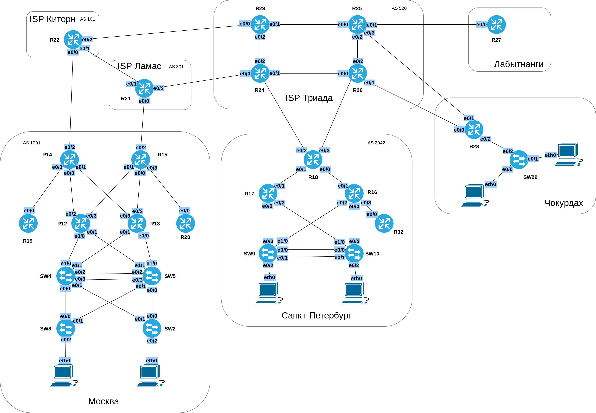

# Распланировать адресное пространство
# Настроить IP на всех активных портах
# Лабораторная работа №7. IPv4/IPv6

### Задание:
#### 1. [Разработать и задокументировать адресное пространство](README.md#1-разработать-и-задокументировать-адресное-пространство-1)
#### 2. [Настроить ip-адреса на каждом активном порту](README.md#настроить-ip-адреса-на-каждом-активном-порту-1)
#### 3. [Настроить каждый VPC в любом офисе в своем VLAN](README.md#настроить-каждый-vpc-в-любом-офисе-в-своем-vlan-1)
#### 4. [Настроить VLAN управления для сетевых устройств](README.md#настроить-vlan-управления-для-сетевых-устройств-1)
#### 5. [Настроить сети офисов так, чтобы не возникало broadcast штормов](README.md#настроить-сети-офисов-так-чтобы-не-возникало-broadcast-штормов-1)

#### [Конфигурационные файлы](README.md#конфигурационные-файлы-здесь)

### Топология

### 1. Разработать и задокументировать адресное пространство

Общая таблица LAN подсетей
<table>
  <tr>
    <th>Network</th>
    <th>Office</th>
    <th>Summary net</th>
    <th>Description</th>
  </tr>
  <tr>
    <th>10.0.0.0/14</th>
    <th>Москва</th>
    <td rowspan="4">/13</td>
    <th>10.[0-3].0.0/14</th>
  <tr>
    <th>10.10.0.0/15</th>
    <th>Санкт-Петербург</th>
    <th>10.[10-11].0.0/15</th>
  </tr>
  <tr>
    <th>10.12.0.0/16</th>
    <th>Чокурдах</th>
    <th>10.[12].0.0/16</th>
  </tr>
  <tr>
    <th>10.13.0.1/16</th>
    <th>Лабытнанги</th>
    <th>10.13.0.1/16</th>
  </tr>
</table>

Адресное пространство IPv4/IPv6

Network IPv4 | Summary net | Network IPv6 | Summary net | Description | Eq&port
------------:|:------------|-------------:|:----------- |:-----------:|:-----
10.0.2.0/24       |  10.0.0.0/14   | 2001:FFCC:1000:2::/64    | 2001:FFCC:1000::/48 | Москва                 | SW2
10.0.3.0/24       | 10.0.0.0/14    | 2001:FFCC:1000:3::/64    | 2001:FFCC:1000::/48 | Москва                 | SW3
10.0.2.0/24       | 10.0.0.0/14    | 2001:FFCC:1000:2::/64    | 2001:FFCC:1000::/48 | Москва                 | SW4
10.0.3.0/24       | 10.0.0.0/14    | 2001:FFCC:1000:3::/64    | 2001:FFCC:1000::/48 | Москва                 | SW5
10.0.2.0/24       | 10.0.0.0/14    | 2001:FFCC:1000:2::/64    | 2001:FFCC:1000::/48 | Москва                 | VPC1
10.0.3.0/24       | 10.0.0.0/14    | 2001:FFCC:1000:3::/64    | 2001:FFCC:1000::/48 | Москва                 | VPC7
10.0.2.0/24       | 10.0.0.0/14    | 2001:FFCC:1000:2::/64    | 2001:FFCC:1000::/48 | Москва                 | R12e0/0.2 SW4e1/0 
10.0.3.0/24       | 10.0.0.0/14    | 2001:FFCC:1000:3::/64    | 2001:FFCC:1000::/48 | Москва                 | R12e0/0.3 SW4e1/0
10.0.2.0/24       | 10.0.0.0/14    | 2001:FFCC:1000:2::/64    | 2001:FFCC:1000::/48 | Москва                 | R12e0/1.2 SW5e1/1
10.0.3.0/24       | 10.0.0.0/14    | 2001:FFCC:1000:3::/64    | 2001:FFCC:1000::/48 | Москва                 | R12e0/1.3 SW5e1/1
10.0.2.0/24       | 10.0.0.0/14    | 2001:FFCC:1000:2::/64    | 2001:FFCC:1000::/48 | Москва                 | R13e0/0.2 SW5 e1/0
10.0.3.0/24       | 10.0.0.0/14    | 2001:FFCC:1000:3::/64    | 2001:FFCC:1000::/48 | Москва                 | R13e0/0.3 SW5e1/0
10.0.2.0/24       | 10.0.0.0/14    | 2001:FFCC:1000:2::/64    | 2001:FFCC:1000::/48 | Москва                 | R13e0/1.2 SW4e1/1
10.0.3.0/24       | 10.0.0.0/14    | 2001:FFCC:1000:3::/64    | 2001:FFCC:1000::/48 | Москва                 | R13e0/1.3 SW4 e1/1
10.1.0.0/23       | 10.0.0.0/14    | 2001:FFCC:1000:1419::/64 | 2001:FFCC:1000::/48 | Москва                 | R19e0/0 R14e0/3
10.1.2.0/23       | 10.0.0.0/14    | 2001:FFCC:1000:1214::/64 | 2001:FFCC:1000::/48 | Москва                 | R12e0/2 R14e0/0
10.1.4.0/23       | 10.0.0.0/14    | 2001:FFCC:1000:1314::/64 | 2001:FFCC:1000::/48 | Москва                 | R14e0/1 R13e0/3
10.1.6.0/23       | 10.0.0.0/14    | 2001:FFCC:1000:1215::/64 | 2001:FFCC:1000::/48 | Москва                 | R12e0/3 R15e0/1
10.1.8.0/23       | 10.0.0.0/14    | 2001:FFCC:1000:1315::/64 | 2001:FFCC:1000::/48 | Москва                 | R13e0/2 R15e0/0
10.1.10.0/23      | 10.0.0.0/14    | 2001:FFCC:1000:1520::/64 | 2001:FFCC:1000::/48 | Москва                 | R15e0/3 R20e0/0
7.7.7.0/27        | not used       | 2001:FFCC:1000:1422::/64 | 2001:FFCC:1000::/48 | To Internet [“Киторн”] | R14e0/2 R22e0/0
2.2.2.0/27        | not used       | 2001:FFCC:1000:1521::/64 | 2001:FFCC:1000::/48 | To Internet [“Ламас”]  | R15e0/2 R21e0/0
10.10.2.0/24      | 10.10.0.0/15   | 2001:FFCC:2000:2::/64    | 2001:FFCC:2000::/48 | С.Петербург            | R17e0/0.2 SW9e0/3
10.10.3.0/24      | 10.10.0.0/15   | 2001:FFCC:2000:3::/64    | 2001:FFCC:2000::/48 | С.Петербург            | R17e0/0.3 SW9e0/3
10.10.2.0/24      | 10.10.0.0/15   | 2001:FFCC:2000:2::/64    | 2001:FFCC:2000::/48 | С.Петербург            | R17e0/2.2 SW10e1/0
10.10.3.0/24      | 10.10.0.0/15   | 2001:FFCC:2000:3::/64    | 2001:FFCC:2000::/48 | С.Петербург            | R17e0/2.3 SW10e1/0
10.10.2.0/24      | 10.10.0.0/15   | 2001:FFCC:2000:2::/64    | 2001:FFCC:2000::/48 | С.Петербург            | R16e0/2.2 SW9e1/0
10.10.3.0/24      | 10.10.0.0/15   | 2001:FFCC:2000:3::/64    | 2001:FFCC:2000::/48 | С.Петербург            | R16e0/2.3 SW9e1/0
10.10.2.0/24      | 10.10.0.0/15   | 2001:FFCC:2000:2::/64    | 2001:FFCC:2000::/48 | С.Петербург            | R16e0/0.2 SW10e0/3
10.10.3.0/24      | 10.10.0.0/15   | 2001:FFCC:2000:3::/64    | 2001:FFCC:2000::/48 | С.Петербург            | R16e0/0.3 SW10e0/3
10.10.2.0/24      | 10.10.0.0/15   | 2001:FFCC:2000:2::/64    | 2001:FFCC:2000::/48 | С.Петербург            | VPC8
10.10.3.0/24      | 10.10.0.0/15   | 2001:FFCC:2000:3::/64    | 2001:FFCC:2000::/48 | С.Петербург            | VPC
10.10.2.0/24      | 10.10.0.0/15   | 2001:FFCC:2000:2::/64    | 2001:FFCC:2000::/48 | С.Петербург            | Vlan2
10.10.3.0/24      | 10.10.0.0/15   | 2001:FFCC:2000:3::/64    | 2001:FFCC:2000::/48 | С.Петербург            | Vlan3
10.10.10.0/23     | 10.10.0.0/15   | 2001:FFCC:2000:1718::/64 | 2001:FFCC:2000::/48 | С.Петербург            | R17e0/1 R18e0/1
10.10.12.0/24     | 10.10.0.0/15   | 2001:FFCC:2000:1618::/64 | 2001:FFCC:2000::/48 | С.Петербург            | R18e0/0 R16e0/1
10.10.13.0/24     | 10.10.0.0/15   | 2001:FFCC:2000:1632::/64 | 2001:FFCC:2000::/48 | С.Петербург            | R16e0/3 R32e0/0
87.250.250.0/27   | not used       | 2001:FFCC:2000:1824::/64 | 2001:FFCC:2000::/48 | To Internet [“Триада”] | R18e0/2 R24e0/3 
82.208.114.0/27   | not used       | 2001:FFCC:2000:1826::/64 | 2001:FFCC:2000::/48 | To Internet [“Триада”] | R18e0/3 R26e0/3
10.12.3.0/24      | 10.12.0.0/16   | 2001:FFCC:3000:3::/64    | 2001:FFCC:3000::/48 | Чокурдах               | R28e0/2.3 SW29e0/2
10.12.4.0/24      | 10.12.0.0/16   | 2001:FFCC:3000:4::/64    | 2001:FFCC:3000::/48 | Чокурдах               | R12e0/2.4 SW29e0/2
10.12.3.0/24      | 10.12.0.0/16   | 2001:FFCC:3000:3::/64    | 2001:FFCC:3000::/48 | Чокурдах               | VPC30
10.12.4.0/24      | 10.12.0.0/16   | 2001:FFCC:3000:4::/64    | 2001:FFCC:3000::/48 | Чокурдах               | VPC31
10.12.3.0/24      | 10.12.0.0/16   | 2001:FFCC:3000:3::/64    | 2001:FFCC:3000::/48 | Чокурдах               | Vlan3
10.12.4.0/24      | 10.12.0.0/16   | 2001:FFCC:3000:4::/64    | 2001:FFCC:3000::/48 | Чокурдах               | Vlan4
87.250.250.64/27  | not used       | 2001:FFCC:3000:2628::/64 | not used            | To Internet [“Триада”] | R28e0/0 R26e0/1
87.250.250.96/27  | not used       | 2001:FFCC:3000:2528::/64 | not used            | To Internet [“Триада”] | R28e0/1 R25e0/3
5.255.255.32/27   | not used       | 2001:FFCC:4000:2527::/64 | not used            | Лабытнанги             | R27e0/0 R25e0/1
212.188.8.48/29   | not used       | 2001:FFCC:5000:2122::/64 | not used            | ISP Киторн-Ламас       | R21e0/1 R22e0/1
217.118.87.96/29  | not used       | 2001:FFCC:6000:2223::/64 | not used            | ISP Киторн-Триада      | R22e0/2 R23e0/0
178.248.237.48/29 | not used       | 2001:FFCC:7000:2124::/64 | not used            | ISP Ламас-Триада       | R21e0/2 R24e0/0
83.239.45.0/28    | 83.239.45.0/26 | 2001:FFCC:8000:2325::/64 | 2001:FFCC:8000::/48 | ISP Триада             | R23e0/1 R25e0/0
83.239.45.16/28   | 83.239.45.0/26 | 2001:FFCC:8000:2526::/64 | 2001:FFCC:8000::/48 | ISP Триада             | R25e0/2 R26e0/2
83.239.45.32/28   | 83.239.45.0/26 | 2001:FFCC:8000:2426::/64 | 2001:FFCC:8000::/48 | ISP Триада             | R26e0/0 R24e0/1
83.239.45.48/28   | 83.239.45.0/26 | 2001:FFCC:8000:2324::/64 | 2001:FFCC:8000::/48 | ISP Триада             | R24e0/2 R23e0/2

