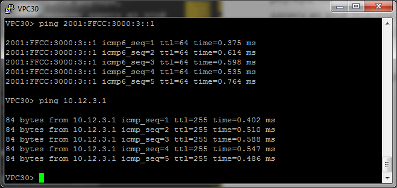

# Маршрутизация на основе политик (PBR)
# Отслеживание линка через технологию IP SLA
# Лабораторная работа №8. PBR & IP SLA

### Задание:
#### 1. [Настроить политику маршрутизации для сетей офиса](README.md#1-настроить-политику-маршрутизации-для-сетей-офиса-1)
#### 2. [Распределить трафик между двумя линками с провайдером](README.md#2-распределить-трафик-между-двумя-линками-с-провайдером-1)
#### 3. [Настроить отслеживание линка через технологию IP SLA](README.md#3-настроить-отслеживание-линка-через-технологию-ip-sla-1)
#### 4. [Настроить для офиса Лабытнанги маршрут по-умолчанию](README.md#4-настроить-для-офиса-лабытнанги-маршрут-по-умолчанию-1)


#### [Конфигурационные файлы](README.md#конфигурационные-файлы-здесь)


### Решение:

### 1. Настроить политику маршрутизации для сетей офиса

Настройка маршрутизации сетевых устройств офиса сводится к указанию шлюза по-умолчанию на каждом из них. В качестве адреса шлюза будет указан ip-адрес подынтерфеса роутера, соответствующий первому адресу этой подсети. К примеру, для устройств подсети 10.12.3.0/24, адрес шлюза 10.12.3.1.

<details>
 <summary>Пример настройки VPC30</summary>

``` bash
set pcname VPC30
ip 10.12.3.30/24 10.12.3.1
ip 2001:FFCC:3000:3::30/64 2001:FFCC:3000:3::1

```
</details>
<details>
 <summary>Проверка доступности шлюза по-умолчанию с VPC30</summary>

\

</details>


### 2. Распределить трафик между двумя линками с провайдером

Для организации маршрутизации "network to ISP" настроим маршруты по-умолчанию на R28, указав одинаковые метрики. В этом случае, маршрутизатор будет балансировать трафик между двумя линками.

<details>
 <summary>Настройка маршрутов по-умолчанию на R28</summary>

``` bash
conf t
 ip route 0.0.0.0 0.0.0.0 87.250.250.97 1 name "to R25 (ISP Триада)"
 ip route 0.0.0.0 0.0.0.0 87.250.250.65 1 name "to R26 (ISP Триада)"
 ipv6 route ::/0 2001:FFCC:3000:2528::25 1 name "to R25 (ISP Триада)"
 ipv6 route ::/0 2001:FFCC:3000:2628::26 1 name "to R26 (ISP Триада)"
 exit
```
</details>
<br>

``` bash
R28#sh ip route static

Gateway of last resort is 87.250.250.97 to network 0.0.0.0

S*    0.0.0.0/0 [1/0] via 87.250.250.97
                [1/0] via 87.250.250.65
```

Теперь требуется настроить балансировку трафика исходя из адреса подсети. К примеру, чтобы трафик с нечётных номеров подсетей (10.12.3.0/24) выходил с интерфейса e0/1, а с чётных (10.12.4.0/24) с e0/0. Для решение данной задачи используем технологию Policy-based routing (PBR). Для данной задачи достаточно проверки source ip, поэтому будем использовать ACL типа standard.


<details>
 <summary>Настройка PBR на R28</summary>

``` bash
#######
# ACL #
#######

ip access-list standard ACL_PBR_TO_R25
  permit 10.12.1.0 0.0.254.255
  deny any
  exit
ipv6 access-list ACL_PBR_TO_R25-v6
  permit 2001:FFCC:3000:3::/64 any
  deny any any
  exit
ip access-list standard ACL_PBR_TO_R26
  permit 10.12.0.0 0.0.254.255
  deny any
  exit
ipv6 access-list ACL_PBR_TO_R26-v6
  permit 2001:FFCC:3000:4::/64 any
  deny any any
  exit

##############
# Route-map  #
##############

route-map PBR_TO_R25 permit 10
  match ip address ACL_PBR_TO_R25
  set ip next-hop 87.250.250.97
  exit
route-map PBR_TO_R25-v6 permit 10
  match ip address ACL_PBR_TO_R25-v6
  set ip next-hop 2001:FFCC:3000:2528::25
  exit

route-map PBR_TO_R26 permit 10
  match ip address ACL_PBR_TO_R26
  set ip next-hop 87.250.250.65
  exit
route-map PBR_TO_R26-v6 permit 10
  match ip address ACL_PBR_TO_R26-v6
  set ip next-hop 2001:FFCC:3000:2628::26
  exit

#############
# Interface #
#############

int e0/1
  ip policy route-map PBR_TO_R25
  ipv6 policy route-map PBR_TO_R25-v6
exit

int e0/0
  ip policy route-map PBR_TO_R26
  ipv6 policy route-map PBR_TO_R26-v6
exit

```
</details>

### 3. Настроить отслеживание линка через технологию IP SLA

Привяжем тесты IP SLA к PBR. Теперь выполнение route-map будет зависеть от результатов тестирования. 
<details>
 <summary>Настройка IP SLA на R28</summary>

``` bash

##############
# Route-map  #
##############
route-map PBR_TO_R25 permit 10
  match ip address ACL_PBR_TO_R25
  set ip next-hop verify-availability 87.250.250.97 1 track 25
  exit

route-map PBR_TO_R25-v6 permit 10
  match ipv6 address ACL_PBR_TO_R25-v6
  set ipv6 next-hop 2001:FFCC:3000:2528::25
  exit

route-map PBR_TO_R26 permit 10
  match ip address ACL_PBR_TO_R26
  set ip next-hop verify-availability 87.250.250.65 1 track 26
  exit

route-map PBR_TO_R26-v6 permit 10
  match ipv6 address ACL_PBR_TO_R26-v6
  set ipv6 next-hop 2001:FFCC:3000:2628::26
  exit
###########
## IP SLA #
###########
  ip sla 25
  icmp-echo 87.250.250.97 source-interface e0/1
  frequency 15
ip sla schedule 25 life forever start-time now
track 25 ip sla 25 reachability

ip sla 256
  icmp-echo 2001:FFCC:3000:2528::25 source-interface e0/1
  frequency 15
ip sla schedule 256 life forever start-time now
track 256 ip sla 256 reachability

ip sla 26
  icmp-echo 87.250.250.65 source-interface e0/0
  frequency 15
ip sla schedule 26 life forever start-time now
track 26 ip sla 26 reachability

ip sla 266
  icmp-echo 2001:FFCC:3000:2628::26 source-interface e0/0
  frequency 15
ip sla schedule 266 life forever start-time now
track 266 ip sla 266 reachability
```
</details>

Не удалось "повесить" трек на route-map из-за отсутствия параметра "verify-availability" в ipv6.

### 4. Настроить для офиса Лабытнанги маршрут по-умолчанию

``` bash
conf t
 ip route 0.0.0.0 0.0.0.0 5.255.255.33 1 name "to R25 (ISP Триада)"
 ipv6 route ::/0 2001:FFCC:4000:2527::25 1 name "to R25 (ISP Триада)"
 exit
```


### Конфигурационные файлы [здесь](config/)