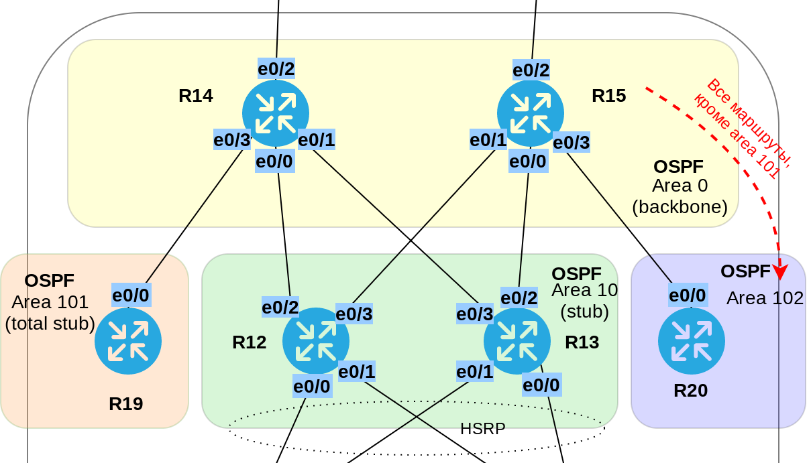

# Различные виды фильтрации в протоколе OSPF
# Лабораторная работа №9. OSPFv2. Фильтрация LSA.

### Задачи:

#### 1. Маршрутизаторы R14-R15 должны находяться в зоне 0 (backbone)
#### 2. Маршрутизаторы R12-R13 должны находяться в зоне 10. Дополнительно к маршрутам должны получать маршрут по-умолчанию
#### 3. Маршрутизатор R19 должен находиться в зоне 101 и получать только маршрут по умолчанию
#### 4. Маршрутизатор R20 должен находиться в зоне 102 и получать все маршруты, кроме маршрутов до сетей зоны 101.

### Решение:

### Топология



#### 1. Маршрутизаторы R14-R15 должны находяться в зоне 0 (backbone)

Настроим OSPF на роутерах R14-R15 и добавим их в зону 0.

<details>
 <summary>Пример настройки R14</summary>

``` bash
conf t
router ospf 1
 network 10.1.12.0 0.0.0.255 area 0
exit

```
</details>

#### 2. Маршрутизаторы R12-R13 должны находяться в зоне 10. Дополнительно к маршрутам должны получать маршрут по-умолчанию

Настроим OSPF на маршрутизаторах R12 и R13. Добавим их в зону 10.
На R14 и R15 настроим статические маршруты по-умолчанию и анонсируем их через OSPF.

<details>
 <summary>Настройки R12, R13</summary>

``` bash
##################
## Настройка R12 #
##################

conf t
router ospf 1
 network 10.0.2.0 0.0.0.255 area 10
 network 10.0.3.0 0.0.0.255 area 10
 network 10.1.2.0 0.0.1.255 area 10
 network 10.1.6.0 0.0.1.255 area 10
 passive-interface default
 no passive-interface e0/2
 no passive-interface e0/3
 
exit


##################
## Настройка R13 #
##################

conf t
router ospf 1
 network 10.0.2.0 0.0.0.255 area 10
 network 10.0.3.0 0.0.0.255 area 10
 network 10.1.8.0 0.0.1.255 area 10
 network 10.1.4.0 0.0.1.255 area 10
 
 passive-interface default
 no passive-interface e0/2
 no passive-interface e0/3
exit

```
</details>

<details>
 <summary>Пример настройки R14</summary>

``` bash

conf t
 ip route 0.0.0.0 0.0.0.0 7.7.7.22 1 name "to R22 (ISP Kitorn)"
 ipv6 route ::/0 2001:FFCC:1000:1422::22 1 name "to R22 (ISP Kitorn)"
router ospf 1
 default-information originate
exit

```
</details>

#### 3. Маршрутизатор R19 должен находиться в зоне 101 и получать только маршрут по умолчанию

Включим OSPF на маршрутизаторе R19. Добавим его в зону 101.
Отфильтруем маршруты для R19 посредством настройки _prefix-list_ на R14. Применим фильтр на вход в зону 101.

<details>
 <summary>Настройка R14</summary>

``` bash
conf t
 ip prefix-list TO_R19_101 deny 10.0.0.0/8
 router ospf 1
 area 101 filter-list prefix TO_R19_101 in
exit
```
</details>

<details>
 <summary>Таблица маршрутизации R19</summary>


#### До
``` bash
R19#sh ip route ospf

Gateway of last resort is 10.1.0.14 to network 0.0.0.0

O*E2  0.0.0.0/0 [110/1] via 10.1.0.14, 00:40:00, Ethernet0/0
      10.0.0.0/8 is variably subnetted, 10 subnets, 3 masks
O IA     10.0.2.0/24 [110/30] via 10.1.0.14, 00:00:02, Ethernet0/0
O IA     10.0.3.0/24 [110/30] via 10.1.0.14, 00:00:02, Ethernet0/0
O IA     10.1.2.0/23 [110/20] via 10.1.0.14, 00:00:02, Ethernet0/0
O IA     10.1.4.0/23 [110/20] via 10.1.0.14, 00:00:02, Ethernet0/0
O IA     10.1.6.0/23 [110/30] via 10.1.0.14, 00:00:02, Ethernet0/0
O IA     10.1.8.0/23 [110/30] via 10.1.0.14, 00:00:02, Ethernet0/0
O IA     10.1.10.0/23 [110/30] via 10.1.0.14, 00:00:02, Ethernet0/0
O IA     10.1.12.0/24 [110/20] via 10.1.0.14, 00:00:02, Ethernet0/0
```

#### После
``` bash
R19#sh ip route ospf

Gateway of last resort is 10.1.0.14 to network 0.0.0.0

O*E2  0.0.0.0/0 [110/1] via 10.1.0.14, 00:32:41, Ethernet0/0
R19#

``` 
</details>

#### 4. Маршрутизатор R20 должен находиться в зоне 102 и получать все маршруты, кроме маршрутов до сетей зоны 101.

<details>
 <summary>Настройка R20</summary>

``` bash

```
</details>
