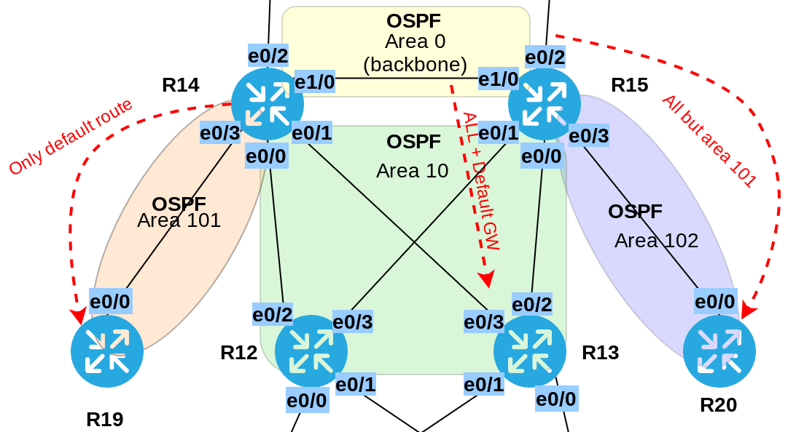

# Различные виды фильтрации в протоколе OSPF
# Лабораторная работа №9. OSPF. Фильтрация LSA c помощью типов зон и prefix-list.

### Задачи:

#### 1. Маршрутизаторы R14-R15 должны находяться в зоне 0 (backbone)
#### 2. Маршрутизаторы R12-R13 должны находяться в зоне 10. Дополнительно к маршрутам должны получать маршрут по-умолчанию
#### 3. Маршрутизатор R19 должен находиться в зоне 101 и получать только маршрут по умолчанию
#### 4. Маршрутизатор R20 должен находиться в зоне 102 и получать все маршруты, кроме маршрутов до сетей зоны 101.

### Решение:

### Топология



#### 1. Маршрутизаторы R14-R15 должны находяться в зоне 0 (backbone)

Настроим OSPF на роутерах R14-R15 и добавим их в зону 0.

<details>
 <summary>Настройка R14-R15</summary>

``` bash

```
</details>

#### 2. Маршрутизаторы R12-R13 должны находяться в зоне 10. Дополнительно к маршрутам должны получать маршрут по-умолчанию


<details>
 <summary>Настройка R12-R13</summary>

``` bash

```
</details>

#### 3. Маршрутизатор R19 должен находиться в зоне 101 и получать только маршрут по умолчанию

<details>
 <summary>Настройка R19</summary>

``` bash

```
</details>

#### 4. Маршрутизатор R20 должен находиться в зоне 102 и получать все маршруты, кроме маршрутов до сетей зоны 101.

<details>
 <summary>Настройка R20</summary>

``` bash

```
</details>
