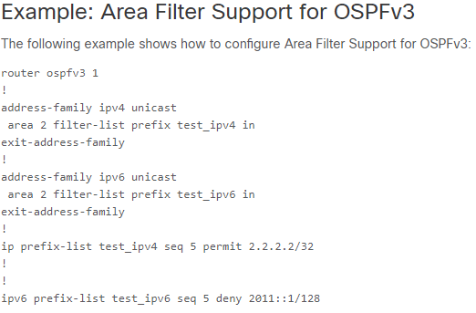
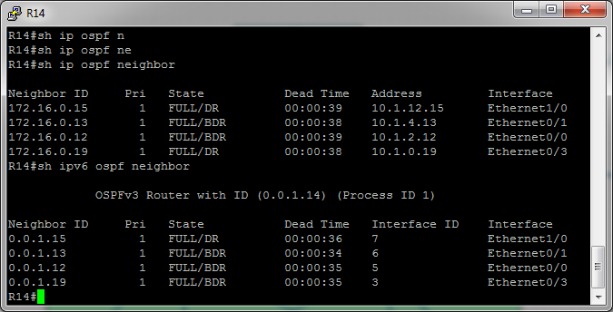

# Работа протокола OSPF для IPv6
# Лабораторная работа №10. OSPFv3.

### Задание:

1. Настроить OSPF для IPv6, сохранив ту же логику работы(метрики, таймеры, фильтры), что OSPF для IPv4.
2. Проверка работоспособности настроек OSPFv3.

Конфигурационные файлы [здесь](config/)

### Решение:


### Топология


### 1. Настроить OSPF для IPv6

Настройка OSPFv3 сводится к:
1. Настройке router-id на все маршрутизаторах;
2. Включению и настройке процесса OSPFv3 на интерфейсе;
3. Настройке таймеров отправки Hello- Dead-пакетов.

Настроим __router-id__ исходя из логики 0.0.[номер_офиса].[номер_устройства].
Например, __router-id__ для __R14__ в московском офисе будет __0.0.1.14__

Значения таймеров Hello/Dead для OSPFv2 равны 10/40. Настроим такие же для OSPFv3.


<details>
 <summary>Пример настройки R14</summary>

``` bash
conf t
ipv6 router ospf 1
 router-id 0.0.1.14
 passive-interface e0/2
 default-information originate

int e0/0
 ipv6 ospf 1 area 10
 ipv6 ospf hello-interval 10
 ipv6 ospf dead-interval 40
 
int e0/1
 ipv6 ospf 1 area 10
 ipv6 ospf hello-interval 10
 ipv6 ospf dead-interval 40
 
int e0/3
 ipv6 ospf 1 area 101
 ipv6 ospf hello-interval 10
 ipv6 ospf dead-interval 40
 
int e1/0
 ipv6 ospf 1 area 0
 ipv6 ospf hello-interval 10
 ipv6 ospf dead-interval 40
exit

ipv6 prefix-list TO_R19_101-v6 
exit
```
</details>


Отфильтровать LSA Type3 OSPFv3 не удалось по причине отсутствия команды prefix-list в меню настройки router ospfv3.
<details>
 <summary>Configuring Area Filter Support for OSPFv3</summary>

OSPFv3 ABR Type 3 LSA Filtering


``` bash
R14(config)#router ospfv3 1
R14(config-router)#ar
R14(config-router)#area 101 ?
  authentication  Enable authentication
  default-cost    Set the summary default-cost of a NSSA/stub area
  encryption      Enable encryption
  no-transit      Do not use this router to transit data
  nssa            Specify a NSSA area
  stub            Specify a stub area

```



``` bash
R14(config)#router ospfv3 1
R14(config-router)#address-family ipv6 unicast
R14(config-router-af)#area 101 ?
  default-cost  Set the summary default-cost of a NSSA/stub area
  no-transit    Do not use this router to transit data
  normal        Specify a normal area type
  nssa          Specify a NSSA area
  range         Summarize routes matching address/mask (border routers only)
  stub          Specify a stub area
  transit       Use this router to transit data
  virtual-link  Define a virtual link and its parameters


```
</details>

### 2. Проверка работоспособности настроек OSPFv3

<details>
 <summary>Проверка соседей на R14</summary>



</details>

<details>
 <summary>Проверка маршрутов на R14</summary>

``` bash
R14#sh ip route ospf

Gateway of last resort is 7.7.7.22 to network 0.0.0.0

      10.0.0.0/8 is variably subnetted, 13 subnets, 3 masks
O        10.0.2.0/24 [110/20] via 10.1.4.13, 21:51:41, Ethernet0/1
                     [110/20] via 10.1.2.12, 21:51:46, Ethernet0/0
O        10.0.3.0/24 [110/20] via 10.1.4.13, 21:51:41, Ethernet0/1
                     [110/20] via 10.1.2.12, 21:51:46, Ethernet0/0
O        10.1.6.0/23 [110/20] via 10.1.2.12, 21:51:41, Ethernet0/0
O        10.1.8.0/23 [110/20] via 10.1.4.13, 21:51:36, Ethernet0/1
O IA     10.1.10.0/23 [110/20] via 10.1.12.15, 21:51:46, Ethernet1/0
```

``` bash
R14#sh ipv6 route ospf
IPv6 Routing Table - default - 17 entries

O   2001:FFCC:1000:1215::/64 [110/20]
     via FE80::12, Ethernet0/0
O   2001:FFCC:1000:1315::/64 [110/20]
     via FE80::13, Ethernet0/1
OI  2001:FFCC:1000:1520::/64 [110/20]
     via FE80::15, Ethernet1/0
R14#

```
</details>

<details>
 <summary>Проверка значений таймеров OSPF на R14</summary>

``` bash
R14#sh ospf interface e0/0
Ethernet0/0 is up, line protocol is up
  Link Local Address FE80::14, Interface ID 3
  Area 10, Process ID 1, Instance ID 0, Router ID 0.0.1.14
  Network Type BROADCAST, Cost: 10
  Transmit Delay is 1 sec, State DR, Priority 1
  Designated Router (ID) 0.0.1.14, local address FE80::14
  Backup Designated router (ID) 0.0.1.12, local address FE80::12
  Timer intervals configured, Hello 10, Dead 40, Wait 40, Retransmit 5
    Hello due in 00:00:05
  Graceful restart helper support enabled
  Index 1/1/1, flood queue length 0
  Next 0x0(0)/0x0(0)/0x0(0)
  Last flood scan length is 1, maximum is 4
  Last flood scan time is 0 msec, maximum is 1 msec
  Neighbor Count is 1, Adjacent neighbor count is 1
    Adjacent with neighbor 0.0.1.12  (Backup Designated Router)
  Suppress hello for 0 neighbor(s)
```

``` bash
R14#sh ospfv3 interface e0/0
Ethernet0/0 is up, line protocol is up
  Link Local Address FE80::14, Interface ID 3
  Area 10, Process ID 1, Instance ID 0, Router ID 0.0.1.14
  Network Type BROADCAST, Cost: 10
  Transmit Delay is 1 sec, State DR, Priority 1
  Designated Router (ID) 0.0.1.14, local address FE80::14
  Backup Designated router (ID) 0.0.1.12, local address FE80::12
  Timer intervals configured, Hello 10, Dead 40, Wait 40, Retransmit 5
    Hello due in 00:00:02
  Graceful restart helper support enabled
  Index 1/1/1, flood queue length 0
  Next 0x0(0)/0x0(0)/0x0(0)
  Last flood scan length is 1, maximum is 4
  Last flood scan time is 0 msec, maximum is 1 msec
  Neighbor Count is 1, Adjacent neighbor count is 1
    Adjacent with neighbor 0.0.1.12  (Backup Designated Router)
  Suppress hello for 0 neighbor(s)
```
</details>


#### Конфигурационные файлы [здесь](config/)