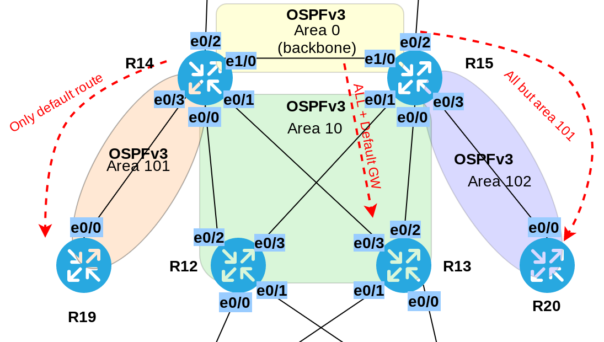
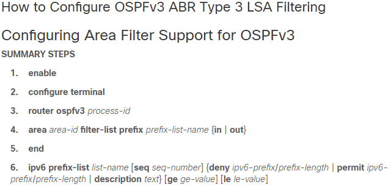

# Работа протокола OSPF для IPv6
# Лабораторная работа №10. OSPFv3.

### Задание:

1. Настроить OSPF для IPv6. сохранив ту же логику работы(метрики, таймеры, фильтры), что OSPF для IPv4
2. План работы и изменения зафиксировать в документации.

Конфигурационные файлы [здесь](config/)

### Решение:


### Топология



Настройка OSPFv3 сводится к:
1. Настройке router-id на все маршрутизаторах;
2. Включению и настройке процесса OSPFv3 на интерфейсе;
3. Настройке таймеров отправки Hello- Dead-пакетов.

Настроим __router-id__ исходя из логики 0.0.[номер_офиса].[номер_устройства].
Например, __router-id__ для __R14__ в московском офисе будет __0.0.1.14__

Значения таймеров Hello/Dead для OSPFv2 равны 10/40. Настроим такие же для OSPFv3.


<details>
 <summary>Пример настройки R14</summary>

``` bash
conf t
ipv6 router ospf 1
 router-id 0.0.1.14
 passive-interface e0/2
 
int e0/0
 ipv6 ospf 1 area 10
 ipv6 ospf hello-interval 10
 ipv6 ospf dead-interval 40
 
int e0/1
 ipv6 ospf 1 area 10
 ipv6 ospf hello-interval 10
 ipv6 ospf dead-interval 40
 
int e0/3
 ipv6 ospf 1 area 101
 ipv6 ospf hello-interval 10
 ipv6 ospf dead-interval 40
 
int e1/0
 ipv6 ospf 1 area 0
 ipv6 ospf hello-interval 10
 ipv6 ospf dead-interval 40
exit

ipv6 prefix-list TO_R19_101-v6 
exit
```
</details>

Отфильтровать LSA Type3 OSPFv3 не удалось по причине отсутствия команды prefix-list в меню настройки router ospfv3.
<details>
 <summary>Configuring Area Filter Support for OSPFv3</summary>

OSPFv3 ABR Type 3 LSA Filtering



``` bash
R14(config)#router ospfv3 1
R14(config-router)#ar
R14(config-router)#area 101 ?
  authentication  Enable authentication
  default-cost    Set the summary default-cost of a NSSA/stub area
  encryption      Enable encryption
  no-transit      Do not use this router to transit data
  nssa            Specify a NSSA area
  stub            Specify a stub area

```
</details>


