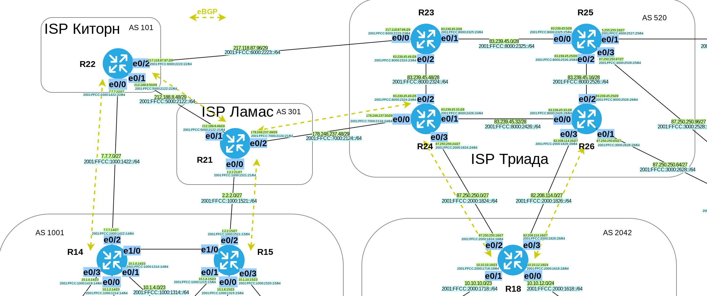

# Лабораторная работа №11. Основы BGP.

### Задание:
1. eBGP между офисом Москва и двумя провайдерами - Киторн и Ламас
2. Настроить eBGP между провайдерами Киторн и Ламас
3. Настроить eBGP между Ламас и Триада
4. eBGP между офисом С.-Петербург и провайдером Триада
5. Организовать IP доступность между офисами Москва и С.-Петербург
6. Настроить отслеживание линка через технологию IP SLA

### Решение:


### Топология



##### Таблица соединений с соседями по BGP 


| ASN    | Routers  | Nbr ASN | Neighbor IP          | 
|:-------|:----|:--------|:---------------------|
| 1001  | R14->R22  | 101   | 7.7.7.22          |
| 1001  | R14->R22  | 101   | 2001:FFCC:1000:1422::22          | 
| 1001  | R15->R21  | 301   | 2.2.2.21 |
| 1001  | R15->R21  | 301   | 2001:FFCC:1000:1521::21 |
| 101  | R22->R14  | 1001   | 7.7.7.14 |
| 101  | R22->R14  | 1001   | 2001:FFCC:1000:1422::14 |
| 301  | R21->R15  | 1001  | 2.2.2.15  |
| 301  | R21->R15  | 1001  | 2001:FFCC:1000:1521::15  |
| 301  | R21->R22  | 101  |  212.188.8.50 |
| 301 | R21->R22  | 101 | 2001:FFCC:5000:2122::22  |
| 101  | R22->R21  | 301 | 212.188.8.49  |
| 101 | R22->R21  | 301  | 2001:FFCC:5000:2122::21  |
| 301 | R21->R24  | 520  | 178.248.237.50  |
| 301 | R21->R24  | 520  | 2001:FFCC:7000:2124::24  |
| 502 | R24->R21  | 301  | 178.248.237.49  |
| 502  | R24->R21  | 301  | 2001:FFCC:7000:2124::21  |
| 2042  | R18->R24  | 502 | 87.250.250.24  |
| 2042  | R18->R24  | 502 | 2001:FFCC:2000:1824::24  |
| 2042 | R18->R26  | 502  | 82.208.114.26  |
| 2042  | R18->R26  | 502   | 2001:FFCC:2000:1826::26  |
| 520  | R24->R18  | 2042  | 87.250.250.18  |
| 520  | R24->R18  | 2042  | 2001:FFCC:2000:1824::18  |
| 520  | R26->R18  | 2042  | 82.208.114.18  |
| 520  | R26->R18  | 2042  | 2001:FFCC:2000:1826::18  |


### 1. Настроить eBGP между офисом Москва и провайдерами Киторн и Ламас.

Настроим eBGP между маршрутизаторами R14-R22 и R15-R21.

<details>
 <summary>Пример настройки eBGP между R14-R22</summary>

``` bash
#################
# Настройки R14 #
#################

conf t
router bgp 1001
neighbor 7.7.7.22 remote-as 101
neighbor 2001:FFCC:1000:1422::22 remote-as 101

#################
# Настройки R22 #
#################

conf t
router bgp 101
neighbor 7.7.7.14 remote-as 1001
neighbor 2001:FFCC:1000:1422::14 remote-as 1001

```
</details>