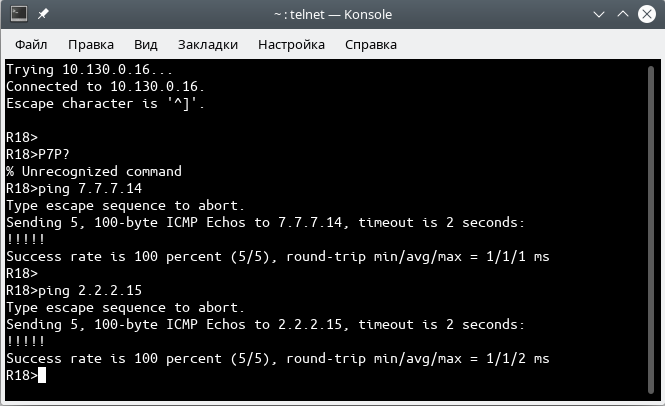

# Лабораторная работа №11. Основы BGP.

### Задание:
1. eBGP между офисом Москва и двумя провайдерами - Киторн и Ламас
2. Настроить eBGP между провайдерами Киторн и Ламас
3. Настроить eBGP между Ламас и Триада
4. eBGP между офисом С.-Петербург и провайдером Триада
5. Организовать IP доступность между офисами Москва и С.-Петербург

Конфигурационные файлы [здесь](config/)

### Решение:


### Топология


##### Таблица соединений с соседями по BGP 


| ASN    | Routers  | Nbr ASN | Neighbor IP          | 
|:-------|:----|:--------|:---------------------|
| 1001  | R14->R22  | 101   | 7.7.7.22          |
| 1001  | R14->R22  | 101   | 2001:FFCC:1000:1422::22          | 
| 1001  | R15->R21  | 301   | 2.2.2.21 |
| 1001  | R15->R21  | 301   | 2001:FFCC:1000:1521::21 |
| 101  | R22->R14  | 1001   | 7.7.7.14 |
| 101  | R22->R14  | 1001   | 2001:FFCC:1000:1422::14 |
| 301  | R21->R15  | 1001  | 2.2.2.15  |
| 301  | R21->R15  | 1001  | 2001:FFCC:1000:1521::15  |
| 301  | R21->R22  | 101  |  212.188.8.50 |
| 301 | R21->R22  | 101 | 2001:FFCC:5000:2122::22  |
| 101  | R22->R21  | 301 | 212.188.8.49  |
| 101 | R22->R21  | 301  | 2001:FFCC:5000:2122::21  |
| 301 | R21->R24  | 520  | 178.248.237.50  |
| 301 | R21->R24  | 520  | 2001:FFCC:7000:2124::24  |
| 502 | R24->R21  | 301  | 178.248.237.49  |
| 502  | R24->R21  | 301  | 2001:FFCC:7000:2124::21  |
| 2042  | R18->R24  | 502 | 87.250.250.24  |
| 2042  | R18->R24  | 502 | 2001:FFCC:2000:1824::24  |
| 2042 | R18->R26  | 502  | 82.208.114.26  |
| 2042  | R18->R26  | 502   | 2001:FFCC:2000:1826::26  |
| 520  | R24->R18  | 2042  | 87.250.250.18  |
| 520  | R24->R18  | 2042  | 2001:FFCC:2000:1824::18  |
| 520  | R26->R18  | 2042  | 82.208.114.18  |
| 520  | R26->R18  | 2042  | 2001:FFCC:2000:1826::18  |


### 1. Настроить eBGP между офисом Москва и провайдерами Киторн и Ламас

Настроим eBGP между маршрутизаторами R14-R22 и R15-R21.

<details>
 <summary>Пример настройки eBGP между R14-R22</summary>

``` bash
#################
# Настройки R14 #
#################

conf t
 router bgp 1001
  neighbor 7.7.7.22 remote-as 101
  neighbor 2001:FFCC:1000:1422::22 remote-as 101

 address-family ipv4
  neighbor 7.7.7.22 activate
  no neighbor 2001:FFCC:1000:1422::22 activate

 address-family ipv6
  neighbor 2001:FFCC:1000:1422::22 activate


#################
# Настройки R22 #
#################

conf t
router bgp 101
 neighbor 7.7.7.14 remote-as 1001
 neighbor 2001:FFCC:1000:1422::14 remote-as 1001

address-family ipv4
 neighbor 7.7.7.14 activate
 no neighbor 2001:FFCC:1000:1422::14 activate
 network 7.7.7.0 mask 255.255.255.224
 network 212.188.8.48 mask 255.255.255.248
 network 217.118.87.96 mask 255.255.255.248
 
 
address-family ipv6
 neighbor 2001:FFCC:1000:1422::14 activate
 network 2001:FFCC:1000:1422::/64
 network 2001:FFCC:5000:2122::/64
 network 2001:FFCC:6000:2223::/64
```
</details>


### 2. Настроить eBGP между провайдерами Киторн и Ламас

Настроим eBGP между маршрутизаторами R21-R22.

<details>
 <summary>Настройки R21 и R22</summary>

``` bash
#################
# Настройки R21 #
#################

conf t
router bgp 301
neighbor 212.188.8.50 remote-as 101
neighbor 2001:FFCC:5000:2122::22 remote-as 101

address-family ipv4
 neighbor 212.188.8.50 activate
 no neighbor 2001:FFCC:5000:2122::22 activate
  
address-family ipv6
 neighbor 2001:FFCC:5000:2122::22 activate
 
#################
# Настройки R22 #
#################

conf t
router bgp 101
neighbor 212.188.8.49 remote-as 301
neighbor 2001:FFCC:5000:2122::21 remote-as 301

address-family ipv4
 neighbor 212.188.8.49 activate
 no neighbor 2001:FFCC:5000:2122::21 activate
 network 7.7.7.0 mask 255.255.255.224
 network 212.188.8.48 mask 255.255.255.248
 network 217.118.87.96 mask 255.255.255.248

address-family ipv6
 neighbor 2001:FFCC:5000:2122::21 activate
 network 2001:FFCC:1000:1422::/64
 network 2001:FFCC:5000:2122::/64
 network 2001:FFCC:6000:2223::/64

```
</details>

### 3. Настроить eBGP между Ламас и Триада

Настроим eBGP между маршрутизаторами R21-R24.

<details>
 <summary>Настройки R21 и R24</summary>

``` bash
#################
# Настройки R21 #
#################

conf t
router bgp 301
neighbor 178.248.237.50 remote-as 520
neighbor 2001:FFCC:7000:2124::24 remote-as 520

address-family ipv4
 neighbor 178.248.237.50 activate
 no neighbor 2001:FFCC:7000:2124::24 activate
  
address-family ipv6
 neighbor 2001:FFCC:7000:2124::24 activate


#################
# Настройки R24 #
#################

conf t
router bgp 520
neighbor 178.248.237.49 remote-as 301
neighbor 2001:FFCC:7000:2124::21 remote-as 301

address-family ipv4
 neighbor 178.248.237.49 activate
 no neighbor 2001:FFCC:7000:2124::21 activate
 network 178.248.237.48 mask 255.255.255.248
 network 83.239.45.48 mask 255.255.255.240
 network 83.239.45.32 mask 255.255.255.240
 network 87.250.250.0 mask 255.255.255.224
 
address-family ipv6
 neighbor 2001:FFCC:7000:2124::21 activate
 network 2001:FFCC:7000:2124::/64
 network 2001:FFCC:8000:2324::/64
 network 2001:FFCC:8000:2426::/64
 network 2001:FFCC:2000:1824::/64

```
</details>

### 4. eBGP между офисом С.-Петербург и провайдером Триада

Настроим eBGP между R18-R24 и R18-R26

<details>
 <summary>Настройки R18, R24, R26</summary>

``` bash
#################
# Настройки R18 #
#################

conf t
router bgp 2042
 neighbor 87.250.250.24 remote-as 520
 neighbor 2001:FFCC:2000:1824::24 remote-as 520
 neighbor 82.208.114.26 remote-as 520
 neighbor 2001:FFCC:2000:1826::26 remote-as 520

address-family ipv4
 neighbor 87.250.250.24 activate
 neighbor 82.208.114.26 activate
 no neighbor 2001:FFCC:2000:1824::24 activate
 no neighbor 2001:FFCC:2000:1826::26 activate
address-family ipv6
 neighbor 2001:FFCC:2000:1824::24 activate
 neighbor 2001:FFCC:2000:1826::26 activate


#################
# Настройки R24 #
#################

conf t
router bgp 520
 neighbor 87.250.250.18 remote-as 2042
 neighbor 2001:FFCC:2000:1824::18 remote-as 2042

address-family ipv4
 neighbor 87.250.250.18 activate
 no neighbor 2001:FFCC:2000:1824::18 activate
 network 178.248.237.48 mask 255.255.255.248
 network 83.239.45.48 mask 255.255.255.240
 network 83.239.45.32 mask 255.255.255.240
 network 87.250.250.0 mask 255.255.255.224

address-family ipv6
 neighbor 2001:FFCC:2000:1824::18 activate
 network 2001:FFCC:7000:2124::/64
 network 2001:FFCC:8000:2324::/64
 network 2001:FFCC:8000:2426::/64
 network 2001:FFCC:2000:1824::/64

#################
# Настройки R26 #
#################

conf t
router bgp 520
 neighbor 82.208.114.18 remote-as 2042
 neighbor 2001:FFCC:2000:1826::18 remote-as 2042

address-family ipv4
 neighbor 82.208.114.18 activate
 no neighbor 2001:FFCC:2000:1826::18 activate
 network 82.208.114.0 mask 255.255.255.224
 network 83.239.45.32 mask 255.255.255.240
 network 83.239.45.16 mask 255.255.255.240
 network 87.250.250.96 mask 255.255.255.224
 
address-family ipv6
 neighbor 2001:FFCC:2000:1826::18 activate
 network 2001:FFCC:2000:1826::/64
 network 2001:FFCC:8000:2426::/64
 network 2001:FFCC:8000:2526::/64
 network 2001:FFCC:3000:2628::/64


```
</details>

### 5. Организовать IP доступность между офисами Москва и С.-Петербург

Проверим "видимость" между пограничными роутерами с помощью утилиты _ping_ \
Выполним на R18:
-  _ping 7.7.7.14_ [R14]
-  _ping 2.2.2.15_ [R15]



<details>
 <summary>Таблица роутинга eBGP R14</summary>

``` bash
R14#sh ip bgp
BGP table version is 9, local router ID is 172.16.0.14
Status codes: s suppressed, d damped, h history, * valid, > best, i - internal,
              r RIB-failure, S Stale, m multipath, b backup-path, f RT-Filter,
              x best-external, a additional-path, c RIB-compressed,
Origin codes: i - IGP, e - EGP, ? - incomplete
RPKI validation codes: V valid, I invalid, N Not found

     Network          Next Hop            Metric LocPrf Weight Path
 *>  2.2.2.0/27       7.7.7.22                               0 101 301 i
 r>  7.7.7.0/27       7.7.7.22                 0             0 101 i
 *>  83.239.45.32/28  7.7.7.22                               0 101 301 520 i
 *>  83.239.45.48/28  7.7.7.22                               0 101 301 520 i
 *>  87.250.250.0/27  7.7.7.22                               0 101 301 520 i
 *>  178.248.237.48/29
                       7.7.7.22                               0 101 301 i
 *>  212.188.8.48/29  7.7.7.22                 0             0 101 i
 *>  217.118.87.96/29 7.7.7.22                 0             0 101 i
R14#

```

</details>


<details>
 <summary>Таблица роутинга eBGP R18</summary>

``` bash

R18#sh ip bgp
BGP table version is 11, local router ID is 172.16.0.18
Status codes: s suppressed, d damped, h history, * valid, > best, i - internal,
              r RIB-failure, S Stale, m multipath, b backup-path, f RT-Filter,
              x best-external, a additional-path, c RIB-compressed,
Origin codes: i - IGP, e - EGP, ? - incomplete
RPKI validation codes: V valid, I invalid, N Not found

     Network          Next Hop            Metric LocPrf Weight Path
 *>  2.2.2.0/27       87.250.250.24                          0 520 301 i
 *>  7.7.7.0/27       87.250.250.24                          0 520 301 101 i
 r>  82.208.114.0/27  82.208.114.26            0             0 520 i
 *>  83.239.45.16/28  82.208.114.26            0             0 520 i
 *   83.239.45.32/28  82.208.114.26            0             0 520 i
 *>                   87.250.250.24            0             0 520 i
 *>  83.239.45.48/28  87.250.250.24            0             0 520 i
 r>  87.250.250.0/27  87.250.250.24            0             0 520 i
 *>  178.248.237.48/29
                       87.250.250.24            0             0 520 i
 *>  212.188.8.48/29  87.250.250.24                          0 520 301 i
 *>  217.118.87.96/29 87.250.250.24                          0 520 301 101 i

```

</details>


### Конфигурационные файлы [здесь](config/)