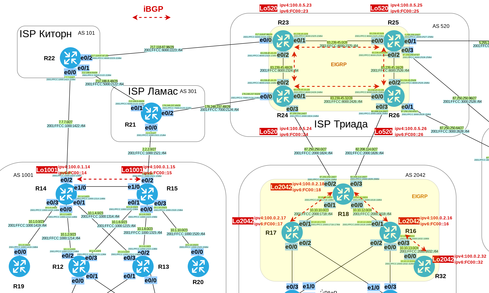
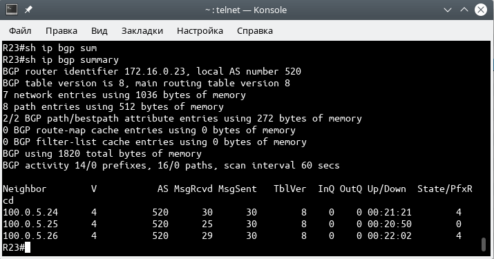

# Лабораторная работа №12. iBGP.

### Задание:

1. Настроить iBGP в офисе Москва между маршрутизаторами R14 и R15;
2. Настроите iBGP в провайдере Триада;
3. Настроить офис Москва так, чтобы приоритетным провайдером стал Ламас;
4. В офисе С.-Петербург работает протокол iBGP. (Не использовать протокол OSPF);
5. Настроить офис С.-Петербург так, чтобы трафик до любого офиса распределялся по двум линкам одновременно;
6. Все сети в лабораторной работе должны иметь IP связность;
7. План работы и изменения зафиксированы в документации.

Конфигурационные файлы [здесь](config/)

### Решение:


### Топология



#### 1. Настроить iBGP в офисе Москва между маршрутизаторами R14 и R15

Создадим Loopback-интерфейсы и анонсируем их через OSPF. Номер Loopback-интерфейса равен номеру AS.

Сетевые настройки для Loopback:\
ipv4: 100.0.__[номер_офиса]__.__[номер_роутера]__ \
ipv6: FC00::__{номер маршрутизатора}__\
ipv6 LL: FE80::__[номер_роутера]__

Например, для маршрутизатора R14\
ipv4: __100.0.1.14__\
ipv6: __FC00:14/128__\
ipv6 LL: __FE80::14__

Настроим на роутерах R14 и R15 параметры:
   - __next-hop-self__;
   - __update-source__; (Loopback)


<details>
 <summary>Настройки iBGP между R14-R15</summary>

``` bash
#################
# Настройки R14 #
#################

conf t

interface Loopback1001
 ip address 100.0.1.14 255.255.255.255
 ipv6 enable
 ipv6 address FC00::14/128
 ipv6 address FE80::14 link-local
 ipv6 ospf 1 area 0
 

router bgp 1001
 neighbor 100.0.1.15 remote-as 1001
 neighbor 100.0.1.15 update-source Loopback1001
 neighbor 100.0.1.15 next-hop-self
 neighbor FC00::15 remote-as 1001
 neighbor FC00::15 update-source Loopback1001
 neighbor FC00::15 next-hop-self

address-family ipv4
 neighbor 100.0.1.15 activate
 no neighbor FC00::15 activate
 
address-family ipv6
 no neighbor 100.0.1.15 activate
 neighbor FC00::15 activate

# Анонсируем loopback1001-интерфейс в OSPF и запретим его анонс через внешний интерфейс
# Политика по-умолчанию passive-interface default

router ospf 1
 network 100.0.1.14 0.0.0.0 area 0

#################
# Настройки R15 #
#################

conf t

interface Loopback1001
 ip address 100.0.1.15 255.255.255.255
 ipv6 enable
 ipv6 address FC00::15/128
 ipv6 address FE80::15 link-local
 ipv6 ospf 1 area 0

router bgp 1001
 neighbor 100.0.1.14 remote-as 1001
 neighbor 100.0.1.14 update-source Loopback1001
 neighbor 100.0.1.14 next-hop-self
 neighbor FC00::14 remote-as 1001
 neighbor FC00::14 update-source Loopback1001
 neighbor FC00::14 next-hop-self

address-family ipv4
 neighbor 100.0.1.14 activate
 no neighbor FC00::14 activate
 
address-family ipv6
 no neighbor 100.0.1.14 activate
 neighbor FC00::14 activate

# Анонсируем loopback1001-интерфейс в OSPF и запретим его анонс через внешний интерфейс
# Политика по-умолчанию passive-interface default

router ospf 1
 network 100.0.1.15 0.0.0.0 area 0
 
```
</details>

<details>
 <summary>Проверка установки BGP-сессии между роутерами</summary>

__ipv4__


__ipv6__


</details>

#### 2. Настроите iBGP в провайдере Триада

Настроим маршрутизаторы R23-R26. Создадим интерфейсы _loopback520_, анонсируем их по EIGRP, далее настроим iBGP.
При настройке iBGP применим шаблоны __peer-group__ и технологию __router-reflector__. Назначим функции RR двум роутерам, R23 и R26. Объединим оба RR в общий кластер.

Адреса __loopback__ назначаются согласно правила 100.0.5.__[номер_маршрутизатора]__\
Значение __router-id__ формируется согласно 0.0.5.__[номер_маршрутизатора]__

<details>
 <summary>Настройки Loopback</summary>

``` bash
#################
# Настройки R23 #
#################

conf t
interface Loopback520
 ip address 100.0.5.23 255.255.255.255
 ipv6 address FE80::23 link-local
 ipv6 address FC00::23/128
 ipv6 enable
 ipv6 eigrp 1
 no shutdown
 

#################
# Настройки R24 #
#################

conf t
interface Loopback520
 ip address 100.0.5.24 255.255.255.255
 ipv6 address FE80::24 link-local
 ipv6 address FC00::24/128
 ipv6 enable
 ipv6 eigrp 1
 no shutdown

#################
# Настройки R25 #
#################

conf t
interface Loopback520
 ip address 100.0.5.25 255.255.255.255
 ipv6 address FE80::25 link-local
 ipv6 address FC00::25/128
 ipv6 enable
 ipv6 eigrp 1
 no shutdown
 
#################
# Настройки R26 #
#################

conf t
interface Loopback520
 ip address 100.0.5.26 255.255.255.255
 ipv6 address FE80::26 link-local
 ipv6 address FC00::26/128
 ipv6 enable
 ipv6 eigrp 1
 no shutdown

```

</details>

<details>
 <summary>Настройки EIGRP</summary>

``` bash
#############
# EIGRP 23  #
#############

conf t
ipv6 unicast-routing
ipv6 router eigrp 1
 eigrp router-id 0.0.5.23
 passive-interface default
 no passive-interface e0/1
 no passive-interface e0/2
 no shutdown

int range e0/0-3
 ipv6 eigrp 1

router eigrp 1
 eigrp router-id 0.0.5.23
 network 100.0.5.23 0.0.0.0
 network 83.239.45.48 0.0.0.15
 network 83.239.45.0 0.0.0.15
 passive-interface default
 no passive-interface e0/1
 no passive-interface e0/2

#############
# EIGRP 24  #
#############

conf t
ipv6 unicast-routing
ipv6 router eigrp 1
 eigrp router-id 0.0.5.24
 passive-interface default
 no passive-interface e0/1
 no passive-interface e0/2
 no shutdown

int range e0/0-3
 ipv6 eigrp 1

router eigrp 1
 eigrp router-id 0.0.5.24
 network 100.0.5.24 0.0.0.0
 network 83.239.45.48 0.0.0.15
 network 83.239.45.32 0.0.0.15
 passive-interface default
 no passive-interface e0/1
 no passive-interface e0/2

#############
# EIGRP 25  #
#############

conf t
ipv6 unicast-routing
ipv6 router eigrp 1
 eigrp router-id 0.0.5.25
 passive-interface default
 no passive-interface e0/0
 no passive-interface e0/2
 no shutdown

int range e0/0-3
 ipv6 eigrp 1

router eigrp 1
 eigrp router-id 0.0.5.25
 network 100.0.5.25 0.0.0.0
 network 83.239.45.0 0.0.0.15
 network 83.239.45.16 0.0.0.15
 passive-interface default
 no passive-interface e0/0
 no passive-interface e0/2

#############
# EIGRP 26  #
#############

conf t
ipv6 unicast-routing
ipv6 router eigrp 1
 eigrp router-id 0.0.5.26
 passive-interface default
 no passive-interface e0/0
 no passive-interface e0/2
 no shutdown

int range e0/0-3
 ipv6 eigrp 1

router eigrp 1
 eigrp router-id 0.0.5.26
 network 100.0.5.26 0.0.0.0
 network 83.239.45.32 0.0.0.15
 network 83.239.45.16 0.0.0.15
 passive-interface default
 no passive-interface e0/0
 no passive-interface e0/2


```

</details>

<details>
 <summary>Проверка доступности Loopback через EIGRP</summary>

__ipv4__


__ipv6__


</details>

<details>
 <summary>Настройки iBGP</summary>

``` bash
##################
# iBGP 23 + RR   #
##################

conf t
router bgp 520
 neighbor AS520 peer-group
 neighbor AS520 remote-as 520
 neighbor AS520 update-source Loopback520
 neighbor AS520 next-hop-self
 neighbor AS520 route-reflector-client
 bgp cluster-id 1
 
 neighbor AS520-6 peer-group
 neighbor AS520-6 remote-as 520
 neighbor AS520-6 update-source Loopback520
 neighbor AS520-6 next-hop-self
 neighbor AS520-6 router-reflector
 
 neighbor 100.0.5.24 peer-group AS520 
 neighbor 100.0.5.25 peer-group AS520
 neighbor 100.0.5.26 peer-group AS520
 neighbor FC00::24 peer-group AS520-6 
 neighbor FC00::25 peer-group AS520-6
 neighbor FC00::26 peer-group AS520-6
 
address-family ipv4
 neighbor 100.0.5.24 activate 
 neighbor 100.0.5.25 activate
 neighbor 100.0.5.26 activate
 no neighbor FC00::24 activate 
 no neighbor FC00::25 activate
 no neighbor FC00::26 activate
 
address-family ipv6
 no neighbor 100.0.5.24 activate 
 no neighbor 100.0.5.25 activate
 no neighbor 100.0.5.26 activate
 neighbor FC00::24 activate 
 neighbor FC00::25 activate
 neighbor FC00::26 activate

#################
# iBGP 26 + RR  #
#################

conf t
router bgp 520
 neighbor AS520 peer-group
 neighbor AS520 remote-as 520
 neighbor AS520 update-source Loopback520
 neighbor AS520 next-hop-self
 neighbor AS520 route-reflector-client
 bgp cluster-id 1
 
 neighbor AS520-6 peer-group
 neighbor AS520-6 remote-as 520
 neighbor AS520-6 update-source Loopback520
 neighbor AS520-6 next-hop-self
 neighbor AS520-6 router-reflector
 
 neighbor 100.0.5.23 peer-group AS520 
 neighbor 100.0.5.24 peer-group AS520
 neighbor 100.0.5.25 peer-group AS520
 neighbor FC00::23 peer-group AS520-6 
 neighbor FC00::24 peer-group AS520-6
 neighbor FC00::25 peer-group AS520-6
 
address-family ipv4
 neighbor 100.0.5.23 activate 
 neighbor 100.0.5.24 activate
 neighbor 100.0.5.25 activate
 no neighbor FC00::23 activate 
 no neighbor FC00::24 activate
 no neighbor FC00::25 activate
 
address-family ipv6
 no neighbor 100.0.5.23 activate 
 no neighbor 100.0.5.24 activate
 no neighbor 100.0.5.25 activate
 neighbor FC00::23 activate 
 neighbor FC00::24 activate
 neighbor FC00::25 activate

#############
# iBGP 24   #
#############

conf t
router bgp 520
 neighbor AS520 peer-group
 neighbor AS520 remote-as 520
 neighbor AS520 update-source Loopback520
 neighbor AS520 next-hop-self
  
 neighbor AS520-6 peer-group
 neighbor AS520-6 remote-as 520
 neighbor AS520-6 update-source Loopback520
 neighbor AS520-6 next-hop-self
 
 neighbor 100.0.5.23 peer-group AS520 
 neighbor 100.0.5.26 peer-group AS520
 neighbor FC00::23 peer-group AS520-6 
 neighbor FC00::26 peer-group AS520-6
  
address-family ipv4
 neighbor 100.0.5.23 activate 
 neighbor 100.0.5.26 activate
 no neighbor FC00::23 activate 
 no neighbor FC00::26 activate
  
address-family ipv6
 no neighbor 100.0.5.23 activate 
 no neighbor 100.0.5.26 activate
 neighbor FC00::23 activate 
 neighbor FC00::26 activate

#############
# iBGP 25   #
#############

conf t
router bgp 520
 neighbor AS520 peer-group
 neighbor AS520 remote-as 520
 neighbor AS520 update-source Loopback520
 neighbor AS520 next-hop-self
  
 neighbor AS520-6 peer-group
 neighbor AS520-6 remote-as 520
 neighbor AS520-6 update-source Loopback520
 neighbor AS520-6 next-hop-self
 
 neighbor 100.0.5.23 peer-group AS520 
 neighbor 100.0.5.26 peer-group AS520
 neighbor FC00::23 peer-group AS520-6 
 neighbor FC00::26 peer-group AS520-6
  
address-family ipv4
 neighbor 100.0.5.23 activate 
 neighbor 100.0.5.26 activate
 no neighbor FC00::23 activate 
 no neighbor FC00::26 activate
  
address-family ipv6
 no neighbor 100.0.5.23 activate 
 no neighbor 100.0.5.26 activate
 neighbor FC00::23 activate 
 neighbor FC00::26 activate


```

</details> 

<details>
 <summary>Проверка работы iBGP</summary>

Проверка работы route-reflector и наличия соседства между роутерами по __ipv4__



Проверка работы route-reflector и наличия соседства между роутерами по __ipv4__


</details>


#### 3. Настроить офис Москва так, чтобы приоритетным провайдером стал Ламас;

Для того, чтобы приоритетным путём для трафика стал "IPS Ламас" необходимо, например, "ухудшить" характеристики второго линка (до ISP "Киторн"). Это можно сделать при помощи _as\_prepend_, добавив в update-сообщения несколько лишних хопов.\
Создадим соотвествующий route-map на R14 и применим его "выход" в сторону соседа R22.


<details>
 <summary>Настройка R14</summary>

``` bash

##################
# AS_PREPEND R14 #
##################

conf t

route-map PREP_TO_R22 permit 10
 set as-path prepend 1001 1001 1001
 
router bgp 1001
 neighbor 7.7.7.22 route-map PREP_TO_R22 out
 
address-family ipv6
 neighbor 2001:FFCC:1000:1422::22 route-map PREP_TO_R22 out
 

```

<details>
 <summary>Таблицы маршрутизации BGP на R14 и R22</summary>


__R14#sh ip bgp__

``` bash
R14#sh ip bgp

     Network          Next Hop            Metric LocPrf Weight Path
 *>i 2.2.2.0/27       100.0.1.15               0    100      0 301 i
 *                    7.7.7.22                               0 101 301 i
 >  7.7.7.0/27        7.7.7.22                 0             0 101 i
 *   82.208.114.0/27  7.7.7.22                               0 101 301 520 i
 *>i                  100.0.1.15               0    100      0 301 520 i
 *   83.239.45.16/28  7.7.7.22                               0 101 301 520 i
 *>i                  100.0.1.15               0    100      0 301 520 i
 *>i 83.239.45.32/28  100.0.1.15               0    100      0 301 520 i
 *                    7.7.7.22                               0 101 301 520 i
 *>i 83.239.45.48/28  100.0.1.15               0    100      0 301 520 i
 *                    7.7.7.22                               0 101 301 520 i
 *>i 87.250.250.0/27  100.0.1.15               0    100      0 301 520 i
 *                    7.7.7.22                               0 101 301 520 i
 *   87.250.250.96/27 7.7.7.22                               0 101 301 520 i
 *>i                  100.0.1.15               0    100      0 301 520 i
 *>i 178.248.237.48/29
                       100.0.1.15               0    100      0 301 i
 *                    7.7.7.22                               0 101 301 i
 * i 212.188.8.48/29  100.0.1.15               0    100      0 301 i
 *>                   7.7.7.22                 0             0 101 i
 *>  217.118.87.96/29 7.7.7.22                 0             0 101 i
```

__R22#sh ip bgp__

``` bash

R22#sh ip bgp

     Network          Next Hop            Metric LocPrf Weight Path
 *   2.2.2.0/27       7.7.7.14                               0 1001 1001 1001 1001 301 i
 *>                   212.188.8.49             0             0 301 i
 *>  7.7.7.0/27       0.0.0.0                  0         32768 i
 *   82.208.114.0/27  7.7.7.14                               0 1001 1001 1001 1001 301 520 i
 *>                   212.188.8.49                           0 301 520 i
 *   83.239.45.16/28  7.7.7.14                               0 1001 1001 1001 1001 301 520 i
 *>                   212.188.8.49                           0 301 520 i
 *   83.239.45.32/28  7.7.7.14                               0 1001 1001 1001 1001 301 520 i
 *>                   212.188.8.49                           0 301 520 i
 *   83.239.45.48/28  7.7.7.14                               0 1001 1001 1001 1001 301 520 i
     Network          Next Hop            Metric LocPrf Weight Path
 *>                   212.188.8.49                           0 301 520 i
 *   87.250.250.0/27  7.7.7.14                               0 1001 1001 1001 1001 301 520 i
 *>                   212.188.8.49                           0 301 520 i
 *   87.250.250.96/27 7.7.7.14                               0 1001 1001 1001 1001 301 520 i
 *>                   212.188.8.49                           0 301 520 i
 *   178.248.237.48/29
                       7.7.7.14                               0 1001 1001 1001 1001 301 i
 *>                   212.188.8.49             0             0 301 i
 *   212.188.8.48/29  212.188.8.49             0             0 301 i
 *>                   0.0.0.0                  0         32768 i
 *>  217.118.87.96/29 0.0.0.0                  0         32768 i
R22#

```

</details>


</details>

#### 4. В офисе С.-Петербург настроить iBGP. (Не использовать протокол OSPF)

Настроим маршрутизаторы R16, R17, R18, R32:
- Создадим loopback-интерфейсы для iBGP;
- Настроим EIGRP и анонсируем loopback-интерфейсы;
- Настроим iBGP;
- Анонсируем интерфейсы по iBGP.

Номер Loopback-интерфейсов равен номеру AS.
Для удобства настройки iBGP применим __peer-group__

<details>
 <summary>Настройка EIGRP и анонсирование Lo-интерфейсов</summary>

``` bash
#############
# EIGRP R17 #
#############

conf t
ipv6 unicast-routing
ipv6 router eigrp 1
 eigrp router-id 0.0.2.17
 passive-interface default
 no passive-interface e0/1
 no shutdown

int range e0/0-2
 ipv6 eigrp 1

interface Loopback2042
 ip address 100.0.2.17 255.255.255.255
 ipv6 enable
 ipv6 address FC00::17/128
 ipv6 address FE80::17 link-local
 ipv6 eigrp 1
end
 
router eigrp 1
 eigrp router-id 0.0.2.17
 network 100.0.2.17 0.0.0.0
 passive-interface default
 no passive-interface e0/1


#############
# EIGRP R18 #
#############

conf t
ipv6 unicast-routing
ipv6 router eigrp 1
 eigrp router-id 0.0.2.18
 passive-interface default
 no passive-interface e0/1
 no passive-interface e0/0
 no shutdown
end

int range e0/0-3
 ipv6 eigrp 1

interface Loopback2042
 ip address 100.0.2.18 255.255.255.255
 ipv6 enable
 ipv6 address FC00::18/128
 ipv6 address FE80::18 link-local
 ipv6 eigrp 1

router eigrp 1
 eigrp router-id 0.0.2.18
 network 100.0.2.18 0.0.0.0
 passive-interface default
 no passive-interface e0/1
 no passive-interface e0/0
end

 
#############
# EIGRP R16 #
#############

conf t
ipv6 unicast-routing
ipv6 router eigrp 1
 eigrp router-id 0.0.2.16
 passive-interface default
 no passive-interface e0/1
 no shutdown

int range e0/0-3
 ipv6 eigrp 1

interface Loopback2042
 ip address 100.0.2.16 255.255.255.255
 ipv6 enable
 ipv6 address FC00::16/128
 ipv6 address FE80::16 link-local
 ipv6 eigrp 1
 
router eigrp 1
 eigrp router-id 0.0.2.16
 network 100.0.2.16 0.0.0.0
 passive-interface default
 no passive-interface e0/1
 no passive-interface e0/3
end

 
#############
# EIGRP R32 #
#############

conf t
ipv6 unicast-routing
ipv6 router eigrp 1
 eigrp router-id 0.0.2.32
 passive-interface default
 no passive-interface e0/0
 no shutdown

int range e0/0
 ipv6 eigrp 1 
 
interface Loopback2042
 ip address 100.0.2.32 255.255.255.255
 ipv6 enable
 ipv6 address FC00::32/128
 ipv6 address FE80::32 link-local
 ipv6 eigrp 1

router eigrp 1
 eigrp router-id 0.0.2.32
 network 100.0.2.32 0.0.0.0
 passive-interface default
 no passive-interface e0/0

 
 ##!!!! НЕ ЗАБЫТЬ ДОБАВИТЬ "ipv6 eigrp 1" ВО ВСЕ ИНТЕРФЕЙСЫ!!!!
```
</details>

<details>
 <summary>Проверка работоспособности EIGRP ipv4/ipv6 в офисе СПб</summary>

__Доступность Lo-интерфейсов между собой__


__Таблица роутинга ipv4 на R17__ 
```bash

R17#sh ip route eigrp

Gateway of last resort is not set

      10.0.0.0/8 is variably subnetted, 8 subnets, 3 masks
D        10.10.12.0/24 [90/307200] via 10.10.10.18, 01:07:57, Ethernet0/1
D        10.10.13.0/24 [90/332800] via 10.10.10.18, 01:05:15, Ethernet0/1
      82.0.0.0/27 is subnetted, 1 subnets
D        82.208.114.0 [90/307200] via 10.10.10.18, 01:07:51, Ethernet0/1
      87.0.0.0/27 is subnetted, 1 subnets
D        87.250.250.0 [90/307200] via 10.10.10.18, 01:07:51, Ethernet0/1
      100.0.0.0/32 is subnetted, 4 subnets
D        100.0.2.16 [90/435200] via 10.10.10.18, 01:05:15, Ethernet0/1
D        100.0.2.18 [90/409600] via 10.10.10.18, 01:13:14, Ethernet0/1
D        100.0.2.32 [90/460800] via 10.10.10.18, 00:41:04, Ethernet0/1
```

__Таблица роутинга ipv6 на R17__ 
```bash
R17#sh ipv6 route eigrp

D   2001:FFCC:2000:1618::/64 [90/307200]
     via FE80::18, Ethernet0/1
D   2001:FFCC:2000:1632::/64 [90/332800]
     via FE80::18, Ethernet0/1
D   2001:FFCC:2000:1824::/64 [90/307200]
     via FE80::18, Ethernet0/1
D   2001:FFCC:2000:1826::/64 [90/307200]
     via FE80::18, Ethernet0/1
D   FC00::18/128 [90/409600]
     via FE80::18, Ethernet0/1
D   FC00::32/128 [90/460800]
     via FE80::18, Ethernet0/1

```

 </details>

<details>
 <summary>Настройки iBGP между R16, R17, R18, R32</summary>

 ``` bash
#################
# Настройки R18 #
#################

conf t

router bgp 2042
 neighbor AS2042 peer-group
 neighbor AS2042 remote-as 2042
 neighbor AS2042 update-source Loopback2042
 neighbor AS2042 next-hop-self
 
 neighbor AS2042-6 peer-group
 neighbor AS2042-6 remote-as 2042
 neighbor AS2042-6 update-source Loopback2042
 neighbor AS2042-6 next-hop-self
 
 neighbor 100.0.2.17 peer-group AS2042 
 neighbor 100.0.2.16 peer-group AS2042
 neighbor 100.0.2.32 peer-group AS2042
 neighbor FC00::17 peer-group AS2042-6 
 neighbor FC00::16 peer-group AS2042-6
 neighbor FC00::32 peer-group AS2042-6
 
address-family ipv4
 neighbor 100.0.2.17 activate 
 neighbor 100.0.2.16 activate
 neighbor 100.0.2.32 activate
 no neighbor FC00::17 activate 
 no neighbor FC00::16 activate
 no neighbor FC00::32 activate
 
address-family ipv6
 no neighbor 100.0.2.17 activate 
 no neighbor 100.0.2.16 activate
 no neighbor 100.0.2.32 activate
 neighbor FC00::17 activate 
 neighbor FC00::16 activate
 neighbor FC00::32 activate


#################
# Настройки R17 #
#################

conf t


router bgp 2042
 neighbor AS2042 peer-group
 neighbor AS2042 remote-as 2042
 neighbor AS2042 update-source Loopback2042
 neighbor AS2042 next-hop-self
 
 neighbor AS2042-6 peer-group
 neighbor AS2042-6 remote-as 2042
 neighbor AS2042-6 update-source Loopback2042
 neighbor AS2042-6 next-hop-self
 
 
 neighbor 100.0.2.18 peer-group AS2042 
 neighbor 100.0.2.16 peer-group AS2042
 neighbor 100.0.2.32 peer-group AS2042
 neighbor FC00::18 peer-group AS2042-6 
 neighbor FC00::16 peer-group AS2042-6
 neighbor FC00::32 peer-group AS2042-6
 
address-family ipv4
 neighbor 100.0.2.18 activate 
 neighbor 100.0.2.16 activate
 neighbor 100.0.2.32 activate
 no neighbor FC00::18 activate 
 no neighbor FC00::16 activate
 no neighbor FC00::32 activate
 
address-family ipv6
 no neighbor 100.0.2.18 activate 
 no neighbor 100.0.2.16 activate
 no neighbor 100.0.2.32 activate
 neighbor FC00::18 activate 
 neighbor FC00::16 activate
 neighbor FC00::32 activate
 
#################
# Настройки R16 #
#################

conf t

router bgp 2042
 neighbor AS2042 peer-group
 neighbor AS2042 remote-as 2042
 neighbor AS2042 update-source Loopback2042
 neighbor AS2042 next-hop-self
 
 neighbor AS2042-6 peer-group
 neighbor AS2042-6 remote-as 2042
 neighbor AS2042-6 update-source Loopback2042
 neighbor AS2042-6 next-hop-self
 
 neighbor 100.0.2.18 peer-group AS2042 
 neighbor 100.0.2.17 peer-group AS2042
 neighbor 100.0.2.32 peer-group AS2042
 neighbor FC00::18 peer-group AS2042-6
 neighbor FC00::17 peer-group AS2042-6
 neighbor FC00::32 peer-group AS2042-6
 
address-family ipv4
 neighbor 100.0.2.18 activate 
 neighbor 100.0.2.17 activate
 neighbor 100.0.2.32 activate
 no neighbor FC00::18 activate 
 no neighbor FC00::17 activate
 no neighbor FC00::32 activate
 
address-family ipv6
 no neighbor 100.0.2.18 activate 
 no neighbor 100.0.2.17 activate
 no neighbor 100.0.2.32 activate
 neighbor FC00::18 activate 
 neighbor FC00::17 activate
 neighbor FC00::32 activate

 
#################
# Настройки R32 #
#################

conf t

router bgp 2042
 neighbor AS2042 peer-group
 neighbor AS2042 remote-as 2042
 neighbor AS2042 update-source Loopback2042
 neighbor AS2042 next-hop-self
 
 neighbor AS2042-6 peer-group
 neighbor AS2042-6 remote-as 2042
 neighbor AS2042-6 update-source Loopback2042
 neighbor AS2042-6 next-hop-self
 
 neighbor 100.0.2.18 peer-group AS2042 
 neighbor 100.0.2.17 peer-group AS2042
 neighbor 100.0.2.16 peer-group AS2042
 neighbor FC00::18 peer-group AS2042-6 
 neighbor FC00::17 peer-group AS2042-6
 neighbor FC00::16 peer-group AS2042-6
 
address-family ipv4
 neighbor 100.0.2.18 activate 
 neighbor 100.0.2.17 activate
 neighbor 100.0.2.16 activate
 no neighbor FC00::18 activate 
 no neighbor FC00::17 activate
 no neighbor FC00::16 activate
 
address-family ipv6
 no neighbor 100.0.2.18 activate 
 no neighbor 100.0.2.17 activate
 no neighbor 100.0.2.16 activate
 neighbor FC00::18 activate 
 neighbor FC00::17 activate
 neighbor FC00::16 activate


 ```
</details>


<details>
 <summary>Проверка работоспособности iBGP ipv4/ipv6 в офисе СПб</summary>

Таблица маршрутов iBGP ipv4 [R17]

``` bash
R17#sh ip route bgp

Gateway of last resort is not set

      83.0.0.0/28 is subnetted, 3 subnets
B        83.239.45.16 [200/0] via 100.0.2.18, 00:04:46
B        83.239.45.32 [200/0] via 100.0.2.18, 00:04:46
B        83.239.45.48 [200/0] via 100.0.2.18, 00:04:40
      178.248.0.0/29 is subnetted, 1 subnets
B        178.248.237.48 [200/0] via 100.0.2.18, 00:04:40

```

Таблица маршрутов iBGP ipv6 [R17]

``` bash
R17#sh ipv6 route bgp

B   2001:FFCC:3000:2628::/64 [200/0]
     via 2001:FFCC:2000:1826::26
B   2001:FFCC:7000:2124::/64 [200/0]
     via 2001:FFCC:2000:1824::24
B   2001:FFCC:8000:2324::/64 [200/0]
     via 2001:FFCC:2000:1824::24
B   2001:FFCC:8000:2426::/64 [200/0]
     via 2001:FFCC:2000:1826::26
B   2001:FFCC:8000:2526::/64 [200/0]
     via 2001:FFCC:2000:1826::26

```

</details>


#### 5. Настроить офис С.-Петербург так, чтобы трафик до любого офиса распределялся по двум линкам одновременно

Для балансировки трафика между двумя линками к одному ISP добавим команду __maximum_paths 2__ в настройки пограничного роутера R18. 

<details>
 <summary>Настройка R18</summary>

``` bash
############################
# Traffic balancing R18    #
############################

conf t

router bgp 2042
 bgp bestpath as-path multipath-relax
 address-family ipv4
  maximum_paths 2
 address-family ipv6
  maximum_paths 2

```

</details>


