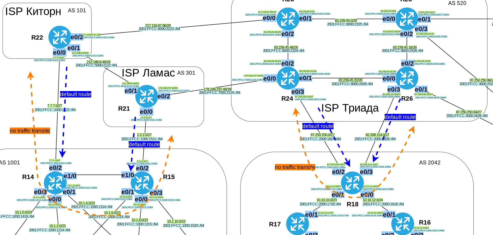
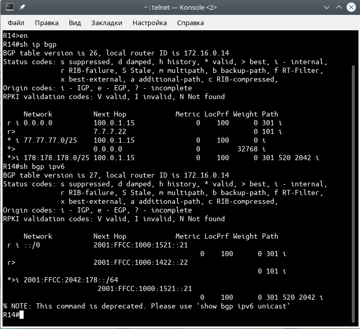
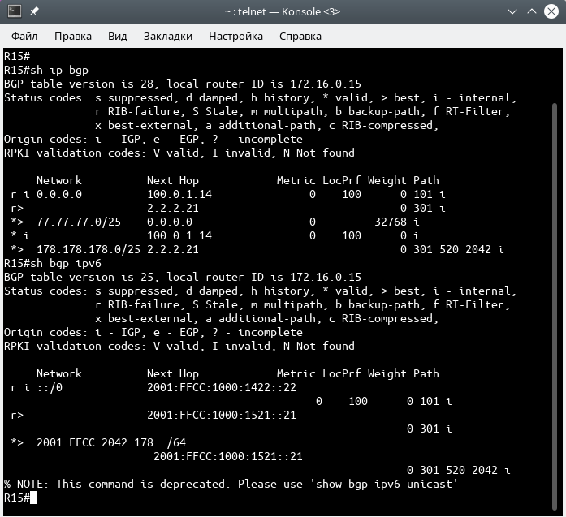

# Лабораторная работа №13. BGP. Выбор пути. Фильтрация.

### Задание:

1. Настроить фильтрацию в офисе Москва так, чтобы не появилось транзитного трафика(Prefix-list)
2. Настроить фильтрацию в офисе С.-Петербург так, чтобы не появилось транзитного трафика(As-path)
3. Настроить провайдера Киторн так, чтобы в офис Москва отдавался только маршрут по-умолчанию
4. Настроить провайдера Ламас так, чтобы в офис Москва отдавался только маршрут по-умолчанию и префикс офиса С.-Петербург

Конфигурационные файлы [здесь](config/)

### Решение:

Добавим таблицу PI-адресов для офисов МСК и СПб.
Для простоты понимания:\
__IPv4__ - адреса на основе __код региона__.\
__IPv6__ - 2001:FFCC:__[Nmbr_ASN]__:__[Code_Region]__
##### Таблица PI-адресов

| Network    | ASN  | Office          |
|-------:|:----|:--------|
| 77.77.77.0/25 | 1001 | Москва |
| 2001:FFCC:1001:77::/64 | 1001 | Москва |
| 178.178.178.0/25 | 2042 | Санкт-Петербург |
| 2001:FFCC:2042:178::/64 | 2042 | Санкт-Петербург |


### Топология



#### 1. Настроить фильтрацию в офисе Москва так, чтобы не появилось транзитного трафика(Prefix-list)

Настроим маршрутизаторы R14 и R15. Разрешим анонсировать только подсети из своей AS (1001), остальные запретим. При фильтрации воспользуемся регулярными выражениями.

<details>
 <summary>Настройки запрета транзитного трафика на R14, R15</summary>

``` bash
##############################
# AS 1001 No traffic transit #
##############################

#############
#  R14      #
#############

conf t
router bgp 1001
 no auto-summary
 address-family ipv4
  neighbor 7.7.7.22 prefix-list NO_TRANSIT out
 exit-address-family
 !
 address-family ipv6
  neighbor 2001:FFCC:1000:1422::22 prefix-list NO_TRANSIT out
 exit-address-family
!
ip prefix-list NO_TRANSIT permit 7.7.7.0/27
ip prefix-list NO_TRANSIT deny 0.0.0.0/0 ge 32
ipv6 prefix-list NO_TRANSIT permit 2001:FFCC:1000:1422::/64
ipv6 prefix-list NO_TRANSIT deny ::/0 ge 128

#############
#  R15      #
#############

conf t
router bgp 1001
 no auto-summary
 address-family ipv4
  neighbor 2.2.2.15 prefix-list NO_TRANSIT out
 exit-address-family
 !
 address-family ipv6
  neighbor 2001:FFCC:1000:1521::21 prefix-list NO_TRANSIT out
 exit-address-family
!
ip prefix-list NO_TRANSIT permit 2.2.2.0/27
ip prefix-list NO_TRANSIT deny 0.0.0.0/0 ge 32
ipv6 prefix-list NO_TRANSIT permit 2001:FFCC:1000:1521::/64
ipv6 prefix-list NO_TRANSIT deny ::/0 ge 128

```

</details>


#### 2. Настроить фильтрацию в офисе С.-Петербург так, чтобы не появилось транзитного трафика(As-path)

Настроим маршрутизатор R18. Разрешим анонсировать только подсети из своей AS (2042), остальные запретим. При фильтрации воспользуемся регулярными выражениями.

<details>
 <summary>Настройки запрета транзитного трафика на R18</summary>

``` bash

##############################
# AS2042 No traffic transit #
##############################

#############
#  R18      #
#############

conf t
router bgp 2042
 no auto-summary
 !
 address-family ipv4
  neighbor 82.208.114.26 filter-list 100 out
  neighbor 87.250.250.24 filter-list 100 out
 exit-address-family
 !
 address-family ipv6
  neighbor 2001:FFCC:2000:1824::24 filter-list 100 out
  neighbor 2001:FFCC:2000:1826::26 filter-list 100 out
 exit-address-family
!
ip as-path access-list 100 permit ^$
ip as-path access-list 100 deny .*


```

</details>

#### 3. Настроить провайдера Киторн так, чтобы в офис Москва отдавался только маршрут по-умолчанию

Настроим роутер R22, указав BGP отправлять только маршрут по-умолчанию в направлении соседа R14.

<details>
 <summary>Настройки R22</summary>

``` bash
##############################
# Only default-route to MSK  #
##############################

#############
#  R22      #
#############

conf t
router bgp 101
 no auto-summary
 address-family ipv4
  neighbor 7.7.7.14 default-originate
  neighbor 7.7.7.14 prefix-list DEF_ROUTEv4 out
 exit-address-family
 !
 address-family ipv6
  neighbor 2001:FFCC:1000:1422::14 default-originate
  neighbor 2001:FFCC:1000:1422::14 prefix-list DEF_ROUTEv6 out
 ! 
 exit-address-family
!
ip prefix-list DEF_ROUTEv4 seq 5 permit 0.0.0.0/0
ipv6 prefix-list DEF_ROUTEv6 seq 5 permit ::/0

```

</details>


#### 4. Настроить провайдера Ламас так, чтобы в офис Москва отдавался только маршрут по-умолчанию и префикс офиса С.-Петербург

Укажем подсеть с PI-адресами для ASN 2042 на пограничном роутере R18 в команде network. А также, укажем, что это подсеть находится на этом же роутере, добавив статический маршрут до неё через _null_.\
Произведём настройки маршрутизатора R22, указав BGP отправлять маршрут по-умолчанию и префикс сети СПб в направлении соседа R15.

<details>
 <summary>Привязка PI-адресов к ASN 1001 (MSK)</summary>

``` bash

##################################
#  ADD PI-address ASN 1001 (MSK) #
##################################

#############
#  R14      #
#############

router bgp 1001
 !
 address-family ipv4
  network 77.77.77.0 mask 255.255.255.128
 exit-address-family
 !
 address-family ipv6
  network 2001:FFCC:1001:77::/64
 exit-address-family

ip route 77.77.77.0 255.255.255.128 Null 0 name "PI IPv4 (ASN 1001)"
ipv6 route 2001:FFCC:1001:77::/6 Null 0 name "PI IPv6 (ASN 1001)"

#############
#  R15      #
#############

router bgp 1001
 !
 address-family ipv4
  network 77.77.77.0 mask 255.255.255.128
 exit-address-family
 !
 address-family ipv6
  network 2001:FFCC:1001:77::/64
 exit-address-family

ip route 77.77.77.0 255.255.255.128 Null 0 name "PI IPv4 (ASN 1001)"
ipv6 route 2001:FFCC:1001:77::/6 Null 0 name "PI IPv6 (ASN 1001)"


```

</details>


<details>
 <summary>Привязка PI-адресов к ASN 2042 (SPb)</summary>

``` bash
##################################
#  ADD PI-address ASN 2042 (SPb) #
##################################

#############
#  R18      #
#############

router bgp 1001
 !
 address-family ipv4
  network 178.178.178.0 mask 255.255.255.128
 exit-address-family
 !
 address-family ipv6
  network 2001:FFCC:2042:178::/64
 exit-address-family

ip route 178.178.178.0 255.255.255.128 Null 0 name "PI IPv4 (ASN 2042)"
ipv6 route 2001:FFCC:2042:178::/64 Null 0 name "PI IPv6 (ASN 2042)"


```

</details>


<details>
 <summary>Настройки R21</summary>

``` bash

###########################################
# Only default-route to MSK + Prefix SPb  #
###########################################

#############
#  R21      #
#############

router bgp 301
 no auto-summary
 !
 address-family ipv4
  neighbor 2.2.2.15 default-originate
  neighbor 2.2.2.15 prefix-list DEF_ROUTEv4 out
 exit-address-family
 !
 address-family ipv6
  neighbor 2001:FFCC:1000:1521::15 default-originate
  neighbor 2001:FFCC:1000:1521::15 prefix-list DEF_ROUTEv6 out
 exit-address-family
!
ip prefix-list DEF_ROUTEv4 seq 5 permit 178.178.178.0/25
ip prefix-list DEF_ROUTEv4 seq 10 permit 0.0.0.0/0
ipv6 prefix-list DEF_ROUTEv6 seq 5 permit 2001:FFCC:2042:178::/64
ipv6 prefix-list DEF_ROUTEv6 seq 10 permit ::/0

```

</details>


<details>
 <summary>Проверка таблиц маршрутизации [IPv4/IPv6] BGP на R14-R15</summary>


__R14__



__R15__



</details>
