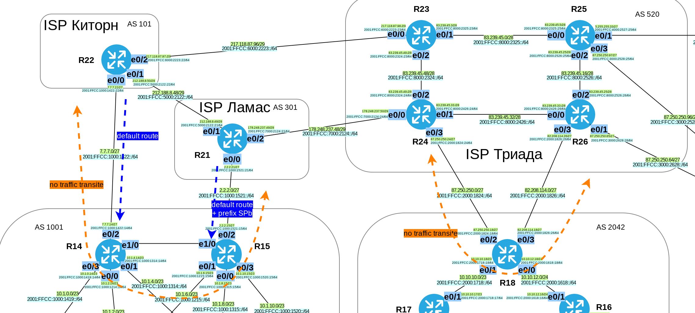

# Лабораторная работа №13. BGP. Выбор пути. Фильтрация.

### Задание:

1. Настроить фильтрацию в офисе Москва так, чтобы не появилось транзитного трафика(As-path)
2. Настроить фильтрацию в офисе С.-Петербург так, чтобы не появилось транзитного трафика(Prefix-list)
3. Настроить провайдера Киторн так, чтобы в офис Москва отдавался только маршрут по-умолчанию
4. Настроить провайдера Ламас так, чтобы в офис Москва отдавался только маршрут по-умолчанию и префикс офиса С.-Петербург

Конфигурационные файлы [здесь](config/)

### Решение:


### Топология



#### 1. Настроить фильтрацию в офисе Москва так, чтобы не появилось транзитного трафика(As-path)

Настроим маршрутизаторы R14 и R15. Разрешим анонсировать только подсети из своей AS (1001), остальные запретим. При фильтрации воспользуемся регулярными выражениями.

<details>
 <summary>Настройки запрета транзитного трафика на R14, R15</summary>

``` bash
##############################
# AS1001 No traffic transit #
##############################

#############
#  R14      #
#############

conf t
router bgp 1001
 address-family ipv4
  neighbor 7.7.7.22 prefix-list NO_TRANSIT out
 exit-address-family
 !
 address-family ipv6
  neighbor 2001:FFCC:1000:1422::22 prefix-list NO_TRANSIT out
 exit-address-family
!
ip prefix-list LAN permit 7.7.7.0/27
ip prefix-list LAN deny 0.0.0.0 ge 32

#############
#  R15      #
#############

conf t
router bgp 1001
 address-family ipv4
  neighbor 2.2.2.15 prefix-list NO_TRANSIT out
 exit-address-family
 !
 address-family ipv6
  neighbor 2001:FFCC:1000:1521::21 prefix-list NO_TRANSIT out
 exit-address-family
!
ip prefix-list LAN permit 2.2.2.0/27
ip prefix-list LAN deny 0.0.0.0 ge 32


```

</details>


#### 2. Настроить фильтрацию в офисе С.-Петербург так, чтобы не появилось транзитного трафика(Prefix-list)

Настроим маршрутизатор R18. Разрешим анонсировать только подсети из своей AS (2042), остальные запретим. При фильтрации воспользуемся регулярными выражениями.

<details>
 <summary>Настройки запрета транзитного трафика на R18</summary>

``` bash

##############################
# AS2042 No traffic transit #
##############################

#############
#  R18      #
#############

conf t
router bgp 2042
 
 !
 address-family ipv4
  neighbor 82.208.114.26 filter-list 100 out
  neighbor 87.250.250.24 filter-list 100 out
 exit-address-family
 !
 address-family ipv6
  neighbor 2001:FFCC:2000:1824::24 filter-list 100 out
  neighbor 2001:FFCC:2000:1826::26 filter-list 100 out
 exit-address-family
!
ip as-path access-list 100 permit ^$
ip as-path access-list 100 deny .*


```

</details>

#### 3. Настроить провайдера Киторн так, чтобы в офис Москва отдавался только маршрут по-умолчанию

Произведём настройки на R21 и R22, указав BGP отправлять только маршрут по-умолчанию в направлении соседей R14 и R15 соответственно.

<details>
 <summary>Настройки R21 и R22</summary>

``` bash
##############################
# Only default-route to MSK  #
##############################

#############
#  R22      #
#############

conf t
router bgp 101
 no auto-summary
 address-family ipv4
  neighbor 7.7.7.14 default-originate
  neighbor 7.7.7.14 prefix-list DEF_ROUTEv4 out
 exit-address-family
 !
 address-family ipv6
  neighbor 2001:FFCC:1000:1422::14 default-originate
  neighbor 2001:FFCC:1000:1422::14 prefix-list DEF_ROUTEv6
 ! 
 exit-address-family
!
ip prefix-list DEF_ROUTEv4 seq 5 permit 0.0.0.0/0
ip prefix-list DEF_ROUTEv6 seq 5 permit ::/0

#############
#  R21      #
#############

router bgp 301
 no auto-summary
 !
 address-family ipv4
  neighbor 2.2.2.15 default-originate
  neighbor 2.2.2.15 prefix-list DEF_ROUTEv4 out
 exit-address-family
 !
 address-family ipv6
  neighbor 2001:FFCC:1000:1521::15 default-originate
  neighbor 2001:FFCC:1000:1521::15 prefix-list DEF_ROUTEv6 out
 exit-address-family
!
ip prefix-list DEF_ROUTEv4 seq 5 permit 0.0.0.0/0
ip prefix-list DEF_ROUTEv6 seq 5 permit ::/0


```

</details>


#### 4. Настроить провайдера Ламас так, чтобы в офис Москва отдавался только маршрут по-умолчанию и префикс офиса С.-Петербург

<details>
 <summary>Настройки R24 и R26</summary>

``` bash
##############################
# Only default-route to SPb  #
##############################

#############
#  R24      #
#############

router bgp 520
 no auto-summary
 !
 address-family ipv4
  neighbor 87.250.250.18 default-originate
  neighbor 87.250.250.18 prefix-list DEF_ROUTEv4 out
 exit-address-family
 !
 address-family ipv6
  neighbor 2001:FFCC:2000:1824::18 default-originate
  neighbor 2001:FFCC:2000:1824::18 prefix-list DEF_ROUTEv6 out
 exit-address-family
!
ip prefix-list DEF_ROUTEv4 seq 5 permit 0.0.0.0/0
ip prefix-list DEF_ROUTEv6 seq 5 permit ::/0

#############
#  R26      #
#############

router bgp 520
 no auto-summary
 !
 address-family ipv4
  neighbor 82.208.114.18 default-originate
  neighbor 82.208.114.18 prefix-list DEF_ROUTEv4 out
 exit-address-family
 !
 address-family ipv6
  neighbor 2001:FFCC:2000:1826::18 default-originate
  neighbor 2001:FFCC:2000:1826::18 prefix-list DEF_ROUTEv6 out
 exit-address-family
!
ip prefix-list DEF_ROUTEv4 seq 5 permit 0.0.0.0/0
ip prefix-list DEF_ROUTEv6 seq 5 permit ::/0


```

</details>
