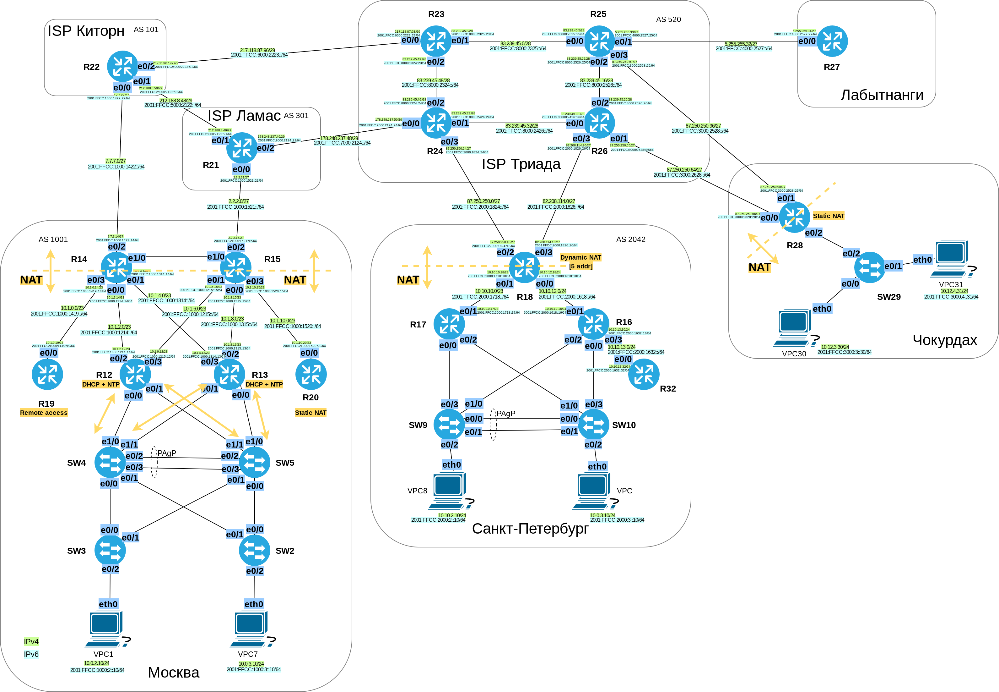
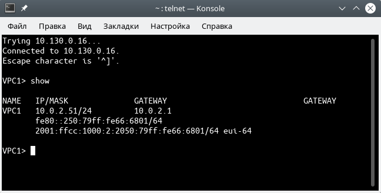
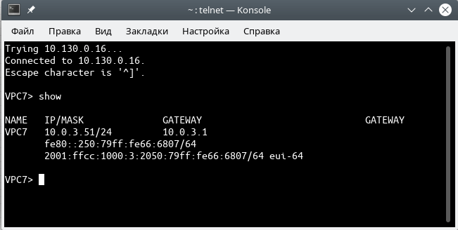
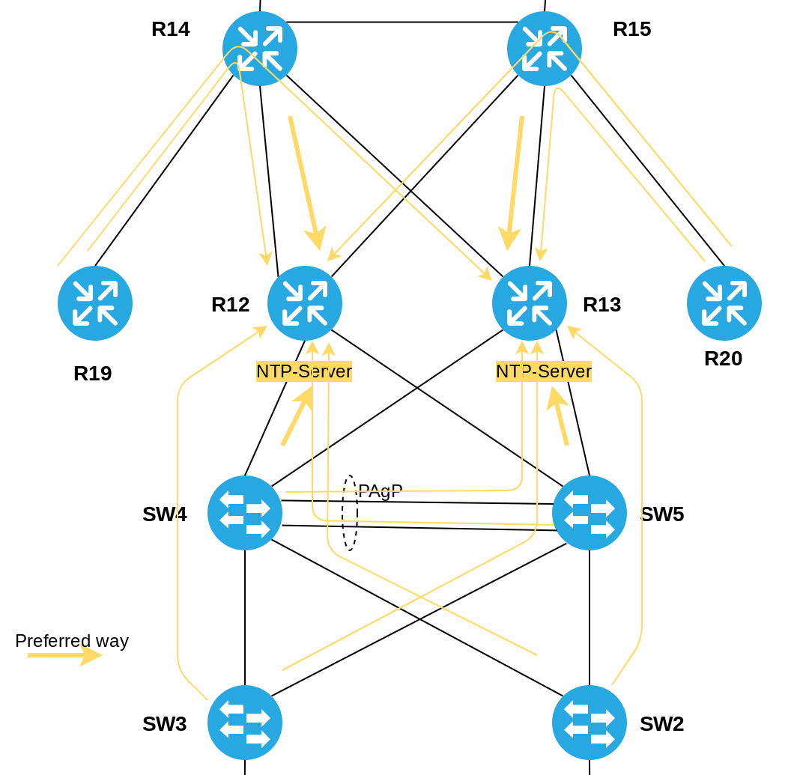

# Лабораторная работа №14. Основные протоколы сети Интернет

### Задание:

1. Настроить NAT(PAT) на R14 и R15. Трансляция должна осуществляться в адрес автономной системы AS1001
2. Настроить NAT(PAT) на R18. Трансляция должна осуществляться в пул из 5 адресов автономной системы AS2042
3. Настроить статический NAT для R20
4. Настроить NAT так, чтобы R19 был доступен с любого узла для удаленного управления
5. Настроить статический NAT(PAT) для офиса Чокурдах
6. Настроить DHCP сервер в офисе Москва на маршрутизаторах R12 и R13. VPC1 и VPC7 должны получать сетевые настройки по DHCP
7. Настроить NTP сервер на R12 и R13. Все устройства в офисе Москва должны синхронизировать время с R12 и R13

Конфигурационные файлы [здесь](config/)

### Решение:

##### Таблица PI-адресов

| Network    | ASN  | Office          |
|-------:|:----|:--------|
| 77.77.77.0/25 | 1001 | Москва |
| 2001:FFCC:1001:77::/64 | 1001 | Москва |
| 178.178.178.0/25 | 2042 | Санкт-Петербург |
| 2001:FFCC:2042:178::/64 | 2042 | Санкт-Петербург |


### Топология



#### 1. Настроить NAT(PAT) на R14 и R15. Трансляция должна осуществляться в адрес автономной системы AS1001

Сделаем трансляцию адресов только для пользовательских подсетей. Пока их две - 10.0.2.0/24 и 10.0.3.0/24, в дальнейшем их кол-во может увеличиться, поэтому сразу укажем суммарный диапазон 10.0.0.0/16. Также, Для роутеров выход в Интернет не требуется, обновления будут устанавливаться из локальных источников (серверов).
Для ASN 1001 выделены PI-адреса 77.77.77.0/25. Выделим по одному внешнему IP-адресу в качестве Global Inside каждому из пограничных маршрутизаторов R14 и R15. Создадим на них по одному Loopback-интерфейсу и присвоим им адреса 77.77.77.14 и 77.77.77.15, соответственно. Т.е. будет работать SNAT для приватных адресов, source-address будет подменяться на ip-адрес интерфейсов Loopback, а пакеты будут отправляться через внешние интерфейсы E0/2.

##### Таблица NAT

| Equipment | Local Inside [IP] | Global Inside [IP] | Local Inside [Port] | Global Inside [Port] | IP_Glob_Pool |
|-------:|----:|:--------|-------:|:----|:--------|
| R14 | 10.0.0.0/16 | 77.77.77.14 | e0/0; e0/1 | Loopback14 | 77.77.77.14/32 |
| R15 | 10.0.0.0/16 | 77.77.77.15 | e0/0; e0/1 | Loopback14 | 77.77.77.15/32 |


<details>
 <summary>Настройки NAT на R14-R15</summary>

``` bash
#################
#  NAT R14      #
#################

int Loopback14
 ip address 77.77.77.14 mask 255.255.255.128
!
interface Ethernet0/2
 ip nat outside
!
interface Ethernet0/0
 ip nat inside
!
interface Ethernet0/1
 ip nat inside
!
! настроим PAT c перегрузкой через интерфейс Ethernet0/2
ip nat inside source list 14 interface Loopback14 overload
!
access-list 14 permit 10.0.0.0 0.0.255.255


#################
#  NAT R15      #
#################

int Loopback15
 ip address 77.77.77.15 mask 255.255.255.128
!
interface Ethernet0/2
 ip nat outside
!
interface Ethernet0/0
 ip nat inside
!
interface Ethernet0/1
 ip nat inside
!
! настроим PAT c перегрузкой через интерфейс interface Ethernet0/2
ip nat inside source list 15 interface Loopback15 overload

access-list 15 permit 10.0.0.0 0.0.255.255


```
</details>


#### 2. Настроить NAT(PAT) на R18. Трансляция должна осуществляться в пул из 5 адресов автономной системы AS2042

Настроим PAT на R18. Выделим пул из 5-ти публичных адресов из PI-диапазона. Укажем интерфейсы e0/0 и e0/2 в качестве "входных", а e0/1 и e0/3 - "выходных".

<details>
 <summary>Настройки NAT на R18</summary>

``` bash
#################
#  NAT R18      #
#################

! Выделим пул из 5-ти публичных адресов из PI-диапазона ASN 2042
ip nat pool NAT_POOL_R18 178.178.178.120 178.178.178.125 mask 255.255.255.128
!
interface Ethernet0/0
 ip nat inside
!
interface Ethernet0/1
 ip nat inside
! 
interface Ethernet0/2
 ip nat outside
!
interface Ethernet0/3
 ip nat outside
!
! настроим PAT c перегрузкой
ip nat inside source list 18 pool NAT_POOL_R18 overload
!
access-list 18 permit 10.10.2.0 0.0.0.255
access-list 18 permit 10.10.3.0 0.0.0.255

```
</details>

#### 3. Настроить статический NAT для R20

Настроим _static NAT_ на R20. В качестве _local inside_ будет выступать ip-адрес Loopback999. В качестве _global inside_ 10.1.10.20.

<details>
 <summary>Настройки Static NAT на R20</summary>

``` bash
###################
# Static NAT R20  #
###################

! настроим статический NAT 172.16.0.20 -> 10.1.10.20
ip nat inside source static 172.16.0.20 10.1.10.20
!
interface Ethernet0/0
 ip nat outside
!
interface Loopback999
 ip nat inside

```
</details>


#### 4. Настроить NAT так, чтобы R19 был доступен с любого узла для удаленного управления

Для доступа к настройкам R19 из-вне (через NAT), необходимо сделать проброс (mapping) портов 21,22 (telnet и ssh) на пограничном роутере R14.

| WAN IP | WAN Port | LAN IP | LAN port | Service |
|-------:|:---------|-------:|:---------|---------|
| 77.77.77.14 | 2121 | 10.1.0.19 | 21 | telnet |
| 77.77.77.14 | 2222 | 10.1.0.19 | 22 | ssh |

<details>
 <summary>Проброс портов 21-22 для R19</summary>

``` bash
###################
# Настройка  R14  #
###################

interface Ethernet0/0
 ip nat inside
 
interface Ethernet0/2
 ip nat outside

ip nat inside source static tcp 10.1.0.19 21 77.77.77.14 2121
ip nat inside source static tcp 10.1.0.19 22 77.77.77.14 2222


```
</details>

#### 5. Настроить статический NAT(PAT) для офиса Чокурдах

Настроим статический NAT для VPC30 и VPC31.

| Local Inside [IP] | Local Inside [Port] | Global Inside [IP] | Global Inside [Port] |
|-------:|:----|--------:|:-------|
| 10.12.3.30 | Ethernet0/2.3 (VLAN3) | 87.250.250.65 | Ethernet0/0 |
| 10.12.4.31 | Ethernet0/2.4 (VLAN4) | 87.250.250.98 | Ethernet0/1 |

<details>
 <summary>Настройка static NAT на R28</summary>

``` bash
###################
# Настройка  R28  #
###################


ip nat inside source static 10.12.3.30 87.250.250.65
ip nat inside source static 10.12.4.31 87.250.250.98
!
interface Ethernet0/0
 ip nat outside
!
 interface Ethernet0/1
 ip nat outside
!
interface Ethernet0/2.3
 ip nat inside
!
interface Ethernet0/2.4
 ip nat inside

```
</details>


#### 6. Настроить DHCP сервер в офисе Москва на маршрутизаторах R12 и R13. VPC1 и VPC7 должны получать сетевые настройки по DHCP

Настроим HSRP на роутерах R12-R13. После настроим DHCP. На интерфейсах, смотрящих в сторону пользовательских подсетей настроим DHCP Relay Agent с осведомлённость о HSRP. Данная настройка позволит хостам, запрашивающим сетевые настройки, не получать настройки дважды (от каждого из роутеров).


<details>
 <summary>Настройка HSRP</summary>

``` bash
###################
# Настройка  R12  #
###################

conf t
service dhcp

int e0/0
ip address 10.0.2.2 255.255.255.0
ip helper-address 10.0.2.1 redundancy HSRP
standby 1 name HSRP
standby 1 ip 10.0.2.1
standby 1 priority 100
standby 1 preempt

#ipv6 
standby version 2
standby 2 ipv6 autoconfig
standby 2 preempt
standby 2 priority 110


int e0/1
ip address 10.0.3.2 255.255.255.0
ip helper-address 10.0.3.1 redundancy HSRP
standby 1 name HSRP
standby 1 ip 10.0.3.1
standby 1 priority 150
standby 1 preempt

#ipv6 
standby version 2
standby 2 ipv6 autoconfig
standby 2 priority 90

###################
# Настройка  R13  #
###################

conf t
service dhcp

int e0/0
ip address 10.0.2.4 255.255.255.0
ip helper-address 10.0.2.1 redundancy HSRP
standby 1 name HSRP
standby 1 ip 10.0.2.1
standby 1 priority 100
standby 1 preempt
#ipv6 
standby version 2
standby 2 ipv6 autoconfig
standby 2 preempt
standby 2 priority 110


int e0/1
ip address 10.0.3.4 255.255.255.0
ip helper-address 10.0.3.1 redundancy HSRP
standby 1 name HSRP
standby 1 ip 10.0.3.1
standby 1 priority 150
standby 1 preempt
#ipv6
standby version 2
standby 2 ipv6 autoconfig
standby 2 priority 90

```
</details>

<details>
 <summary>Настройка DHCP</summary>

``` bash
###################
# Настройка  R12  #
###################

conf t
service dhcp
ip dhcp excluded-address 10.0.2.1 10.0.2.50
ip dhcp excluded-address 10.0.3.1 10.0.3.50
ip dhcp excluded-address 10.0.2.254
ip dhcp excluded-address 10.0.3.254

ip dhcp pool POOL-VLAN2
 network 10.0.2.0 255.255.255.0
 default-router 10.0.2.1

ip dhcp pool POOL-VLAN3
 network 10.0.3.0 255.255.255.0
 default-router 10.0.3.1

ipv6 unicast-routing

ipv6 dhcp pool IPV6-STATEFUL-2
address prefix 2001:FFCC:1000:2::/64

ipv6 dhcp pool IPV6-STATEFUL-3
address prefix 2001:FFCC:1000:3::/64

int e0/0
ipv6 dhcp server IPV6-STATEFUL-2
ipv6 nd managed-config-flag

int e0/1
ipv6 dhcp server IPV6-STATEFUL-3
ipv6 nd managed-config-flag


###################
# Настройка  R13  #
###################

conf t

ip dhcp excluded-address 10.0.2.1 10.0.2.50
ip dhcp excluded-address 10.0.3.1 10.0.3.50
ip dhcp excluded-address 10.0.2.254
ip dhcp excluded-address 10.0.3.254

ip dhcp pool POOL-VLAN2
 network 10.0.2.0 255.255.255.0
 default-router 10.0.2.1

ip dhcp pool POOL-VLAN3
 network 10.0.3.0 255.255.255.0
 default-router 10.0.3.1

ipv6 unicast-routing

ipv6 dhcp pool IPV6-STATEFUL-2
address prefix 2001:FFCC:1000:2::/64


ipv6 dhcp pool IPV6-STATEFUL-3
address prefix 2001:FFCC:1000:3::/64

int e0/0
ipv6 dhcp server IPV6-STATEFUL-2
ipv6 nd managed-config-flag

int e0/1
ipv6 dhcp server IPV6-STATEFUL-3
ipv6 nd managed-config-flag

```
</details>

<details>
 <summary>Проверка получения сетевых настроек по DHCP</summary>

__VPC1__



__VPC7__



</details>

#### 7. Настроить NTP сервер на R12 и R13

Настроим роутеры R12-R13 в качестве NTP-серверов, остальные устройства как NTP-клиенты.
Ограничим доступ к NTP-серверам, кроме устройств из подсетей МСК. NTP-клиентам разрешим обновлять время только с наших серверов (R12-R13).

| ver. IP | network | 
|---|--- |
| ipv4: | 10.0.0.0/14 |
| ipv6: | 2001:FFCC:1000::/48 |

##### NTP network



<details>
 <summary>Настройка NTP</summary>

``` bash
###################
# Настройка  R12  #
###################

conf t

ntp master 2
 clock timezone UTC 3
 ip access-list standard 2
  10 permit 10.0.0.0 0.3.255.255
  100 deny any
  exit
 ntp access-group ipv4 serve-only 2
 
 ipv6 access-list NTPSERVER_IPV6_ACL
  permit ipv6 host FE80::14 host FE80::12 sequence 10
  permit ipv6 host FE80::15 host FE80::12 sequence 20
  permit ipv6 host FE80::19 host FE80::12 sequence 30
  permit ipv6 host FE80::13 host FE80::12 sequence 40
  permit ipv6 host FE80::20 host FE80::12 sequence 50
  permit ipv6 host FE80::4 host FE80::12 sequence 60
  permit ipv6 host FE80::5 host FE80::12 sequence 70
  permit ipv6 host FE80::3 host FE80::12 sequence 80
  permit ipv6 host FE80::2 host FE80::12 sequence 90
  permit ipv6 2001:FFCC:1000::/48 any sequence 100
  deny ipv6 any any sequence 400
  exit
 ntp access-group ipv6 serve-only NTPSERVER_IPV6_ACL

clock calendar-valid
ntp update-calendar

###################
# Настройка  R13  #
###################

conf t

ntp master 2
 clock timezone UTC 3
 ip access-list standard 2
  10 permit 10.0.0.0 0.3.255.255
  100 deny any
  exit
 ntp access-group ipv4 serve-only 2
 
 ipv6 access-list NTPSERVER_IPV6_ACL
  permit ipv6 host FE80::14 host FE80::13 sequence 10
  permit ipv6 host FE80::15 host FE80::13 sequence 20
  permit ipv6 host FE80::19 host FE80::13 sequence 30
  permit ipv6 host FE80::12 host FE80::13 sequence 40
  permit ipv6 host FE80::20 host FE80::13 sequence 50
  permit ipv6 host FE80::4 host FE80::12 sequence 60
  permit ipv6 host FE80::5 host FE80::12 sequence 70
  permit ipv6 host FE80::3 host FE80::12 sequence 80
  permit ipv6 host FE80::2 host FE80::12 sequence 90
  permit ipv6 2001:FFCC:1000::/48 any sequence 100
  deny ipv6 any any sequence 400
  exit
 ntp access-group ipv6 serve-only NTPSERVER_IPV6_ACL

clock calendar-valid
ntp update-calendar

###################
# Настройка  R19  #
###################

conf t
!
 ntp server 10.1.2.12
 ntp server FE80::12
 ntp server 2001:FFCC:1000:1214:12
 ntp server 10.1.4.13
 ntp server FE80::13
 ntp server 2001:FFCC:1000:1314:13
 
 
 ip access-list standard 2
  10 permit 10.1.2.12 0.0.0.0
  20 permit 10.1.4.13 0.0.0.0
  400 deny any
  exit
 ntp access-group ipv4 peer 2
!
 ipv6 access-list NTPSERVER_IPV6_ACL
  permit ipv6 host FE80::9 any sequence 10
  permit ipv6 host 2001:FFCC:1000:1214:12 any sequence 20
  permit ipv6 host 2001:FFCC:1000:1314:13 any sequence 30
  deny ipv6 any any sequence 400
  exit
 ntp access-group ipv6 peer NTPSERVER_IPV6_ACL
 exit

clock timezone UTC 3
clock calendar-valid
ntp update-calendar
 
###################
# Настройка  R14  #
###################

conf t
!
 ntp server 10.1.2.12 prefer
 ntp server FE80::12 prefer
 ntp server 2001:FFCC:1000:1214:12 prefer
 ntp server 10.1.4.13
 ntp server FE80::13
 ntp server 2001:FFCC:1000:1314:13
 
 
 ip access-list standard 2
  10 permit 10.1.2.12 0.0.0.0
  20 permit 10.1.4.13 0.0.0.0
  400 deny any
  exit
 ntp access-group ipv4 peer 2
!
 ipv6 access-list NTPSERVER_IPV6_ACL
  permit ipv6 host FE80::9 any sequence 10
  permit ipv6 host 2001:FFCC:1000:1214:12 any sequence 20
  permit ipv6 host 2001:FFCC:1000:1314:13 any sequence 30
  deny ipv6 any any sequence 400
  exit
 ntp access-group ipv6 peer NTPSERVER_IPV6_ACL
 exit

clock timezone UTC 3
clock calendar-valid
ntp update-calendar

###################
# Настройка  R15  #
###################

conf t
!
 ntp server 10.1.8.13 prefer
 ntp server FE80::13 prefer
 ntp server 2001:FFCC:1000:1315:13 prefer
 ntp server 10.1.6.12
 ntp server FE80::12
 ntp server 2001:FFCC:1000:1215:12
 
 
 ip access-list standard 2
  10 permit 10.1.8.13 0.0.0.0
  20 permit 10.1.6.12 0.0.0.0
  400 deny any
  exit
 ntp access-group ipv4 peer 2
!
 ipv6 access-list NTPSERVER_IPV6_ACL
  permit ipv6 host FE80::9 any sequence 10
  permit ipv6 host 2001:FFCC:1000:1315:13 any sequence 20
  permit ipv6 host 2001:FFCC:1000:1215:12 any sequence 30
  deny ipv6 any any sequence 400
  exit
 ntp access-group ipv6 peer NTPSERVER_IPV6_ACL
 exit

clock timezone UTC 3
clock calendar-valid
ntp update-calendar

###################
# Настройка  R20  #
###################

conf t
!
 ntp server 10.1.8.13
 ntp server FE80::13
 ntp server 2001:FFCC:1000:1315:13
 ntp server 10.1.6.12
 ntp server FE80::12
 ntp server 2001:FFCC:1000:1215:12
 
 
 ip access-list standard 2
  10 permit 10.1.8.13 0.0.0.0
  20 permit 10.1.6.12 0.0.0.0
  400 deny any
  exit
 ntp access-group ipv4 peer 2
!
 ipv6 access-list NTPSERVER_IPV6_ACL
  permit ipv6 host FE80::9 any sequence 10
  permit ipv6 host 2001:FFCC:1000:1315:13 any sequence 20
  permit ipv6 host 2001:FFCC:1000:1215:12 any sequence 30
  deny ipv6 any any sequence 400
  exit
 ntp access-group ipv6 peer NTPSERVER_IPV6_ACL
 exit

clock timezone MSK 3
clock calendar-valid
ntp update-calendar


###################
# Настройка  SW4  #
###################

conf t
ntp server 10.0.2.2
ntp server 2001:FFCC:1000:2::2
ntp server 10.0.3.5
ntp server 2001:FFCC:1000:3::5

clock timezone UTC 3
clock calendar-valid
ntp update-calendar

###################
# Настройка  SW5  #
###################

conf t
ntp server 10.0.2.5
ntp server 2001:FFCC:1000:2::5
ntp server 10.0.3.4
ntp server 2001:FFCC:1000:3::4

clock timezone UTC 3
clock calendar-valid

###################
# Настройка  SW3  #
###################

conf t
ntp server 10.0.2.2
ntp server 2001:FFCC:1000:2::2
ntp server 10.0.3.5
ntp server 2001:FFCC:1000:3::5

clock timezone UTC 3
clock calendar-valid
ntp update-calendar

###################
# Настройка  SW2  #
###################

conf t
ntp server 10.0.2.5
ntp server 2001:FFCC:1000:2::5
ntp server 10.0.3.4
ntp server 2001:FFCC:1000:3::4

clock timezone UTC 3
clock calendar-valid

```
</details>
