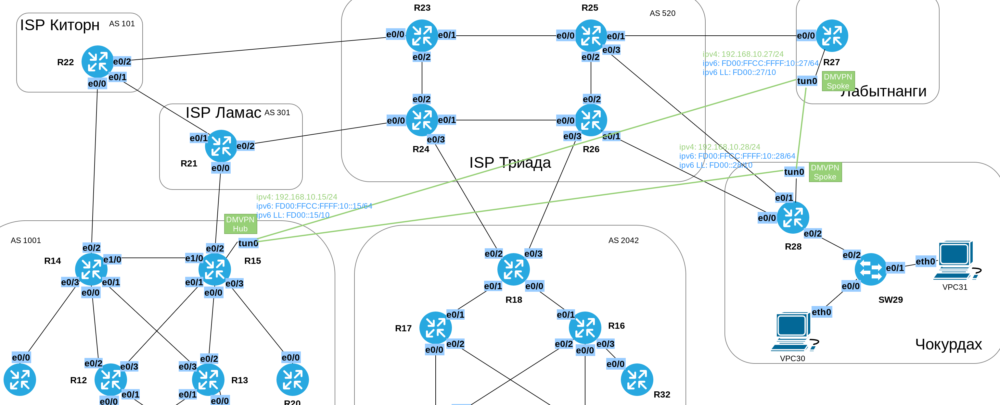

# Лабораторная работа №15. VPN. GRE. DmVPN

### Задание:

1. Настроить GRE между офисами Москва и С.-Петербург
2. Настроить DMVPN между Москва и Чокурдах, Лабытнанги

Конфигурационные файлы [здесь](config/)

#### 1. Настроить GRE между офисами Москва и С.-Петербург

###### Топология GRE туннелей


Создадим виртуальные интерфейсы __tun__ на роутерах R14, R15, R18. Номера туннельным интерфейсам присваиваются исходя из логики {tun}{номер_роутера_1}{номер_роутера_2}{ip_ver}.\
__tun1418__ туннель между роутерами R14-R18 GREv4\
__tun14186__ туннель между роутерами R14-R18 GREv6

Для резервирования сделаем по два туннеля R14-R18 и R15-R18, по одному для каждой версии ip-протокола.
В качестве _tunnel source_ укажем интерфейсы маршрутизаторов смотрящие во внешние сети (в сторону ISP). На _Ethernet0/2_ у R14 и R15, _Ethernet0/2_ и _Ethernet0/3_ у R18.


##### Таблица туннелей GRE
| Tunnel | Network | Eq1 | Port | Eq2 | Port |
|:---|:--- |---:|:---|---:|:---|
| tun1418 | 192.168.0.0/30 | R14 | e0/2 | R18 | e0/2 |
| tun14186 | FD00:FFCC:1418::0/127 | R15 | e0/2 | R18 | e0/2 |
| tun1518 | 192.168.0.4/30 | R14 | e0/2 | R18 | e0/3 |
| tun15186 | FD00:FFCC:1518::0/127 | R15 | e0/2 | R18 | e0/3 |


##### Таблица адресов туннелей GRE

| Equip | Port | IP ver.| Address | tun_src | tun_dst |
|:--- |:--- |:--- |:--- |---:|:--- |
| R14 | tun1418 | ipv4 | 192.168.0.1 | Ethernet0/2 | 178.178.178.118 |
| R14 | tun14186 | ipv6 | FD00:FFCC:1418::0/127 | Ethernet0/2 | 2001:FFCC:2042:178::118 |
| R14 | tun14186 | ipv6 LL | FE80::14 |  |  |
| R18 | tun1418 | ipv4 | 192.168.0.2 | Ethernet0/2 | 77.77.77.114 |
| R18 | tun14186 | ipv6 | FD00:FFCC:1418::1/127 | Ethernet0/2  | 2001:FFCC:1001:77::114 |
| R18 | tun14186 | ipv6 LL | FE80:18  |  |  |
| R15 | tun1518 | ipv4 | 192.168.0.5 | Ethernet0/2 | 178.178.178.115 |
| R15 | tun15186 | ipv6 | FD00:FFCC:1518::0/127 | Ethernet0/2 | 2001:FFCC:2042:178::119 |
| R15 | tun15186 | ipv6 LL | FE80:15 |  |  |
| R18 | tun1518 | ipv4 | 192.168.0.6 | Ethernet0/3 | 77.77.77.115 |
| R18 | tun15186 | ipv6 | FD00:FFCC:1518::1/127 | Ethernet0/3 | 2001:FFCC:1001:77:115 |
| R18 | tun15186 | ipv6 LL |  |  |  |

<details>
 <summary>Настройки GRE</summary>

``` bash
###################
# Настройка R14   #
###################

conf t
int tun1418
  description "GREv4 Tunnel MSK-SPb to R18"
  ip addr 192.168.0.1 255.255.255.252
  ip mtu 1400
  ip tcp adjust-mss 1360
  tunnel source Ethernet0/2
  tunnel destination 178.178.178.118
  tunnel mode gre ipv4
  no shutdown

int tun14186
  description "GREv6 Tunnel MSK-SPb to R18"
  ipv6 enable
  ipv6 address FE80::14 link-local
  ipv6 address FD00:FFCC:1418::0/127
  tunnel source Ethernet0/2
  tunnel destination 2001:FFCC:2042:178::118
  tunnel mode gre ipv6
  no shutdown

###################
# Настройка R18   #
###################

conf t
int tun1418
  description "GREv4 Tunnel SPb-MSK to R14"
  ip addr 192.168.0.2 255.255.255.252
  ip mtu 1400
  ip tcp adjust-mss 1360
  tunnel source Ethernet0/2
  tunnel destination 77.77.77.114
  tunnel mode gre ipv4
  no shutdown

int tun14186  
  description "GREv6 Tunnel MSK-SPb to R14"
  ipv6 enable
  ipv6 address FE80::18 link-local
  ipv6 address FD00:FFCC:1418::1/127
  tunnel source Ethernet0/2
  tunnel destination 2001:FFCC:1001:77::114
  tunnel mode gre ipv6
  no shutdown
  
int tun1518
  description "GREv4 Tunnel SPb-MSK to R15"
  ip addr 192.168.0.6 255.255.255.252
  ip mtu 1400
  ip tcp adjust-mss 1360
  tunnel source Ethernet0/3
  tunnel destination 77.77.77.115
  tunnel mode gre ipv4
  no shutdown

int tun15186  
  description "GREv6 Tunnel SPb-MSK to R15"
  ipv6 enable
  ipv6 address FE80::18 link-local
  ipv6 address FD00:FFCC:1518::1/127
  tunnel source Ethernet0/3
  tunnel destination 2001:FFCC:1001:77::115
  tunnel mode gre ipv6
  no shutdown 
  
###################
# Настройка R15   #
###################

conf t
int tun1518
  description "GREv4 Tunnel SPb-MSK to R18"
  ip addr 192.168.0.5 255.255.255.252
  ip mtu 1400
  ip tcp adjust-mss 1360
  tunnel source Ethernet0/2
  tunnel destination 178.178.178.119
  tunnel mode gre ipv4
  no shutdown

int Tun15186
  description "GREv6 Tunnel SPb-MSK to R18"
  ipv6 enable
  ipv6 address FE80::15 link-local
  ipv6 address FD00:FFCC:1518::0/127
  tunnel source Ethernet0/2
  tunnel destination 2001:FFCC:2042:178::119
  tunnel mode gre ipv6
  no shutdown


```
</details>

#### 2. Настроить DMVPN между Москва и Чокурдах, Лабытнанги

###### Топология DMVPN туннелей



<details>
 <summary>Настройки DMVPN</summary>

 ``` bash

 #####################
# DMVPN R15 (Hub)   #
#####################

int tun0
  ip addr ip/mask
  ip nhrp auth otus
  ip nhrp network-id 1
  tunnel source ip (или порт)
  tunnel mode gre multipoint
  ip nhrp map multicast dynamic
  ##для phase 3
  #ip nhrp redirect

#####################
# DMVPN R27 (Spoke) #
#####################

int tun0
  ip addr ip/mask
  ip nhrp auth otus
  ip nhrp network-id 1
  ip nhrp nhs [внутренний-ip-хаба]
  ip nhrp map [внутренний-ip] [внешний-ip]
  tunnel mode gre multipoint
  tunnel source ip
  #tunnel dest ip (в фазе 2 не нужен!)
  ##для phase 3
  #ip nhrp shortcut
  #ip nhrp redirect

#####################
# DMVPN R28 (Spoke) #
#####################

int tun0
  ip addr ip/mask
  ip nhrp auth otus
  ip nhrp network-id 1
  ip nhrp nhs [внутренний-ip-хаба]
  ip nhrp map [внутренний-ip] [внешний-ip]
  tunnel mode gre multipoint
  tunnel source ip
  #tunnel dest ip (в фазе 2 не нужен!)
  ##для phase 3
  #ip nhrp shortcut
  #ip nhrp redirect


 ```
</details>

